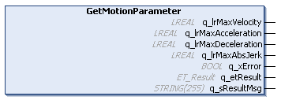

# IF\_Motion - GetMotionParameter (Method)

## Overview

|  |  |
| --- | --- |
| Type: | Method |
| Available as of: | V1.0.0.0 |

## Task

Reading the motion parameters.

## Description

With the method GetMotionParameter, you can read the maximum velocity (change of position per time unit), the maximum acceleration/deceleration (change of velocity per time unit), and the maximum jerk (change of acceleration per time unit) with which the motion of the carrier is executed.

See also [SetMotionParameter](IF_Motion-SetMotionParameterMethod-534A9C05.html#IF_Motion-SetMotionParameterMethod-534A9C05).

## Inputs

The method has no inputs.

## Outputs

| Output | Data type | Unit | Description |
| --- | --- | --- | --- |
| q\_lrMaxVelocity | LREAL | mm/s | Indicates the specified maximum velocity (change of position per time unit). |
| q\_lrMaxAcceleration | LREAL | mm/s2 | Indicates the specified maximum acceleration (change of velocity per time unit). |
| q\_lrMaxDeceleration | LREAL | mm/s2 | Indicates the specified maximum deceleration (change of velocity per time unit). |
| q\_lrMaxAbsJerk | LREAL | mm/s3 | Indicates the specified maximum jerk (change of acceleration per time unit). |
| q\_xError | BOOL | – | Indicates TRUE if an error has been detected. For details, refer to q\_etResult and q\_sResultMsg. |
| q\_etResult | [ET\_Result](ET_Result-509D6EF3.html#ET_Result-509D6EF3) | – | Provides diagnostic and status information as a numeric value. If q\_xError = FALSE, q\_etResult provides status information. If q\_xError = TRUE, q\_etResult provides diagnostic/error information. |
| q\_sResultMsg | STRING [255] | – | Provides additional diagnostic and status information as a text message. |

EIO0000004641.10