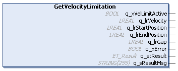

# IF\_Motion - GetVelocityLimitation (Method)

## Overview

|  |  |
| --- | --- |
| Type: | Method |
| Available as of: | V1.0.0.0 |

## Task

Reading the values of the configured velocity limitation for the movement of the carrier.

## Description

The method GetVelocityLimitation returns the values configured for the velocity limitation in the method outputs, provided that a velocity limitation is active. In case the velocity limitation is not configured for the carrier, the outputs are set as follows:

| Output | Value |
| --- | --- |
| q\_xVelLimitActive | FALSE |
| q\_lrVelocity | -1 |
| q\_lrStartPosition | -1 |
| q\_lrEndPosition | -1 |

## Inputs

The method has no inputs.

## Outputs

| Output | Data type | Unit | Description |
| --- | --- | --- | --- |
| q\_xVelLimitActive | BOOL | – | Indicates TRUE if velocity limitation is configured for the carrier. |
| q\_lrVelocity | LREAL | mm/s | Indicates the configured velocity of a carrier at q\_lrStartPosition. |
| q\_lrStartPosition | LREAL | mm | Indicates the configured start position that the carrier must have before velocity limitation. |
| q\_lrEndPosition | LREAL | mm | Indicates the configured end position that the carrier must have after velocity limitation. |
| q\_lrGap | LREAL | mm | Indicates the configured gap that the carrier must have in the section of the track with defined velocity limitation. |
| q\_xError | BOOL | – | Indicates TRUE if an error has been detected. For details, refer to q\_etResult and q\_sResultMsg. |
| q\_etResult | [ET\_Result](ET_Result-509D6EF3.html#ET_Result-509D6EF3) | – | Provides diagnostic and status information as a numeric value. If q\_xError = FALSE, q\_etResult provides status information. If q\_xError = TRUE, q\_etResult provides diagnostic/error information. |
| q\_sResultMsg | STRING [255] | – | Provides additional diagnostic and status information as a text message. |

EIO0000004641.10