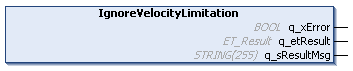

# IF\_Motion - IgnoreVelocityLimitation (Method)

## Overview

|  |  |
| --- | --- |
| Type: | Method |
| Available as of: | V1.0.0.0 |

## Task

Ignoring a configured velocity limitation for the movement of the carrier.

## Description

When the method IF\_Motion - IgnoreVelocityLimitation is called, a velocity limitation configured for the carrier with the method SetVelocityLimitation (see [SetVelocityLimitation](SetVelocLimit-B0EB335C.html#SetVelocLimit-B0EB335C)) is ignored. The carrier will not decelerate to the limited velocity.

## Inputs

The method has no inputs.

## Outputs

| Output | Data type | Description |
| --- | --- | --- |
| q\_xError | BOOL | Indicates TRUE if an error has been detected. For details, refer to q\_etResult and q\_sResultMsg. |
| q\_etResult | [ET\_Result](ET_Result-509D6EF3.html#ET_Result-509D6EF3) | Provides diagnostic and status information as a numeric value. If q\_xError = FALSE, q\_etResult provides status information. If q\_xError = TRUE, q\_etResult provides diagnostic/error information. |
| q\_sResultMsg | STRING [255] | Provides additional diagnostic and status information as a text message. |

EIO0000004641.10