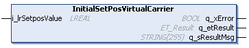

# IF\_Motion - InitialSetPosVirtualCarrier (Method)

## Overview

|  |  |
| --- | --- |
| Type: | Method |
| Available as of: | V1.0.0.0 |

## Task

Setting the position of a carrier on a virtual Lexium™ MC multi carrier transport system.

## Description

With the method InitialSetPosVirtualCarrier, you can set the position of a carrier. The track ID of the carrier object is set to the same value as the track ID of the track object assigned to the same instance of the function block [FB\_Multicarrier](FB_Multicarrier-5B874FA7.html#FB_Multicarrier-5B874FA7).

The method is only applicable to virtual Lexium™ MC multi carrier transport systems.

NOTE: Use this method for virtual multi-track systems with several Lexium™ MC multi carrier tracks.

## Inputs

| Input | Data type | Description |
| --- | --- | --- |
| i\_lrSetPosValue | LREAL | Specifies the absolute value of the reference position for the carrier on a virtual Lexium™ MC multi carrier transport system. |

## Outputs

| Output | Data type | Description |
| --- | --- | --- |
| q\_xError | BOOL | Indicates TRUE if an error has been detected. For details, refer to q\_etResult and q\_sResultMsg. |
| q\_etResult | [ET\_Result](ET_Result-509D6EF3.html#ET_Result-509D6EF3) | Provides diagnostic and status information as a numeric value. If q\_xError = FALSE, q\_etResult provides status information. If q\_xError = TRUE, q\_etResult provides diagnostic/error information. |
| q\_sResultMsg | STRING [255] | Provides additional diagnostic and status information as a text message. |

EIO0000004641.10