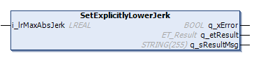

# IF\_Motion - SetExplicitlyLowerJerk (Method)

## Overview

|  |  |
| --- | --- |
| Type: | Method |
| Available as of: | V1.1.9.0 |

## Task

Setting the jerk parameter.

## Description

With the method SetExplicitlyLowerJerk, you can choose a lower value than the calculated value for the maximum jerk (change of acceleration per time unit) with which the motion of the carrier must be executed.

When using the method [SetMotionParameter](IF_Motion-SetMotionParameterMethod-534A9C05.html), the value of lrMaxAbsJerk is set to 10 times greater than the value for lrMaxAcceleration (or lrMaxDeceleration) if it is less than that calculated value. If the value of lrMaxAbsJerk is greater than that calculated value, then the greater value is retained.

NOTE: Internally, it is determined which value is greater between lrMaxAcceleration and lrMaxDeceleration. The greater value is used for the calculation of the jerk.

The method SetExplicitlyLowerJerk must be called after the method SetMotionParameter, to override this calculated value.

NOTE: The modified jerk value is not considered for the running move command but for the next move command.

NOTE: If the jerk value is not within the valid value range, a diagnostic message is generated and the modified jerk value is not considered for the next move command. The next move command uses the last valid jerk value.

NOTE: The jerk value defined with the method SetExplicitlyLowerJerk must be smaller than the corresponding jerk value defined with the method [SetEmergencyParameter](IF_MulticarrierConfiguration-SetEme-7E9E3DC9.html#IF_MulticarrierConfiguration-SetEme-7E9E3DC9).

## Inputs

| Input | Data type | Value range | Unit | Description |
| --- | --- | --- | --- | --- |
| i\_lrMaxAbsJerk | LREAL | GCL.Gc\_lrMinAbsJerk ≤  i\_ lrMaxAbsJerk ≤  GCL.Gc\_lrMaxAbsJerk (1) | mm/s3 | Specifies the maximum jerk (change of acceleration per time unit). |
| **(1)** For more information on the value range, refer to the [Global Constants List (GCL)](GlobalConstantsListGCL-50A754B1.html#GlobalConstantsListGCL-50A754B1). | | | | |

## Outputs

| Output | Data type | Description |
| --- | --- | --- |
| q\_xError | BOOL | Indicates TRUE if an error has been detected. For details, refer to q\_etResult and q\_sResultMsg. |
| q\_etResult | [ET\_Result](ET_Result-509D6EF3.html#ET_Result-509D6EF3) | Provides diagnostic and status information as a numeric value. If q\_xError = FALSE, q\_etResult provides status information. If q\_xError = TRUE, q\_etResult provides diagnostic/error information. |
| q\_sResultMsg | STRING [255] | Provides additional diagnostic and status information as a text message. |

EIO0000004641.10