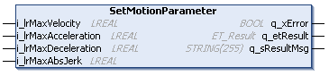

# IF\_Motion - SetMotionParameter (Method)

## Overview

|  |  |
| --- | --- |
| Type: | Method |
| Available as of: | V1.0.0.0 |

## Task

Setting the motion parameters.

## Description

With the method SetMotionParameter, you can specify the maximum velocity (change of position per time unit), the maximum acceleration/deceleration (change of velocity per time unit), and the maximum jerk (change of acceleration per time unit) with which the motion of the carrier must be executed.

NOTE: Modified motion values are not considered for the running move command but for the next move command.

NOTE: If one or more of the motion parameters are not within the valid value range, a diagnostic message is generated and the modified motion values are not considered for the next move command. The next move command uses the last valid set of motion parameters.

NOTE: The values defined with the method SetMotionParameter must be smaller than the corresponding values defined with the method [SetEmergencyParameter](IF_MulticarrierConfiguration-SetEme-7E9E3DC9.html#IF_MulticarrierConfiguration-SetEme-7E9E3DC9).

NOTE: When an antislosh mode is activated, the values of the inputs i\_lrMaxAcceleration and i\_lrMaxDeceleration must be identical.  
For more information on antislosh modes, refer to the enumeration ET\_AntisloshMode ([ET\_AntisloshMode](ET_AntisloshMode-862CB87D.html)) as well as to the StartAntislosh methods ([IF\_MoveDirectly - StartAntislosh](MoveDirectly-StartAntislosh-86A6B45A.html), [IF\_MoveGapControl - StartAntislosh](MoveGap-StartAntislosh-86A10BCB.html)).

## Inputs

| Input | Data type | Value range | Unit | Description |
| --- | --- | --- | --- | --- |
| i\_lrMaxVelocity | LREAL | GCL.Gc\_lrMinVelocity ≤  i\_lrMaxVelocity ≤  GCL.Gc\_lrMaxVelocity (1) | mm/s | Specifies the maximum velocity (change of position per time unit). |
| i\_lrMaxAcceleration | LREAL | GCL.Gc\_lrMinAcceleration ≤  i\_lrMaxAcceleration ≤  GCL.Gc\_lrMaxAcceleration (1) | mm/s2 | Specifies the maximum acceleration (change of velocity per time unit). |
| i\_lrMaxDeceleration | LREAL | GCL.Gc\_lrMinDeceleration ≤  i\_lrMaxDeceleration ≤  GCL.Gc\_lrMaxDeceleration (1) | mm/s2 | Specifies the maximum deceleration (change of velocity per time unit). |
| i\_lrMaxAbsJerk | LREAL | GCL.Gc\_lrMinAbsJerk ≤  i\_ lrMaxAbsJerk ≤  GCL.Gc\_lrMaxAbsJerk (1)  AND  i\_ lrMaxAbsJerk ≥  i\_lrMaxAcceleration (2) × 10 (3) | mm/s3 | Specifies the maximum jerk (change of acceleration per time unit). |
| **(1)** For more information on the value range, refer to the [Global Constants List (GCL)](GlobalConstantsListGCL-50A754B1.html#GlobalConstantsListGCL-50A754B1).  **(2)** Internally, it is determined which value is greater between i\_lrMaxAcceleration and i\_lrMaxDeceleration. The greater value is used for this calculation.  **(3)** The value of i\_ lrMaxAbsJerk must be greater than or equal to 10 times the value of i\_lrMaxAcceleration (or i\_lrMaxDeceleration, whichever of the two is greater). If this is not the case, it is internally set to a value that is 10 times the value of i\_lrMaxAcceleration or i\_lrMaxDeceleration. NOTE: For setting a lower value than the calculated value for i\_ lrMaxAbsJerk, you can use the method [SetExplicitlyLowerJerk](SetExplicitlyLowerJerk-2D871D00.html). | | | | |

## Outputs

| Output | Data type | Description |
| --- | --- | --- |
| q\_xError | BOOL | Indicates TRUE if an error has been detected. For details, refer to q\_etResult and q\_sResultMsg. |
| q\_etResult | [ET\_Result](ET_Result-509D6EF3.html#ET_Result-509D6EF3) | Provides diagnostic and status information as a numeric value. If q\_xError = FALSE, q\_etResult provides status information. If q\_xError = TRUE, q\_etResult provides diagnostic/error information. |
| q\_sResultMsg | STRING [255] | Provides additional diagnostic and status information as a text message. |

EIO0000004641.10