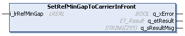
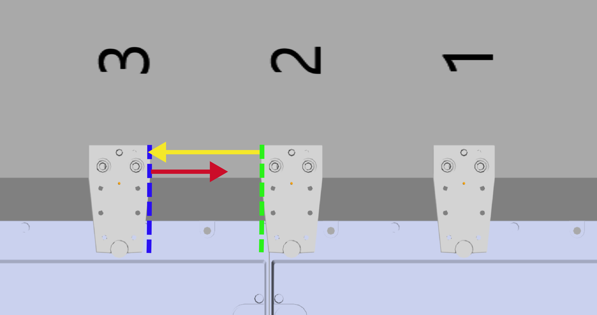
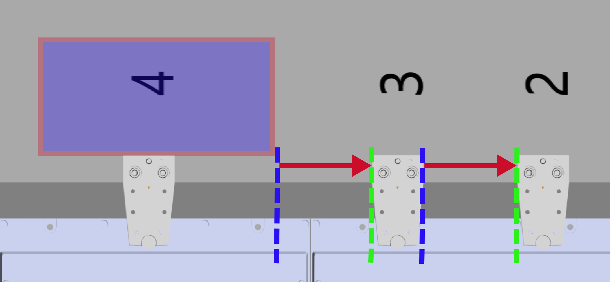
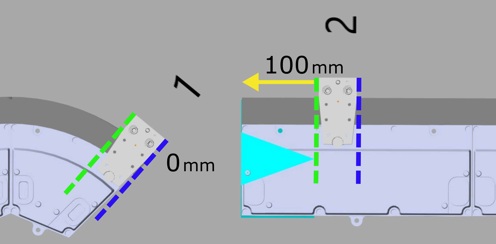

# IF\_Motion - SetRefMinGapToCarrierInFront (Method)

## Overview

|  |  |
| --- | --- |
| Type: | Method |
| Available as of: | V1.0.0.0 |

## Task

Setting the minimum gap to the carrier in front.

(For more information on the carrier positions, refer to the [general description](IntroMC_MovDir-10BB46E9.html#IntroMC_MovDir-10BB46E9__InFrontBehind-10BB584B) of a Lexium™ MC multi carrier track.)

## Description

With the method SetRefMinGapToCarrierInFront, you can specify the minimum gap between the selected carrier and the carrier in front.

The properties FrontOffset and RearOffset (based on the [ToolDimensions](IF_CarrierConfiguration-SetToolDime-51BFC8FC.html#IF_CarrierConfiguration-SetToolDime-51BFC8FC) and the [ToolOffset](IF_CarrierConfiguration-SetToolOffs-51C243A4.html#IF_CarrierConfiguration-SetToolOffs-51C243A4) as well as the [ProductDimensions](IF_CarrierConfiguration-SetProductD-514499A8.html#IF_CarrierConfiguration-SetProductD-514499A8) and the [ProductOffset](IF_CarrierConfiguration-SetProductO-51C0FECB.html#IF_CarrierConfiguration-SetProductO-51C0FECB)) are taken into account.

For the minimum gap of the first and the last carrier on an open track, only the carrier is taken into account for the RearOffset and/or the FrontOffset, not the tool (ToolDimensions and ToolOffset) nor the product (ProductDimensions and ProductOffset). For an example of an open track, see [Example for Open Track](#IF_Motion-SetRefMinGapToCarrierInFr-6E20C338__ExampleForOpenTrackSystem-D71F0555).

For more details on the properties FrontOffset and RearOffset, refer to [IF\_CarrierFeedbackConfiguration - General Information](CarrFeedbConf-E1D3F75B.html#CarrFeedbConf-E1D3F75B).

## Example without Additional Offsets

*Conditions:*

* Moving direction of the carriers: from left to right (clockwise).
* The red-marked minimum gap of carrier 3 in relation to the carrier in front is set to 70 mm (2.76 in).
* The yellow-marked minimum gap of carrier 2 in relation to the carrier behind is set to 100 mm (3.94 in).

*Result:*

* Carrier 3 has to maintain a gap of 100 mm (3.94 in) considering the FrontOffset (blue dotted line) of carrier 3 and the RearOffset (green dotted line) of carrier 2.

## Example with Additional Offset

*Conditions:*

* Moving direction of the carriers: from left to right (clockwise).
* The red-marked minimum gap for the carriers in relation to the carriers in front is set to 50 mm (1.97 in).
* For carrier 4, the ProductOffset has to be considered for the FrontOffset.

*Result:*

* The gap for carrier 4 is considering the minimum gap plus the ProductOffset.

## Example for Open Track

For the minimum gap of the first and the last carrier on an open track, only the carrier is taken into account for the FrontOffset and/or the RearOffset, not the tool (ToolDimensions and ToolOffset) nor the product (ProductDimensions and ProductOffset).

*Conditions:*

* Moving direction of the carriers: from left to right (clockwise).
* For carrier 1, the minimum gap (to carriers) in front is set to 0 mm (0.00 in).
* For carrier 2, the minimum gap (to carriers) behind is set to 100 mm (3.94 in).

*Result:*

* For carrier 1, the gap between the end position of the track and the last carrier is 0 mm (0.00 in). The tool and the product for carrier 1 are not considered.
* For carrier 2, the gap between the start position of the track and the first carrier is 100 mm (3.94 in). The tool and the product for carrier 2 are not considered.

## Inputs

| Input | Data type | Value range | Unit | Description |
| --- | --- | --- | --- | --- |
| i\_lrRefMinGap | LREAL | i\_lrRefMinGap ≥ 0.0 | mm | Specifies the minimum gap to the carrier in front.  The FrontOffset and/or the RearOffset is taken into account.  For more details on the properties FrontOffset and RearOffset, refer to [IF\_CarrierFeedbackConfiguration - General Information](CarrFeedbConf-E1D3F75B.html#CarrFeedbConf-E1D3F75B). |

## Outputs

| Output | Data type | Description |
| --- | --- | --- |
| q\_xError | BOOL | Indicates TRUE if an error has been detected. For details, refer to q\_etResult and q\_sResultMsg. |
| q\_etResult | [ET\_Result](ET_Result-509D6EF3.html#ET_Result-509D6EF3) | Provides diagnostic and status information as a numeric value. If q\_xError = FALSE, q\_etResult provides status information. If q\_xError = TRUE, q\_etResult provides diagnostic/error information. |
| q\_sResultMsg | STRING [255] | Provides additional diagnostic and status information as a text message. |

EIO0000004641.10