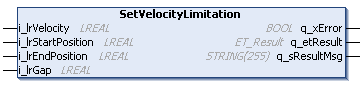
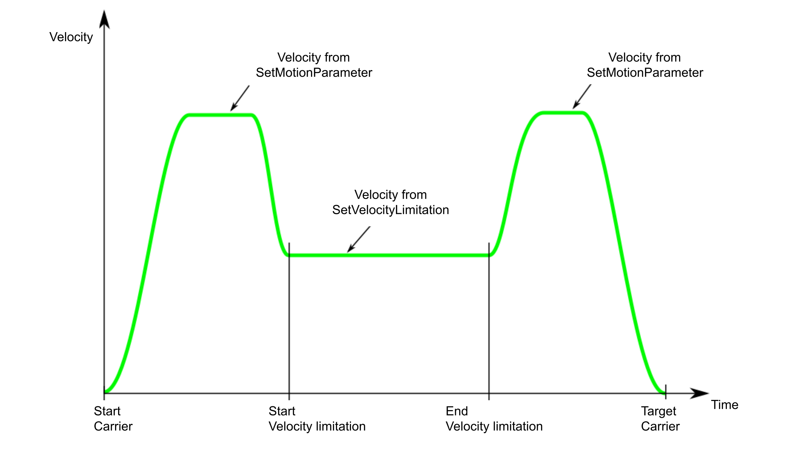

# IF\_Motion - SetVelocityLimitation (Method)

## Overview

|  |  |
| --- | --- |
| Type: | Method |
| Available as of: | V1.0.0.0 |

## Task

Setting a limited velocity between a defined start position and a defined end position.

## Description

The method SetVelocityLimitation works in combination with the move command [MoveGapControl](IF_MoveGapControl-5B81ACFA.html#IF_MoveGapControl-5B81ACFA). When a carrier is sent to a target via a MoveGapControl command, you can set a limited velocity for a section that is defined by a start position and an end position. The carrier is decelerating before the start position and accelerating after the end position of the velocity limitation section.

NOTE: The command MoveGapControl considers only one velocity limitation section. For another velocity limitation section, the command MoveGapControl must be called again.

  

|  |  |
| --- | --- |
|  | For a visual illustration of the velocity limitation option, refer to the [velocity limitation](../../../../../api/video?lang=en-US&bookKey=12b7d85fa51c27993eba220464d3f92e7f4b2e169ad9a7e8385a2a97ab6ec332&videoName=MLSLib_VelLimit.mp4) video sequence. |

## Inputs

| Input | Data type | Value range | Unit | Description |
| --- | --- | --- | --- | --- |
| i\_lrVelocity | LREAL | 0.0 ≤ i\_lrVelocity ≤ i\_lrMaxVelocity | mm/s | Specifies the velocity of a carrier at i\_lrStartPosition.  For more information on the parameter i\_lrMaxVelocity, refer to the method [SetMotionParameter](IF_Motion-SetMotionParameterMethod-534A9C05.html#IF_Motion-SetMotionParameterMethod-534A9C05__Inputs-534AB186). |
| i\_lrStartPosition | LREAL | 0.0 ≤ i\_ lrStartPosition ≤ lrTrackLength(1) | mm | Specifies the start position that the carrier must have before velocity limitation. |
| i\_lrEndPosition | LREAL | 0.0 ≤ i\_ lrEndPosition ≤ lrTrackLength(1) | mm | Specifies the end position that the carrier must have after velocity limitation. |
| i\_lrGap | LREAL | 0.0 ≤ i\_lrGap ≤ lrTrackLength(1) | mm | Specifies a minimum (not constant) gap of the selected carrier to a carrier in front and/or a carrier behind for a section of the track with velocity limitation.  If the value for the parameter i\_lrGap is lower than the minimum gap defined by the parameter SetRefMinGapToCarrierInFront and/or SetRefMinGapToCarrierBehind, the gap i\_lrGap is internally set to this minimum gap. |
| **(1)** For more information on the track length, refer to [lrTrackLength](FeedbConfig-D619B88F.html#FeedbConfig-D619B88F). | | | | |

## Outputs

| Output | Data type | Description |
| --- | --- | --- |
| q\_xError | BOOL | Indicates TRUE if an error has been detected. For details, refer to q\_etResult and q\_sResultMsg. |
| q\_etResult | [ET\_Result](ET_Result-509D6EF3.html#ET_Result-509D6EF3) | Provides diagnostic and status information as a numeric value. If q\_xError = FALSE, q\_etResult provides status information. If q\_xError = TRUE, q\_etResult provides diagnostic/error information. |
| q\_sResultMsg | STRING [255] | Provides additional diagnostic and status information as a text message. |

EIO0000004641.10