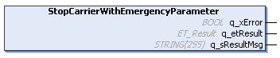

# IF\_Motion - StopCarrierWithEmergencyParameter (Method)

## Overview

|  |  |
| --- | --- |
| Type: | Method |
| Available as of: | V1.0.0.0 |



## Task

Stopping the carrier movement with emergency parameters.

## Description

The method StopCarrierWithEmergencyParameter stops the carrier movement with emergency parameters and aborts previous move commands.

NOTE: The method must be finished before starting a new move command.

When the method is called, the carrier is stopped with a positioning command setting the velocity to zero:

```
Vel = 0
```

The motion parameters specified by the method SetEmergencyParameter (MaxAcceleration, MaxDeceleration, and MaxAbsJerk) are used for stopping the movement. For more details on setting the emergency parameters, refer to [SetEmergencyParameter](IF_MulticarrierConfiguration-SetEme-7E9E3DC9.html#IF_MulticarrierConfiguration-SetEme-7E9E3DC9).

The carrier movement is stopped by executing a standard stop motion profile; antislosh motion profiles are not considered. For more information on antislosh move commands, refer to the methods [IF\_MoveDirectly - StartAntislosh](MoveDirectly-StartAntislosh-86A6B45A.html#MoveDirectly-StartAntislosh-86A6B45A) and [IF\_MoveGapControl - StartAntislosh](MoveGap-StartAntislosh-86A10BCB.html#MoveGap-StartAntislosh-86A10BCB).

  

With the method IF\_Motion - StopCarrierWithEmergencyParameter, the movement of the carrier is stopped without considering other carriers, for example without considering if the carrier in front stops faster. Take this into account during path planning.

| CAUTION | |
| --- | --- |
|  | CARRIER Collision  Define the carrier path in a way that avoids collisions with other carriers.  Failure to follow these instructions can result in injury or equipment damage. |

NOTE: You can use the function block [FB\_CrashPrevention](FB_CrashPrev-B100416B.html#FB_CrashPrev-B100416B) as an additional protection measure to help avoid collisions.

## Inputs

The method has no inputs.

## Outputs

| Output | Data type | Description |
| --- | --- | --- |
| q\_xError | BOOL | Indicates TRUE if an error has been detected. For details, refer to q\_etResult and q\_sResultMsg. |
| q\_etResult | [ET\_Result](ET_Result-509D6EF3.html#ET_Result-509D6EF3) | Provides diagnostic and status information as a numeric value. If q\_xError = FALSE, q\_etResult provides status information. If q\_xError = TRUE, q\_etResult provides diagnostic/error information. |
| q\_sResultMsg | STRING [255] | Provides additional diagnostic and status information as a text message. |

EIO0000004641.10