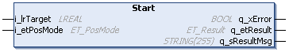

# IF\_MoveDirectly - Start (Method)

## Overview

|  |  |
| --- | --- |
| Type: | Method |
| Available as of: | V1.0.0.0 |



## Task

Moving the carrier to a target position without considering other carriers.

## Description

With the method IF\_MoveDirectly - Start, the carrier is moved to a given target position without considering other carriers. The carrier is moved to the target with the velocity, the acceleration and the jerk that have been defined with the method [SetMotionParameter](IF_Motion-SetMotionParameterMethod-534A9C05.html#IF_Motion-SetMotionParameterMethod-534A9C05).

NOTE: When executing this move command, you override previous move commands.

With the move command MoveDirectly, the carrier moves directly to the target position without considering the other carriers. Take this into account during path planning.

| CAUTION | |
| --- | --- |
|  | CARRIER Collision  Define the carrier path in a way that avoids collisions with other carriers.  Failure to follow these instructions can result in injury or equipment damage. |

NOTE: You can use the function block [FB\_CrashPrevention](FB_CrashPrev-B100416B.html#FB_CrashPrev-B100416B) as an additional protection measure to help avoid collisions.

NOTE: If, in case of an open-track system (see [open track example](IF_Motion-SetRefMinGapToCarrierInFr-6E20C338.html#IF_Motion-SetRefMinGapToCarrierInFr-6E20C338__ExampleForOpenTrackSystem-D71F0555)), the target position exceeds the start or end hardware limits of the track, the carrier moves to the maximum position within the hardware limits.

With an open track, the carriers could leave the track at the ends. Therefore, mechanical hard stops must be mounted at both ends of an open track.

| WARNING | |
| --- | --- |
|  | Unintended Equipment OPERATION  Mount mechanical hard stops at both ends of an open track.  Failure to follow these instructions can result in death, serious injury, or equipment damage. |

## Feedbacks

Feedbacks are available in the interface [IF\_CarrierFeedbackMoveDirectly](IF_FeedbackMoveDirectly-54C7AC81.html#IF_FeedbackMoveDirectly-54C7AC81).

## Inputs

| Input | Data type | Value range | Unit | Description |
| --- | --- | --- | --- | --- |
| i\_lrTarget | LREAL | 0.0 ≤ i\_lrTarget ≤ lrTrackLength (1) | mm | Specifies the travel distance to the target. The travel distance to the target depends on the positioning mode defined by the parameter i\_etPosMode. |
| i\_etPosMode | ET\_PosMode | – | – | For the positioning modes available, refer to the enumeration [ET\_PosMode](ET_PosMode-GeneralInformation-6D8695BB.html). |
| **(1)** In the positioning modes Relative and Absolute, i\_lrTarget is not limited to the track length as specified by the parameter lrTrackLength when the track is a closed track.  For more information on the track length, refer to [lrTrackLength](FeedbConfig-D619B88F.html#FeedbConfig-D619B88F). | | | | |

## Outputs

| Output | Data type | Description |
| --- | --- | --- |
| q\_xError | BOOL | Indicates TRUE if an error has been detected. For details, refer to q\_etResult and q\_sResultMsg. |
| q\_etResult | [ET\_Result](ET_Result-509D6EF3.html#ET_Result-509D6EF3) | Provides diagnostic and status information as a numeric value. If q\_xError = FALSE, q\_etResult provides status information. If q\_xError = TRUE, q\_etResult provides diagnostic/error information. |
| q\_sResultMsg | STRING [255] | Provides additional diagnostic and status information as a text message. |

## Call Examples

Before executing the method IF\_MoveDirectly - Start, the method SetMotionParameter must be called at least once.

Example 1:

```
...ifMotion.SetMotionParameter(...)
...ifMoveDirectly.Start(...)
```

Example 2:

```
...ifMotion.SetMotionParameter(...)
...ifMoveDirectly.Start(...)
...ifMoveDirectly.Start(...)
```

EIO0000004641.10