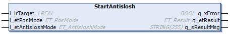

# IF\_MoveDirectly - StartAntislosh (Method)

## Overview

|  |  |
| --- | --- |
| Type: | Method |
| Available as of: | V1.3.7.0 |



## Task

Moving the carrier to a target position with an additional antislosh motion profile, without considering other carriers.

## Description

When transporting liquids in open bottles or open containers on a Lexium™ MC multi carrier track, liquid could slosh out. To help prevent or reduce the sloshing of homogeneous liquids, you can use the method IF\_MoveDirectly - StartAntislosh.

With the method IF\_MoveDirectly - StartAntislosh, the carrier is moved to a given target position without considering other carriers, similarly to the method [IF\_MoveDirectly - Start](IF_MoveDirectly-StartMethod-5445716E.html). Additionally, an antislosh motion profile helps to flatten the wave profile of the transported liquid. For the internal calculation of the antislosh motion profile, the natural damping coefficient and the natural frequency of the liquid, specified with the method [IF\_CarrierConfiguration - SetAntisloshParameter](CarrConfig_SetAntislosh-86359640.html#CarrConfig_SetAntislosh-86359640), are taken into account.

NOTE: For executing the method StartAntislosh, the liquid must be at rest.

NOTE: When executing the method StartAntislosh, you override previous move commands.

NOTE: Before setting a new StartAntislosh move command during the execution of an active antislosh profile, verify that the carrier is in the phase of constant velocity or in standstill. For verification, refer to etAntisloshPhase in the interface [IF\_CarrierFeedbackMoveDirectly](IF_FeedbackMoveDirectly-54C7AC81.html#IF_FeedbackMoveDirectly-54C7AC81).

NOTE: When an antislosh mode is activated, the values for lrMaxAcceleration and lrMaxDeceleration, set with the method [IF\_Motion - SetMotionParameter](IF_Motion-SetMotionParameterMethod-534A9C05.html#IF_Motion-SetMotionParameterMethod-534A9C05__Inputs-534AB186), must be identical.

Antislosh Motion Profile


**1** Acceleration phase

**2** Velocity phase

**3** Deceleration phase

  

With an open track, the carriers could leave the track at the ends. Therefore, mechanical hard stops must be mounted at both ends of an open track.

| WARNING | |
| --- | --- |
|  | Unintended Equipment OPERATION  Mount mechanical hard stops at both ends of an open track.  Failure to follow these instructions can result in death, serious injury, or equipment damage. |

## Feedbacks

Feedbacks are available in the interface [IF\_CarrierFeedbackMoveDirectly](IF_FeedbackMoveDirectly-54C7AC81.html#IF_FeedbackMoveDirectly-54C7AC81).

## Inputs

| Input | Data type | Value range | Unit | Description |
| --- | --- | --- | --- | --- |
| i\_lrTarget | LREAL | 0.0 ≤ i\_lrTarget ≤ lrTrackLength (1) | mm | Specifies the distance to the end target. The travel distance to the target depends on the positioning mode defined by the parameter i\_etPosMode. |
| i\_etPosMode | ET\_PosMode | – | – | For the positioning modes available, refer to the enumeration [ET\_PosMode](ET_PosMode-GeneralInformation-6D8695BB.html). |
| i\_etAntisloshMode | ET\_AntisloshMode | – | – | For the antislosh modes Standard and Advanced, refer to the enumeration [ET\_AntisloshMode](ET_AntisloshMode-862CB87D.html#ET_AntisloshMode-862CB87D). |
| **(1)** In the positioning modes Relative and Absolute, i\_lrTarget is not limited to the track length as specified by the parameter lrTrackLength when the track is a closed track.  For more information on the track length, refer to [lrTrackLength](FeedbConfig-D619B88F.html#FeedbConfig-D619B88F). | | | | |

## Outputs

| Output | Data type | Description |
| --- | --- | --- |
| q\_xError | BOOL | Indicates TRUE if an error has been detected. For details, refer to q\_etResult and q\_sResultMsg. |
| q\_etResult | [ET\_Result](ET_Result-509D6EF3.html#ET_Result-509D6EF3) | Provides diagnostic and status information as a numeric value. If q\_xError = FALSE, q\_etResult provides status information. If q\_xError = TRUE, q\_etResult provides diagnostic/error information. |
| q\_sResultMsg | STRING [255] | Provides additional diagnostic and status information as a text message. |

## Call Examples

Before executing the method IF\_MoveDirectly - StartAntislosh, the method [IF\_CarrierConfiguration - SetAntisloshParameter](CarrConfig_SetAntislosh-86359640.html#CarrConfig_SetAntislosh-86359640) and the method [IF\_Motion – SetMotionParameter](IF_Motion-SetMotionParameterMethod-534A9C05.html#IF_Motion-SetMotionParameterMethod-534A9C05) must be called at least once.

Example 1:

```
...ifConfiguration.SetAntisloshParameter(...)
...ifMotion.SetMotionParameter(...)
...ifMoveDirectly.StartAntislosh(...)
```

Example 2:

```
...ifConfiguration.SetAntisloshParameter(...)
...ifMotion.SetMotionParameter(...)
...ifMoveDirectly.StartAntislosh(...)
...ifMoveDirectly.StartAntislosh(...)
```

EIO0000004641.10