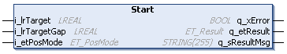

# IF\_MoveGapControl - Start (Method)

## Overview

|  |  |
| --- | --- |
| Type: | Method |
| Available as of: | V1.0.0.0 |



## Task

Moving the carrier to a target position while maintaining the defined gaps to the carriers in front and behind.

## Description

With the method IF\_MoveGapControl - Start, the carrier is moved to a given target position while maintaining a defined gap to the carrier in front or behind. The carrier is moved to the target with the velocity, the acceleration and the jerk that have been defined with the method [SetMotionParameter](IF_Motion-SetMotionParameterMethod-534A9C05.html#IF_Motion-SetMotionParameterMethod-534A9C05).

NOTE: When executing this move command, you override previous move commands.

For the movement of the carrier with the move command MoveGapControl, the minimum gap defined with the method SetRefMinGapToCarrierBehind and/or SetRefMinGapToCarrierInFront is taken into account. For more details, refer to:

* [SetRefMinGapToCarrierBehind](IF_Motion-SetRefMinGapToCarrierBehi-534E0D23.html#IF_Motion-SetRefMinGapToCarrierBehi-534E0D23)
* [SetRefMinGapToCarrierInFront](IF_Motion-SetRefMinGapToCarrierInFr-6E20C338.html#IF_Motion-SetRefMinGapToCarrierInFr-6E20C338)

When the carrier cannot move to the defined end target position because this position or the way to it is blocked, the carrier moves to the next possible temporary target position, which is a calculated position depending on the target gap. The carrier automatically continues its movement (to the next temporary target or to the end target position) as soon as the next carrier in the moving direction starts moving.

Every carrier has an internal target position. When the method IF\_MoveGapControl - Start is executed or when the carrier in front or behind receives a new target command, the carrier is calculating its new internal target position depending on the target position of the carrier in front or behind.

For the movement of the carrier to the target position, a target gap can be defined to stop the movement of the carrier if another carrier is already present at the target position. If the value for the parameter i\_lrTargetGap is lower than the minimum gap defined by the parameters SetRefMinGapToCarrierInFront and/or SetRefMinGapToCarrierBehind, the target gap is internally set to this minimum gap.

NOTE: If the carrier tool(s) and/or product(s) extend below the X axis (negative Y) and if the tool(s) and/or product(s) are wider than the outside shape of the carrier, the actual gap in a curve is smaller than the minimum gap defined. The minimum gap (between the rear and the front end of two carriers) is measured on the path described by the carrier center points when moving on the track. (For the calculation of the gap, refer to the [general gap description](IntroMC_DistGap-10C0BAC2.html#IntroMC_DistGap-10C0BAC2__Gap-10C0C813).)

| CAUTION | |
| --- | --- |
|  | Carrier Collision  Take into account the tool and product dimensions and the tool and product offset when moving carriers on curved segments.  Failure to follow these instructions can result in injury or equipment damage. |

NOTE: If the move command MoveGapControl is used in addition to the synchronized movement of a master carrier with one or more connected carriers, ensure that in the moving direction, connected carrier(s) are behind the master carrier:

* Forward movement: A master carrier with connected carrier(s) in front cannot be moved forward with the move command MoveGapControl.
* Backward movement: A master carrier with connected carrier(s) behind cannot be moved backward with the move command MoveGapControl.

NOTE: If, in case of an open-track system (see [open track example](IF_Motion-SetRefMinGapToCarrierInFr-6E20C338.html#IF_Motion-SetRefMinGapToCarrierInFr-6E20C338__ExampleForOpenTrackSystem-D71F0555)), the target position exceeds the start or end hardware limits of the track, the carrier moves to the maximum position within the hardware limits.

With an open track, the carriers could leave the track at the ends. Therefore, mechanical hard stops must be mounted at both ends of an open track.

| WARNING | |
| --- | --- |
|  | Unintended Equipment OPERATION  Mount mechanical hard stops at both ends of an open track.  Failure to follow these instructions can result in death, serious injury, or equipment damage. |

## Principles When the Next Carrier Uses MoveGapControl or MoveDirectly

If the next carrier or the master of the next carrier uses the move command MoveGapControl or MoveDirectly, the following three principles apply to the method IF\_MoveGapControl - Start:

| Principle | Description |  |
| --- | --- | --- |
| Temporary target | If the end target position i\_IrTarget is blocked, the carrier moves to the next possible temporary target. The carrier automatically moves to the next possible temporary target until it reaches the end target. Additional calls are not necessary.  If in case of an open-track system (see [open track example](IF_Motion-SetRefMinGapToCarrierInFr-6E20C338.html#IF_Motion-SetRefMinGapToCarrierInFr-6E20C338__ExampleForOpenTrackSystem-D71F0555)), the end target position exceeds the start or end hardware limits of the track, the carrier moves to the maximum position within the hardware limits (temporary target). | For a visual illustration, refer to the [Temporary target](../../../../../api/video?lang=en-US&bookKey=12b7d85fa51c27993eba220464d3f92e7f4b2e169ad9a7e8385a2a97ab6ec332&videoName=MLSLib_TempTarget.mp4) video sequence. |
| Maintain gap distance | If the positioning of the carrier cannot be started (for example, if another carrier is inside the minimum gap), the command is stored internally and will be executed by the carrier as soon as the other carrier in the moving direction is outside the minimum gap. | — |
| Cruise control | When the next carrier in the moving direction is slower than the selected carrier, the selected carrier decelerates automatically to maintain the minimum gap. When the next carrier accelerates, the selected carrier accelerates accordingly, up to the maximum configured velocity. | For a visual illustration, refer to the [Cruise control](../../../../../api/video?lang=en-US&bookKey=12b7d85fa51c27993eba220464d3f92e7f4b2e169ad9a7e8385a2a97ab6ec332&videoName=MLSLib_CruiseControl.mp4) video sequence. |

## Principles When the Next Carrier Does Not Use MoveGapControl or MoveDirectly

If the next carrier or the master of the next carrier does not use the move command MoveGapControl or MoveDirectly, the following three principles apply to the method IF\_MoveGapControl - Start:

| Principle | Description |
| --- | --- |
| Temporary target | If the end target position i\_IrTarget is blocked, the carrier moves to the next possible temporary target. The carrier only moves to the next possible temporary target if the next carrier is in standstill. It stays at the temporary target until the end target is free and then moves to the end target.  Additional calls are not necessary.  NOTE: The calculation of the temporary target does not take into account if the next carrier is moving towards the selected carrier.  If, in case of an open-track system (see [open track example](IF_Motion-SetRefMinGapToCarrierInFr-6E20C338.html#IF_Motion-SetRefMinGapToCarrierInFr-6E20C338__ExampleForOpenTrackSystem-D71F0555)), the end target position exceeds the start or end hardware limits of the track, the carrier moves to the maximum position within the hardware limits (temporary target). |
| Maintain gap distance | If the positioning of the carrier cannot be started (for example, if another carrier is inside the minimum gap), the command is stored internally and will be executed by the carrier as soon as the other carrier in the moving direction is outside the minimum gap and the next carrier is in standstill. |
| Cruise control | The carrier only moves to the temporary target and stays there until the next carrier is in standstill before moving to the next temporary target. |

## Feedbacks

Feedbacks are available in the interface [IF\_CarrierFeedbackMoveGapControl](IF_FeedbackMoveGapControl-5488A867.html#IF_FeedbackMoveGapControl-5488A867).

## Inputs

| Input | Data type | Value range | Unit | Description |
| --- | --- | --- | --- | --- |
| i\_lrTarget | LREAL | 0.0 ≤ i\_lrTarget ≤ lrTrackLength (1) | mm | Specifies the distance to the end target. The travel distance to the target depends on the positioning mode defined by the parameter i\_etPosMode. |
| i\_lrTargetGap | LREAL | 0.0 ≤ i\_lrTargetGap ≤ lrTrackLength (1) | mm | Specifies the minimum gap to the next carrier in target position.  If the value for the parameter i\_lrTargetGap is lower than the minimum gap defined by the parameter SetRefMinGapToCarrierInFront and/or SetRefMinGapToCarrierBehind, the target gap is internally set to this minimum gap. |
| i\_etPosMode | ET\_PosMode | – | – | For the positioning modes available, refer to the enumeration [ET\_PosMode](ET_PosMode-GeneralInformation-6D8695BB.html).  NOTE: The positioning modes Relative and Absolute are not allowed for the move command MoveGapControl. |
| **(1)** For more information on the track length, refer to the parameter [lrTrackLength](FeedbConfig-D619B88F.html#FeedbConfig-D619B88F). | | | | |

## Outputs

| Output | Data type | Description |
| --- | --- | --- |
| q\_xError | BOOL | Indicates TRUE if an error has been detected. For details, refer to q\_etResult and q\_sResultMsg. |
| q\_etResult | [ET\_Result](ET_Result-509D6EF3.html#ET_Result-509D6EF3) | Provides diagnostic and status information as a numeric value. If q\_xError = FALSE, q\_etResult provides status information. If q\_xError = TRUE, q\_etResult provides diagnostic/error information. |
| q\_sResultMsg | STRING [255] | Provides additional diagnostic and status information as a text message. |

## Call Examples

Before executing the method IF\_MoveGapControl - Start, the method SetMotionParameter must be called at least once.

To define a new minimum gap, the method SetRefMinGapToCarrierBehind and/or SetRefMinGapToCarrierInFront must be called at least once before calling IF\_MoveGapControl - Start. The specified value for the minimum gap remains unchanged until the method SetRefMinGapToCarrierBehind and/or SetRefMinGapToCarrierInFront is called again.

Example 1:

```
...ifMotion.SetMotionParameter(...)
...ifMoveGapControl.Start(...)
```

Example 2:

```
...ifMotion.SetMotionParameter(...)
...ifMoveGapControl.Start(...)
...ifMoveGapControl.Start(...)
```

Example 3:

```
...ifMotion.SetMotionParameter(...)
...ifMotion.SetRefMinGapToCarrierBehind (...)
...ifMoveGapControl.Start(...)
```

EIO0000004641.10