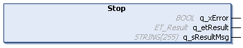

# IF\_MoveGapControl - Stop (Method)

## Overview

|  |  |
| --- | --- |
| Type: | Method |
| Available as of: | V1.0.0.0 |



## Task

Stopping the carrier movement controlled by the move command MoveGapControl.

## Description

The method IF\_MoveGapControl - Stop stops a carrier movement started by the method [IF\_MoveGapControl - Start](IF_MoveGapControl-5B81ACFA.html#IF_MoveGapControl-5B81ACFA).

When the method IF\_MoveGapControl - Stop is called, the carrier is stopped with a positioning command setting the velocity to zero:

```
Vel = 0
```

The motion parameters specified by the method SetMotionParameter (MaxAcceleration, MaxDeceleration, and MaxAbsJerk) are used for stopping the movement. For more details on the motion parameters, refer to [SetMotionParameter](IF_Motion-SetMotionParameterMethod-534A9C05.html#IF_Motion-SetMotionParameterMethod-534A9C05).

With the method IF\_MoveGapControl - Stop, the movement of the carrier is stopped without considering other carriers, for example without considering if the carrier in front stops faster. Take this into account during path planning.

| CAUTION | |
| --- | --- |
|  | CARRIER Collision  Define the carrier path in a way that avoids collisions with other carriers.  Failure to follow these instructions can result in injury or equipment damage. |

NOTE: You can use the function block [FB\_CrashPrevention](FB_CrashPrev-B100416B.html#FB_CrashPrev-B100416B) as an additional protection measure to help avoid collisions.

  

NOTE: If the carrier tool(s) and/or product(s) extend below the X axis (negative Y) and if the tool(s) and/or product(s) are wider than the outside shape of the carrier, the actual gap in a curve is smaller than the minimum gap defined. The minimum gap (between the rear and the front end of two carriers) is measured on the path described by the carrier center points when moving on the track. (For the calculation of the gap, refer to the [general gap description](IntroMC_DistGap-10C0BAC2.html#IntroMC_DistGap-10C0BAC2__Gap-10C0C813).)

| CAUTION | |
| --- | --- |
|  | Carrier Collision  Take into account the tool and product dimensions and the tool and product offset when moving carriers on curved segments.  Failure to follow these instructions can result in injury or equipment damage. |

With an open track, the carriers could leave the track at the ends. Therefore, mechanical hard stops must be mounted at both ends of an open track.

| WARNING | |
| --- | --- |
|  | Unintended Equipment OPERATION  Mount mechanical hard stops at both ends of an open track.  Failure to follow these instructions can result in death, serious injury, or equipment damage. |

## Inputs

The method has no inputs.

## Outputs

| Output | Data type | Description |
| --- | --- | --- |
| q\_xError | BOOL | Indicates TRUE if an error has been detected. For details, refer to q\_etResult and q\_sResultMsg. |
| q\_etResult | [ET\_Result](ET_Result-509D6EF3.html#ET_Result-509D6EF3) | Provides diagnostic and status information as a numeric value. If q\_xError = FALSE, q\_etResult provides status information. If q\_xError = TRUE, q\_etResult provides diagnostic/error information. |
| q\_sResultMsg | STRING [255] | Provides additional diagnostic and status information as a text message. |

EIO0000004641.10