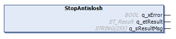
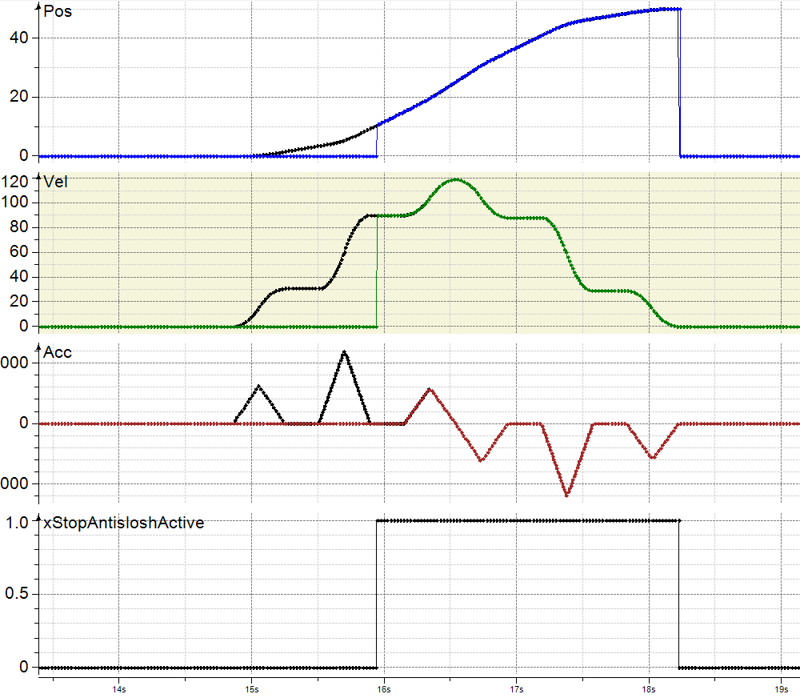
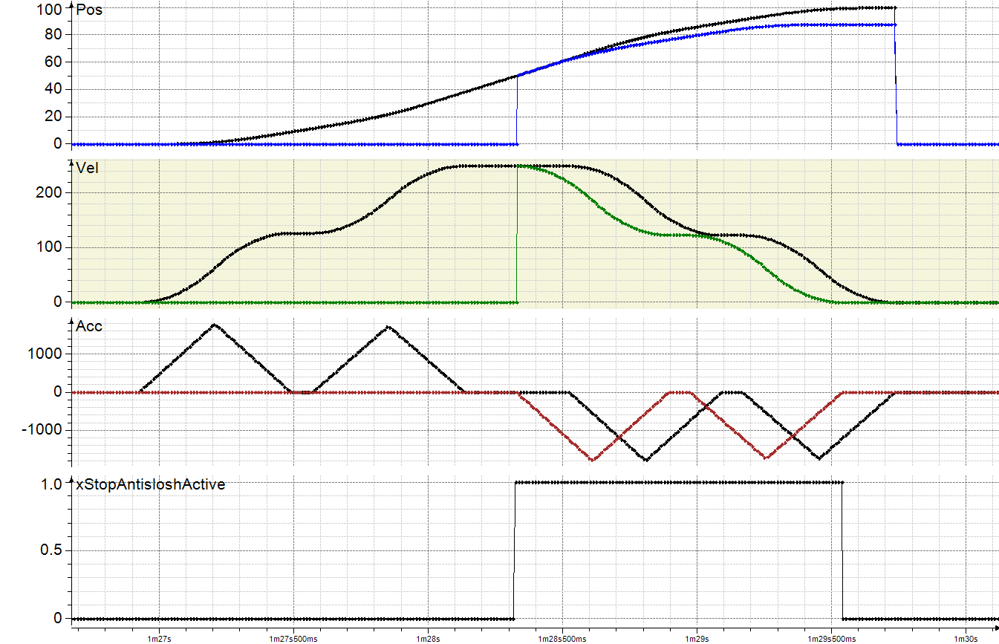
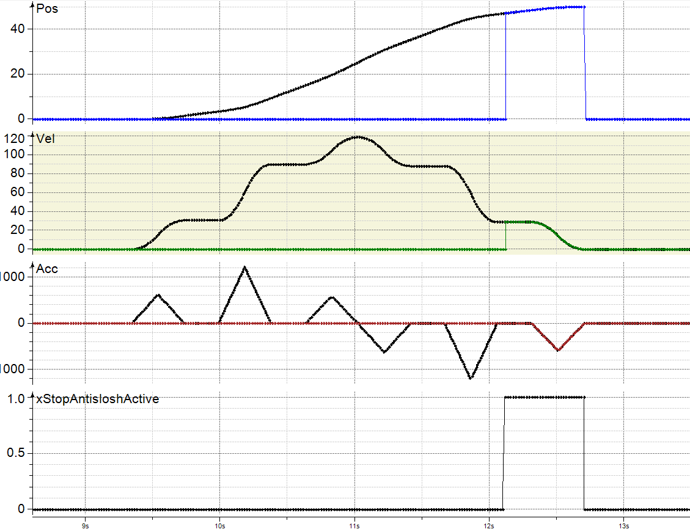

# IF\_MoveGapControl - StopAntislosh (Method)

## Overview

|  |  |
| --- | --- |
| Type: | Method |
| Available as of: | V1.5.10.0 |



## Task

Stopping the movement of a carrier that uses an antislosh motion profile, started by the method [IF\_MoveGapControl - StartAntislosh](MoveGap-StartAntislosh-86A10BCB.html#MoveGap-StartAntislosh-86A10BCB), without considering other carriers.

## Description

The method IF\_MoveGapControl - StopAntislosh stops a carrier movement started by the method IF\_MoveGapControl - StartAntislosh.

When the method IF\_MoveGapControl - StopAntislosh is called, the carrier is stopped according to an antislosh motion profile.

The motion parameters specified by the method SetMotionParameter (MaxAcceleration, MaxDeceleration, and MaxAbsJerk) are used for stopping the movement. For more details on the motion parameters, refer to [IF\_Motion - SetMotionParameter](IF_Motion-SetMotionParameterMethod-534A9C05.html#IF_Motion-SetMotionParameterMethod-534A9C05).

For the internal calculation of the antislosh motion profile, the natural damping coefficient and the natural frequency of the liquid, specified with the method [IF\_CarrierConfiguration - SetAntisloshParameter](CarrConfig_SetAntislosh-86359640.html#CarrConfig_SetAntislosh-86359640), are taken into account.

NOTE: When executing the method StopAntislosh, you override previous move commands.

An antislosh stop motion profile is applied only if the following preconditions are fulfilled:  

* The carrier is in Ready state. If not, a diagnostic message is displayed.
* No other stop command is active for the carrier. If another stop command is active, a diagnostic message is displayed and the method is not executed.
* The maximum acceleration i\_lrMaxAcceleration and the maximum deceleration i\_lrMaxDeceleration set with the method IF\_Motion - SetMotionParameter have the same value. If not, a diagnostic message is displayed and the carrier executes a standard stop profile.
* The carrier executes an antislosh move command, for example IF\_MoveGapControl - StartAntislosh. If not, a diagnostic message is displayed and the carrier executes a standard stop profile.
* The carrier respects the minimum gap to the next carrier set with the method [IF\_Motion - SetRefMinGapToCarrierBehind](IF_Motion-SetRefMinGapToCarrierBehi-534E0D23.html#IF_Motion-SetRefMinGapToCarrierBehi-534E0D23) or [IF\_Motion - SetRefMinGapToCarrierInFront](IF_Motion-SetRefMinGapToCarrierInFr-6E20C338.html#IF_Motion-SetRefMinGapToCarrierInFr-6E20C338). If the calculated gap is not sufficient for executing the antislosh stop motion profile, no diagnostic message is displayed and the carrier executes a standard stop profile. The carrier uses the motion parameters specified for the selected carrier or, in case the corresponding values are higher, the parameters for the next carrier.

  

NOTE: In case the motion profile calculated by the method IF\_MoveGapControl - StopAntislosh would lead to a carrier collision, the standard stop profile is used. This can happen when the next carrier stops or changes target.

NOTE: The execution of the new motion and antislosh parameters depends on the phases of the running antislosh profile:  

1. If the method is called during the acceleration phase of a running antislosh profile, the acceleration phase is first finished with the given antislosh and motion parameters. Then, the pending antislosh stop profile applies the deceleration profile, taking into account the pending antislosh and motion parameters.
2. If the method is called during the velocity phase of a running antislosh profile, the pending antislosh stop profile is executed immediately, taking into account the pending antislosh and motion parameters.
3. If the method is called during the deceleration phase of a running antislosh profile, the pending antislosh stop profile is ignored and the deceleration phase is executed with the specified antislosh and motion parameters. If the result of the deceleration is a standstill, the pending antislosh profile is not executed. However, if the result of the deceleration is a steady state continuation of movement, the antislosh stop is executed.

For more information on the acceleration, velocity and deceleration phases of an antislosh profile, refer to the enumeration [ET\_AntisloshPhase](ET_AntisloshPhase-862738A7.html#ET_AntisloshPhase-862738A7).

  

NOTE: If the carrier tool(s) and/or product(s) extend below the X axis (negative Y) and if the tool(s) and/or product(s) are wider than the outside shape of the carrier, the actual gap in a curve is smaller than the minimum gap defined. The minimum gap (between the rear and the front end of two carriers) is measured on the path described by the carrier center points when moving on the track. (For the calculation of the gap, refer to the [general gap description](IntroMC_DistGap-10C0BAC2.html#IntroMC_DistGap-10C0BAC2__Gap-10C0C813).)

| CAUTION | |
| --- | --- |
|  | Carrier Collision  Take into account the tool and product dimensions and the tool and product offset when moving carriers on curved segments.  Failure to follow these instructions can result in injury or equipment damage. |

  

With an open track, the carriers could leave the track at the ends. Therefore, mechanical hard stops must be mounted at both ends of an open track.

| WARNING | |
| --- | --- |
|  | Unintended Equipment OPERATION  Mount mechanical hard stops at both ends of an open track.  Failure to follow these instructions can result in death, serious injury, or equipment damage. |

## Inputs

The method has no inputs.

## Outputs

| Output | Data type | Description |
| --- | --- | --- |
| q\_xError | BOOL | Indicates TRUE if an error has been detected. For details, refer to q\_etResult and q\_sResultMsg. |
| q\_etResult | [ET\_Result](ET_Result-509D6EF3.html#ET_Result-509D6EF3) | Provides diagnostic and status information as a numeric value. If q\_xError = FALSE, q\_etResult provides status information. If q\_xError = TRUE, q\_etResult provides diagnostic/error information. |
| q\_sResultMsg | STRING [255] | Provides additional diagnostic and status information as a text message. |

## Call Examples

Before executing the method IF\_MoveGapControl - StopAntislosh, the method IF\_CarrierConfiguration - SetAntisloshParameter and the method IF\_Motion – SetMotionParameter must be called at least once, followed by an active antislosh move command like IF\_MoveGapControl - StartAntislosh.

Example 1:

```
...ifConfiguration.SetAntisloshParameter(...)
...ifMotion.SetMotionParameter(...)
...ifMoveGapControl.StartAntislosh(...)
...ifMoveGapControl.StopAntislosh(...)
```

Example 2:

```
...ifConfiguration.SetAntisloshParameter(...)
...ifMotion.SetMotionParameter(...)
...ifMoveGapControl.StartAntislosh(...)

...ifConfiguration.SetAntisloshParameter(...)
...ifMotion.SetMotionParameter(...)
...ifMoveGapControl.StopAntislosh(...)
```

EIO0000004641.10