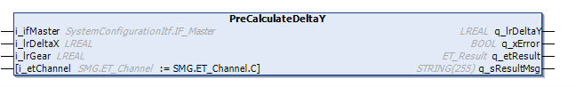
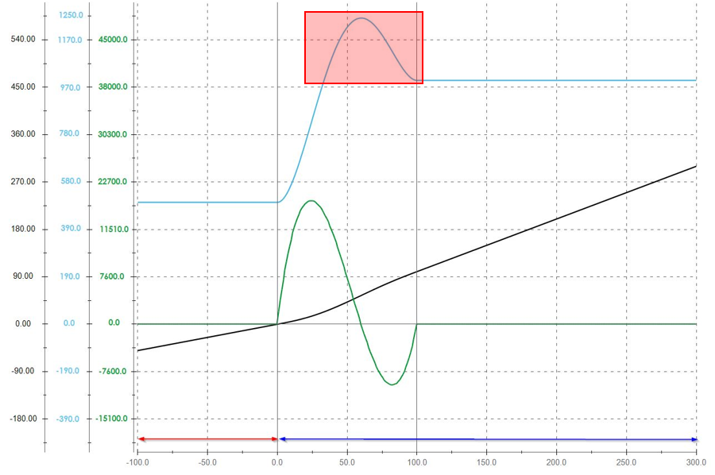
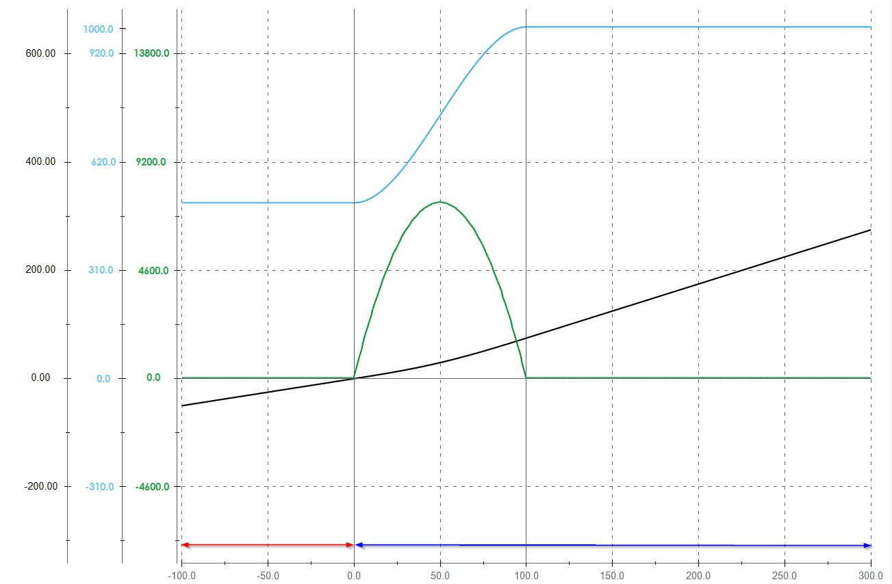

# IF\_MovePosAndSync - PreCalculateDeltaY (Method)

## Overview

|  |  |
| --- | --- |
| Type: | Method |
| Available as of: | V1.5.10.0 |



## Task

Pre-calculation of the DeltaY for the move command [StartSyncOnTheFly](MovePosSync-SyncOnTheFly-45C04DE3.html).

## Description

The method PreCalculateDeltaY allows you to calculate the DeltaY for the move command StartSyncOnTheFly for helping to avoid overshooting or undershooting of the velocity (see [Examples](#MovePosAndSync-PrecalcY-4627BE23__Examples-4627D96D)).

NOTE: The method is only applicable to movements of a master and a connected carrier with identical movement direction.

For calling the method PreCalculateDeltaY, the velocity of the master must be greater than or equal to 0.

NOTE: The master velocity must be constant during the complete phasing process.

The channel can be selected with the input i\_etChannel.

Unlike in the method StartSyncOnTheFly where you can specify a user-defined DeltaY, the following rule applies to the pre-calculation of DeltaY: If the master velocity is smaller than 20 mm/s or the velocity of the connected carrier is smaller than 0.1 mm/s, DeltaY = DeltaX/2\*lrGear. This means that in the same time period, the carrier runs half of the distance of the master multiplied with the gear factor.

With the gear factor, you can define the relation (slope) between the velocity of the master and the velocity of the connected carrier after phasing (synchronization).

**Example:**   

* Gear factor = 0.8
* Master velocity = 100 mm/s
* Velocity of the connected carrier: 80 mm/s

For more information on using the gear factor, refer to the [Examples](MovePosAndSync-StartSyncFrStand-4544E151.html#MovePosAndSync-StartSyncFrStand-4544E151__Example-4544F731) in the description of the method StartSyncFromStandstill.

NOTE: Executing this pre-calculation method does not override previous move commands on the selected channel.

## Examples

StartSyncOnTheFly without PreCalculateDeltaY 

| **Line color** | **Description** |
| --- | --- |
| Light blue | Carrier velocity |
| Green | Carrier acceleration/deceleration |
| Black | Carrier position |
| Red | Carrier following the previous master |
| Dark Blue | Carrier following the new master |

StartSyncOnTheFly with PreCalculateDeltaY 

| **Line color** | **Description** |
| --- | --- |
| Light blue | Carrier velocity |
| Green | Carrier acceleration/deceleration |
| Black | Carrier position |
| Red | Carrier following the previous master |
| Dark Blue | Carrier following the new master |

## Feedbacks

Feedbacks are available in the interface [IF\_CarrierFeedbackMovePosAndSync](CarrFeedbMovePosAndSync-46408D6C.html#CarrFeedbMovePosAndSync-46408D6C).

## Inputs

| Input | Data type | Description |
| --- | --- | --- |
| i\_ifMaster | [SystemConfigurationItf.IF\_Master](../../../../../api/crossBook?lang=en-US&virtualBookName=PD.Lib.SystemConfigurationItf&topicID=D_SE_0089174) | Access to the interface of the master.  For more information on the interface IF\_Master, refer to the [SystemConfigurationItf library](../../../../../api/crossBook?lang=en-US&virtualBookName=PD.Lib.SystemConfigurationItf&topicID=). |
| i\_lrDeltaX | LREAL | Travel distance of the master during the phasing of the connected carrier to the master movement. |
| i\_lrGear | LREAL | The gear factor for defining the relation (slope) between the velocity of the master and the velocity of the connected carrier after phasing.  **Example:**    * Gear factor = 0.8 * Master velocity = 100 mm/s * Velocity of the connected carrier: 80 mm/s |
| i\_etChannel | [SMG.ET\_Channel](../../../../../api/crossBook?lang=en-US&virtualBookName=PD.Lib.SoMotionGenerator&topicID=D_SE_0089430) | SMG channel where the MovePosAndSync cam method is to be started. |

## Outputs

| Output | Data type | Description |
| --- | --- | --- |
| q\_lrDeltaY | LREAL | Indicates the calculated DeltaY. |
| q\_xError | BOOL | Indicates TRUE if an error has been detected. For details, refer to q\_etResult and q\_sResultMsg. |
| q\_etResult | [ET\_Result](ET_Result-509D6EF3.html#ET_Result-509D6EF3) | Provides diagnostic and status information as a numeric value. If q\_xError = FALSE, q\_etResult provides status information. If q\_xError = TRUE, q\_etResult provides diagnostic/error information. |
| q\_sResultMsg | STRING [255] | Provides additional diagnostic and status information as a text message. |

## Call Examples

Before executing the method PreCalculateDeltaY, the method SetMotionParameter must be called at least once because the motion parameters are needed when calling a stop method.  
The method StartSyncOnTheFly must be called directly after the method PreCalculateDeltaY.

Example:

```
...ifMotion.SetMotionParameter(...)
...ifMovePosAndSync.PreCalculateDeltaY(...)
...ifMovePosAndSync.StartSyncOnTheFly(...)
```

EIO0000004641.10