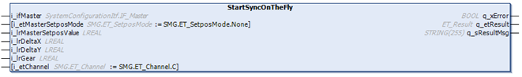
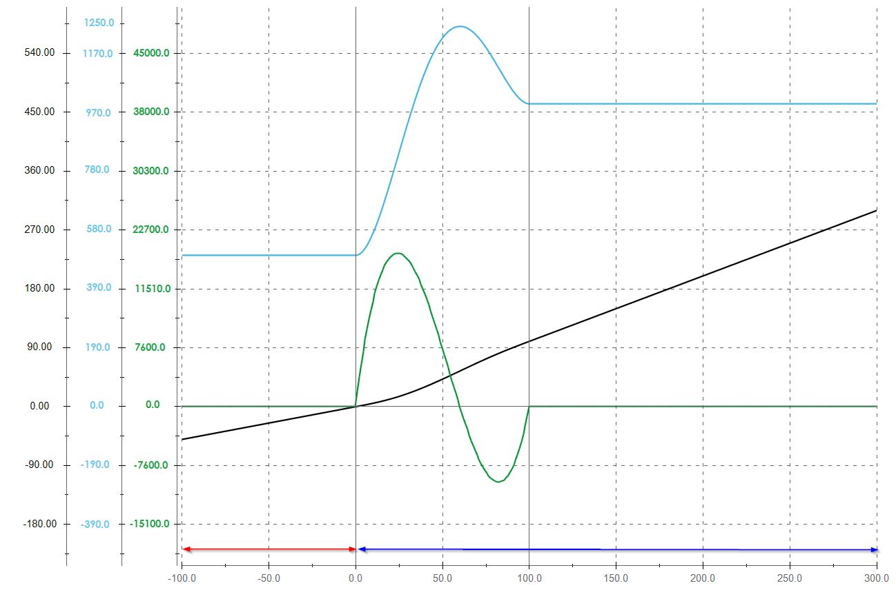

# IF\_MovePosAndSync - StartSyncOnTheFly (Method)

## Overview

|  |  |
| --- | --- |
| Type: | Method |
| Available as of: | V1.5.10.0 |



## Task

On-the-fly synchronization of the selected carrier to a new master or to a different gear factor.

## Description

The method StartSyncOnTheFly allows the on-the-fly synchronization of the selected carrier to a new master or to the defined master with a different gear factor:

NOTE: The method can be called when the master and the connected carrier are in movement.

NOTE: The method is only applicable to movements of a master and a connected carrier with identical movement direction.

The channel of the movement can be selected with the input i\_etChannel.

With the gear factor, you can define the relation (slope) between the velocity of the master and the velocity of the connected carrier after phasing.

**Example:**   

* Gear factor = 0.8
* Master velocity = 100 mm/s
* Velocity of the connected carrier: 80 mm/s

For more information on using the gear factor, refer to the method [StartSyncFromStandstill](MovePosAndSync-StartSyncFrStand-4544E151.html#MovePosAndSync-StartSyncFrStand-4544E151__Example-4544F731).

NOTE: The parameters set with the method [SetMotionParameter](IF_Motion-SetMotionParameterMethod-534A9C05.html#IF_Motion-SetMotionParameterMethod-534A9C05) are not considered.

NOTE: When executing this move command, you override previous move commands on the selected channel.

In synchronized movements of a carrier connected to an external master or to a master carrier in front or behind, the movement of the selected carrier is controlled by the master.

| CAUTION | |
| --- | --- |
|  | CARRIER Collision  Define the master movement in a way that avoids collisions with other carriers.  Failure to follow these instructions can result in injury or equipment damage. |

NOTE: You can use the function block [FB\_CrashPrevention](FB_CrashPrev-B100416B.html#FB_CrashPrev-B100416B) as an additional protection measure to help avoid collisions.

With an open track, the carriers could leave the track at the ends. Therefore, mechanical hard stops must be mounted at both ends of an open track.

| WARNING | |
| --- | --- |
|  | Unintended Equipment OPERATION  Mount mechanical hard stops at both ends of an open track.  Failure to follow these instructions can result in death, serious injury, or equipment damage. |

In a section of the master movement defined by the parameter i\_lrDeltaX, the carrier is phasing to the master movement. After setpos, XStart is internally set to the master position and the phasing starts immediately.

If the selected master is new, the velocity of the master must be > 0.  
If the selected master remains unchanged, the velocity of the master must be ≥ 0.

NOTE: The master velocity must be constant during the phasing process.

Unlike in the method [StartSyncToExternalMaster](MoveSyncExtMaster-080435F3.html), the ratio of DeltaY and DeltaX is not fixed, and you can specify a user-defined DeltaY.  
In the method StartSyncToExternalMaster, the start cam is defined as follows: In the same time period, the carrier runs half of the distance of the master (DeltaY = DeltaX/2).  
In the method StartSyncOnTheFly, the start cam is defined as follows: In the same time period, the carrier runs the distance DeltaY while the master runs the distance DeltaX.

NOTE: You can use the method [PreCalculateDeltaY](MovePosAndSync-PrecalcY-4627BE23.html#MovePosAndSync-PrecalcY-4627BE23) to calculate the value of DeltaY for helping to avoid overshooting or undershooting of the velocity.

After phasing, the carrier follows the master with a straight cam and with the selected gear factor.

NOTE: With the synchronized movement, the carrier follows the master one-to-one without considering the motion parameters specified in the method [SetMotionParameter](IF_Motion-SetMotionParameterMethod-534A9C05.html).

NOTE: The synchronization of carriers can result in deviations in the acceleration/deceleration of a synchronized carrier so that the maximum acceleration/deceleration values for the synchronized carrier could be exceeded. The maximum acceleration/deceleration values of the master carrier are not affected.

If you use a C2C Encoder Input as a master, you can use the parameter C2CEncoderInput.ApplicationDelay to compensate for the delay between the master encoder (that is, the carrier) and the C2C Encoder Output on the other controller. For carrier synchronization, an additional delay of one Sercos cycle occuring on the C2C Encoder Output side of the C2C network must be input via the parameter ApplicationDelay. The method IF\_MoveSyncFromStandstill.StartSyncToExternalMaster() uses both delay parameters ApplicationDelay and DataDelay (the delay of the C2C network) to compensate for the various delays.  
For more information, refer to the description of the Synchronized Carrier Movement via C2C in the [Lexium™ MC multi carrier Device Objects and Parameters Guide](../../../../../api/crossBook?lang=en-US&virtualBookName=MCRDOaPG&topicID=SyncCarrMovemC2C_512A42D4).  
For additional information, refer also to the description of the function FC\_SetMasterEncoder() in the [SystemInterface library](../../../../../api/crossBook?lang=en-US&virtualBookName=PD.Lib.SystemInterface&topicID=D_SE_0085311) and to the description of the C2C Encoder Input delay parameters in the [LMC Pro Device Objects and Parameters Guide](../../../../../api/crossBook?lang=en-US&virtualBookName=PD.Parameter.LMCPro&topicID=D_SE_0082657).

## Examples

**Example 1:**

* i\_etMasterSetposMode = Absolute
* i\_lrMasterSetposValue = 0.0
* i\_lrDeltaX = 100.0
* i\_lrDeltaY = 100.0
* i\_lrGear = 1.0
* Master velocity of the active master = 500 mm/s
* Master velocity of the new master = 1000 mm/s

At the end of the phasing (master position = 100):

* Position of the connected carrier = 100 mm
* Carrier velocity = 1000 mm/s
* Slope = 1.0



| **Line color** | **Description** |
| --- | --- |
| Light blue | Carrier velocity |
| Green | Carrier acceleration/deceleration |
| Black | Carrier position |
| Red | Carrier following the previous master |
| Dark Blue | Carrier following the new master |

**Example 2:**

* i\_etMasterSetposMode = Absolute
* i\_lrMasterSetposValue = 0.0
* i\_lrDeltaX = 100.0
* i\_lrDeltaY = 75.0
* i\_lrGear = 1.0
* Master velocity of the active master = 500 mm/s
* Master velocity of the new master = 1000 mm/s

At the end of the phasing (master position = 100):

* Position of the connected carrier = 75 mm
* Carrier velocity = 1000 mm/s
* Slope = 1.0


| **Line color** | **Description** |
| --- | --- |
| Light blue | Carrier velocity |
| Green | Carrier acceleration/deceleration |
| Black | Carrier position |
| Red | Carrier following the previous master |
| Dark Blue | Carrier following the new master |

## Feedbacks

Feedbacks are available in the interface [IF\_CarrierFeedbackMovePosAndSync](CarrFeedbMovePosAndSync-46408D6C.html#CarrFeedbMovePosAndSync-46408D6C).

## Inputs

| Input | Data type | Description |
| --- | --- | --- |
| i\_ifMaster | [SystemConfigurationItf.IF\_Master](../../../../../api/crossBook?lang=en-US&virtualBookName=PD.Lib.SystemConfigurationItf&topicID=D_SE_0089174) | Access to the interface of the master.  For more information on the interface IF\_Master, refer to the [SystemConfigurationItf library](../../../../../api/crossBook?lang=en-US&virtualBookName=PD.Lib.SystemConfigurationItf&topicID=). |
| i\_etMasterSetposMode | [SMG.ET\_SetposMode](../../../../../api/crossBook?lang=en-US&virtualBookName=PD.Lib.SoMotionGenerator&topicID=D_SE_0089446) | Access to the enumeration ET\_SetposMode for the setpos of the master position.  For more information on the enumeration ET\_SetposMode, refer to the [PD\_SoMotionGenerator library](../../../../../api/crossBook?lang=en-US&virtualBookName=PD.Lib.SoMotionGenerator&topicID=D_SE_0089446). |
| i\_lrMasterSetposValue | LREAL | Value for the setpos of the master position |
| i\_lrDeltaX | LREAL | Travel distance of the master during the phasing of the carrier to the master movement.  NOTE: i\_lrDeltaX > 0 |
| i\_lrDeltaY | LREAL | Travel distance of the connected carrier during the phasing of the carrier to the master movement.  NOTE: i\_lrDeltaY > 0 |
| i\_lrGear | LREAL | The gear factor for defining the relation (slope) between the velocity of the master and the velocity of the connected carrier after phasing.  NOTE: i\_lrGear > 0  **Example:**    * Gear factor = 0.8 * Master velocity = 100 mm/s * Velocity of the connected carrier: 80 mm/s |
| i\_etChannel | [SMG.ET\_Channel](../../../../../api/crossBook?lang=en-US&virtualBookName=PD.Lib.SoMotionGenerator&topicID=D_SE_0089430) | SMG channel to which the cam job is to be assigned. |

## Outputs

| Output | Data type | Description |
| --- | --- | --- |
| q\_xError | BOOL | Indicates TRUE if an error has been detected. For details, refer to q\_etResult and q\_sResultMsg. |
| q\_etResult | [ET\_Result](ET_Result-509D6EF3.html#ET_Result-509D6EF3) | Provides diagnostic and status information as a numeric value. If q\_xError = FALSE, q\_etResult provides status information. If q\_xError = TRUE, q\_etResult provides diagnostic/error information. |
| q\_sResultMsg | STRING [255] | Provides additional diagnostic and status information as a text message. |

## Call Examples

Before executing the method StartSyncOnTheFly, the method SetMotionParameter must be called at least once because the motion parameters are needed when calling a stop method.

Example:

```
...ifMotion.SetMotionParameter(...)
...ifMovePosAndSync.StartSyncOnTheFly(...)
```

EIO0000004641.10