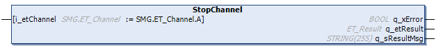

# IF\_MovePosAndSync - StopChannel (Method)

## Overview

|  |  |
| --- | --- |
| Type: | Method |
| Available as of: | V1.5.10.0 |



## Task

Stopping the carrier movement on a selected channel, controlled by the move command [MovePosAndSync](IF_MovePosAndSync-4526BC87.html#IF_MovePosAndSync-4526BC87).

For more information on the use of channels, refer to [Move Commands and Channels](Move_Channels-36D35D8B.html).

## Description

The method IF\_MovePosAndSync - StopChannel stops a carrier movement on the selected channel, started by one of the methods of the interface IF\_MovePosAndSync.

When the method IF\_MovePosAndSync - StopChannel is called, the movement of the carrier on the selected channel is stopped with a positioning command setting the velocity to zero:

```
Vel = 0
```

NOTE: The movements on other channels are not stopped by this method.

The motion parameters specified by the method SetMotionParameter (MaxAcceleration, MaxDeceleration, and MaxAbsJerk) are used for stopping the movement. For more details on the motion parameters, refer to [SetMotionParameter](IF_Motion-SetMotionParameterMethod-534A9C05.html#IF_Motion-SetMotionParameterMethod-534A9C05).

With the method IF\_MovePosAndSync - StopChannel, the movement of the carrier is stopped without considering other carriers, for example without considering if the carrier in front stops faster. Take this into account during path planning.

| CAUTION | |
| --- | --- |
|  | CARRIER Collision  Define the carrier path in a way that avoids collisions with other carriers.  Failure to follow these instructions can result in injury or equipment damage. |

NOTE: You can use the function block [FB\_CrashPrevention](FB_CrashPrev-B100416B.html#FB_CrashPrev-B100416B) as an additional protection measure to help avoid collisions.

With an open track, the carriers could leave the track at the ends. Therefore, mechanical hard stops must be mounted at both ends of an open track.

| WARNING | |
| --- | --- |
|  | Unintended Equipment OPERATION  Mount mechanical hard stops at both ends of an open track.  Failure to follow these instructions can result in death, serious injury, or equipment damage. |

## Feedbacks

Feedbacks are available in the interface [IF\_CarrierFeedbackMovePosAndSync](CarrFeedbMovePosAndSync-46408D6C.html#CarrFeedbMovePosAndSync-46408D6C).

## Inputs

| Input | Data type | Description |
| --- | --- | --- |
| i\_etChannel | [SMG.ET\_Channel](../../../../../api/crossBook?lang=en-US&virtualBookName=PD.Lib.SoMotionGenerator&topicID=D_SE_0089430) | SMG channel to which the positioning job is to be assigned. |

## Outputs

| Output | Data type | Description |
| --- | --- | --- |
| q\_xError | BOOL | Indicates TRUE if an error has been detected. For details, refer to q\_etResult and q\_sResultMsg. |
| q\_etResult | [ET\_Result](ET_Result-509D6EF3.html#ET_Result-509D6EF3) | Provides diagnostic and status information as a numeric value. If q\_xError = FALSE, q\_etResult provides status information. If q\_xError = TRUE, q\_etResult provides diagnostic/error information. |
| q\_sResultMsg | STRING [255] | Provides additional diagnostic and status information as a text message. |

EIO0000004641.10