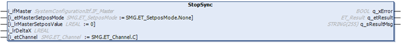
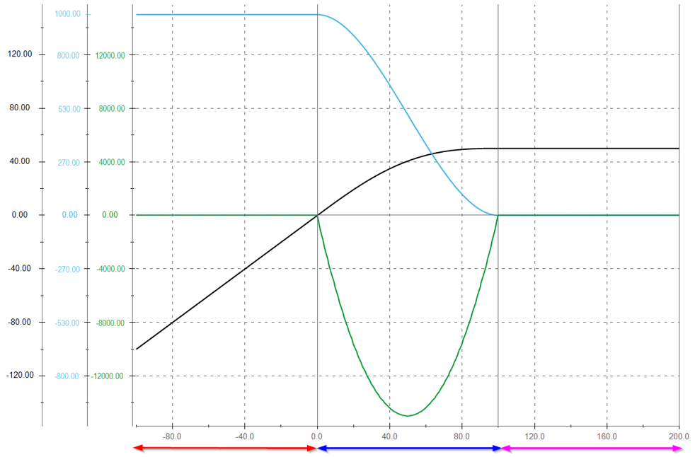

# IF\_MovePosAndSync - StopSync (Method)

## Overview

|  |  |
| --- | --- |
| Type: | Method |
| Available as of: | V1.9.12.0 |



## Task

Stopping the movement of a carrier synchronized with a master using a Poly5com profile.

## Description

The method StopSync allows the execution of a stop movement of a carrier synchronized to a master. The connected carrier stops its movement with a Poly5com profile synchronously to the master, which keeps its velocity. After phasing, the job is finished.

NOTE: The method can be called when the master and the connected carrier are in movement.

NOTE: The method is only applicable to movements of a master and a connected carrier with identical movement direction.

The channel of the movement can be selected with the input i\_etChannel.

NOTE: The parameters set with the method [SetMotionParameter](IF_Motion-SetMotionParameterMethod-534A9C05.html#IF_Motion-SetMotionParameterMethod-534A9C05) are not considered for the synchronous stop using a Poly5com profile.

NOTE: When executing this move command, you override previous move commands on the selected channel.

In synchronized movements of a carrier connected to an external master or to a master carrier in front or behind, the movement of the selected carrier is controlled by the master.

| CAUTION | |
| --- | --- |
|  | CARRIER Collision  Define the master movement in a way that avoids collisions with other carriers.  Failure to follow these instructions can result in injury or equipment damage. |

NOTE: You can use the function block [FB\_CrashPrevention](FB_CrashPrev-B100416B.html#FB_CrashPrev-B100416B) as an additional protection measure to help avoid collisions.

With an open track, the carriers could leave the track at the ends. Therefore, mechanical hard stops must be mounted at both ends of an open track.

| WARNING | |
| --- | --- |
|  | Unintended Equipment OPERATION  Mount mechanical hard stops at both ends of an open track.  Failure to follow these instructions can result in death, serious injury, or equipment damage. |

In a section of the master movement defined by the parameter i\_lrDeltaX, the carrier is desynchronizing from the master movement.

NOTE: The master velocity must be constant during the phasing process.

lrGearStart is calculated internally with the following formula:  
lrGearStart = lrVelocityOfTheChannel  / lrVelocityOfTheMaster

DeltaY is calculated internally with the following formula:   
IrDeltaY = IrDeltaX / 2 \*lrGearStart

NOTE: After phasing, the cam movement is finished and the job is not active anymore.

NOTE: If the master velocity is less than 5 mm/s or the velocity of the connected carrier is less than 5 mm/s, the carrier is not stopped with a cam. Instead, it is stopped with a StopChannel positioning stop (see [StopChannel](IF_MovePosAndSync-StopChann-453F2AC3.html#IF_MovePosAndSync-StopChann-453F2AC3)).

## Example

* i\_etMasterSetposMode = Absolute
* i\_lrMasterSetposValue = 0.0
* i\_lrDeltaX = 100.0
* Master velocity = 1000 mm/s

At the end of the phasing (master position = 100):

* Position of the connected carrier = 50 mm
* Carrier velocity = 0 mm/s



| **Line color** | **Description** |
| --- | --- |
| Light blue | Carrier velocity |
| Green | Carrier acceleration/deceleration |
| Black | Carrier position |
| Red | Carrier following the master with the previous method |
| Dark blue | Carrier desynchronizing from the master, using the method StopSync |
| Magenta | Carrier job not active anymore |

## Feedbacks

Feedbacks are available in the interface [IF\_CarrierFeedbackMovePosAndSync](CarrFeedbMovePosAndSync-46408D6C.html#CarrFeedbMovePosAndSync-46408D6C).

## Inputs

| Input | Data type | Description |
| --- | --- | --- |
| i\_ifMaster | [SystemConfigurationItf.IF\_Master](../../../../../api/crossBook?lang=en-US&virtualBookName=PD.Lib.SystemConfigurationItf&topicID=D_SE_0089174) | Access to the interface of the master.  For more information on the interface IF\_Master, refer to the [SystemConfigurationItf library](../../../../../api/crossBook?lang=en-US&virtualBookName=PD.Lib.SystemConfigurationItf&topicID=). |
| i\_etMasterSetposMode | [SMG.ET\_SetposMode](../../../../../api/crossBook?lang=en-US&virtualBookName=PD.Lib.SoMotionGenerator&topicID=D_SE_0089446) | Access to the enumeration ET\_SetposMode for the setpos of the master position.  For more information on the enumeration ET\_SetposMode, refer to the [PD\_SoMotionGenerator library](../../../../../api/crossBook?lang=en-US&virtualBookName=PD.Lib.SoMotionGenerator&topicID=D_SE_0089446). |
| i\_lrMasterSetposValue | LREAL | Value for the setpos of the master position. |
| i\_lrDeltaX | LREAL | Travel distance of the master during the desynchronization of the carrier from the master movement.  NOTE: i\_lrDeltaX must be greater than 0. |
| i\_etChannel | [SMG.ET\_Channel](../../../../../api/crossBook?lang=en-US&virtualBookName=PD.Lib.SoMotionGenerator&topicID=D_SE_0089430) | SMG channel to which the cam job is to be assigned. |

## Outputs

| Output | Data type | Description |
| --- | --- | --- |
| q\_xError | BOOL | Indicates TRUE if an error has been detected. For details, refer to q\_etResult and q\_sResultMsg. |
| q\_etResult | [ET\_Result](ET_Result-509D6EF3.html#ET_Result-509D6EF3) | Provides diagnostic and status information as a numeric value. If q\_xError = FALSE, q\_etResult provides status information. If q\_xError = TRUE, q\_etResult provides diagnostic/error information. |
| q\_sResultMsg | STRING [255] | Provides additional diagnostic and status information as a text message. |

## Call Examples

Before executing the method StopSync, the method SetMotionParameter must be called at least once because the motion parameters are needed when calling a stop method.

Example:

```
...ifMotion.SetMotionParameter(...)
...ifMovePosAndSync.StartSyncFromStandstill(...)
...ifMovePosAndSync.StopSync(...)
```

EIO0000004641.10