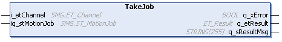

# IF\_MovePureSmg - TakeJob (Method)

## Overview

|  |  |
| --- | --- |
| Type: | Method |
| Available as of: | V1.0.0.0 |



## Task

Carrier movement with a motion job assigned to the SoMotionGenerator (SMG).

For more information on the SoMotionGenerator, refer to the [PD\_SoMotion Generator library](../../../../../api/crossBook?lang=en-US&virtualBookName=PD.Lib.SoMotionGenerator&topicID=).

## Description

With the method IF\_MovePureSmg - TakeJob, motion jobs are assigned to the SoMotionGenerator. The carrier is moved to a given target with the velocity, the acceleration and the jerk that are defined in the corresponding motion job of the SoMotionGenerator. The parameters set with the method [SetMotionParameter](IF_Motion-SetMotionParameterMethod-534A9C05.html#IF_Motion-SetMotionParameterMethod-534A9C05) are not considered.

NOTE: This move command does not automatically override on-going move commands. For information on verifying that no other move command is active, see the [Call Examples](IF_MovePureSmg-TakeJobMethod-58F0A231.html#IF_MovePureSmg-TakeJobMethod-58F0A231__CallExamples-6E18C1F4) below.

NOTE: In a Lexium™ MC multi carrier track, you can use a combination of move commands like MovePureSmg and MoveGapControl for different carriers at the same time. Keep in mind that the MovePureSmg commands on channel B and C for the selected carrier are not taken into account by the carrier in front or behind that uses, for example, the move command [MoveGapControl](IF_MoveGapControl-5B81ACFA.html).

NOTE: For the behavior of carriers using the move command MovePureSmg in combination with carriers using the move command MoveGapControl, refer to the appropriate [behavior principles](IF_MoveGapControl-StartMethod-53C5DF88.html#IF_MoveGapControl-StartMethod-53C5DF88__Principles_NotMoveGap-495858BC).

NOTE: The reference values (position, velocity, acceleration) of the different channels are summed up.

| WARNING | |
| --- | --- |
|  | Inoperable equipment or Unintended Equipment Operation  Do not exceed the physical limits of the carrier or the defined limit values.  Failure to follow these instructions can result in death, serious injury, or equipment damage. |

The move command MovePureSmg allows programmers that are experienced in the use of the SoMotionGenerator library to execute special movements.

In comparison to the standard SoMotionGenerator functions, the move command MovePureSmg provides the following features:

* Use of the carrier object.
* From the setpos modes for defining reference positions (iq\_stMotionJob.etSetposMode), only the setpos mode Relative can be used. (For more information on the enumeration ET\_SetposMode, refer to the [PD\_SoMotionGenerator library](../../../../../api/crossBook?lang=en-US&virtualBookName=PD.Lib.SoMotionGenerator&topicID=).)
* The possible values for the setpos (iq\_stMotionJob.IrSetposValue) are limited to the length of the track. (For more information on the track length, refer to [lrTrackLength](FeedbConfig-D619B88F.html#FeedbConfig-D619B88F).)

With the move command MovePureSmg, the carrier uses the positioning or the cam commands of the SoMotionGenerator without considering the other carriers. Take this into account during path planning.

| CAUTION | |
| --- | --- |
|  | CARRIER Collision  Define the master movement and the carrier path in a way that avoids collisions with other carriers.  Failure to follow these instructions can result in injury or equipment damage. |

NOTE: You can use the function block [FB\_CrashPrevention](FB_CrashPrev-B100416B.html#FB_CrashPrev-B100416B) as an additional protection measure to help avoid collisions.

With an open track, the carriers could leave the track at the ends. Therefore, mechanical hard stops must be mounted at both ends of an open track.

| WARNING | |
| --- | --- |
|  | Unintended Equipment OPERATION  Mount mechanical hard stops at both ends of an open track.  Failure to follow these instructions can result in death, serious injury, or equipment damage. |

Do not use the MovePureSmg command in combination with other Move commands for the carrier and ensure that no other move command is active for the carrier before calling the method IF\_MovePureSmg - TakeJob. For more details, refer to the [Call Examples](IF_MovePureSmg-TakeJobMethod-58F0A231.html#IF_MovePureSmg-TakeJobMethod-58F0A231__CallExamples-6E18C1F4).

## Feedback

Feedbacks are available in the interface [IF\_FeedbackMovePureSmg](IF_FeedbackMovePureSmg-58EB777B.html#IF_FeedbackMovePureSmg-58EB777B).

## Inputs

| Input | Data type | Description |
| --- | --- | --- |
| i\_etChannel | [SMG.ET\_Channel](../../../../../api/crossBook?lang=en-US&virtualBookName=PD.Lib.SoMotionGenerator&topicID=D_SE_0089430) | SMG channel to which the positioning job is to be assigned. |

## Inputs/Outputs

| Input/Output | Data type | Description |
| --- | --- | --- |
| iq\_stMotionJob | [SMG.ST\_MotionJob](../../../../../api/crossBook?lang=en-US&virtualBookName=PD.Lib.SoMotionGenerator&topicID=D_SE_0089488) | SMG job structure containing the positioning job data. |

## Outputs

| Output | Data type | Description |
| --- | --- | --- |
| q\_xError | BOOL | Indicates TRUE if an error has been detected. For details, refer to q\_etResult and q\_sResultMsg. |
| q\_etResult | [ET\_Result](ET_Result-509D6EF3.html#ET_Result-509D6EF3) | Provides diagnostic and status information as a numeric value. If q\_xError = FALSE, q\_etResult provides status information. If q\_xError = TRUE, q\_etResult provides diagnostic/error information. |
| q\_sResultMsg | STRING [255] | Provides additional diagnostic and status information as a text message. |

## Call Examples

To ensure that no other Move command is active, the following parameters must be TRUE before calling the method IF\_MovePureSmg - TakeJob:

```
stMotionJob.xClearBufferedJobs = TRUE
stMotionJob.xTerminateCurrentJob = TRUE
```

Example 1:

```
...ifMovePureSmg.TakeJob(…)
```

Example 2:

```
...ifMovePureSmg.TakeJob(…)
...ifMovePureSmg.TakeJob(…)
```

EIO0000004641.10