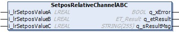

# IF\_MovePureSmg - SetposRelativeChannelABC (Method)

## Overview

|  |  |
| --- | --- |
| Type: | Method |
| Available as of: | V1.0.16.0 |



## Task

Assigning a setpos motion job to the channels A, B and C of the SoMotionGenerator (SMG), using the setpos mode Relative.

For more information on the use of channels, refer to [Move Commands and Channels](Move_Channels-36D35D8B.html).

For more information on the SoMotionGenerator, refer to the [PD\_SoMotion Generator library](../../../../../api/crossBook?lang=en-US&virtualBookName=PD.Lib.SoMotionGenerator&topicID=).

## Description

With the method IF\_MovePureSmg - SetposRelativeChannelABC, setpos motion jobs are assigned to the SoMotionGenerator. The reference position (RefPosition) of the carrier on channels A, B and C is modified by the input values i\_lrSetposValueA, i\_lrSetposValueB and i\_lrSetposValueC. With these input values, you can split the carrier position value between the channels or you can shift the carrier position by one complete track length (in positive or negative direction). (For more information on the track length, refer to [lrTrackLength](FeedbConfig-D619B88F.html#FeedbConfig-D619B88F).)

**Preconditions:**

* No motion job is active for the carrier.
* After defining the setpos values, the position of the carrier on the track must remain unchanged: The sum of the setpos values must be 0 (applicable to closed or open tracks) or correspond to one track length in positive or negative direction (only applicable to closed tracks):
  + Example values for sum of setpos values = 0: i\_lrSetposValueA = +300, i\_lrSetposValueB = -100 and i\_lrSetposValueC = -200.
  + Example values for shifting by one track length of 3700 mm: i\_lrSetposValueA = -3500, i\_lrSetposValueB = +100 and i\_lrSetposValueC = -300.

|  |  |
| --- | --- |
|  | For a visual illustration of the method SetposRelativeChannelABC, refer to the [channels ABC](../../../../../api/video?lang=en-US&bookKey=12b7d85fa51c27993eba220464d3f92e7f4b2e169ad9a7e8385a2a97ab6ec332&videoName=MLSLib_ChannABC.mp4) video sequence. |

NOTE: In a Lexium™ MC multi carrier track, you can use a combination of move commands like MovePureSmg and MoveGapControl for different carriers at the same time. Keep in mind that the MovePureSmg commands on channel B and C for the selected carrier are not taken into account by the carrier in front or behind that uses, for example, the move command [MoveGapControl](IF_MoveGapControl-5B81ACFA.html).

The move command MovePureSmg allows programmers that are experienced in the use of the SoMotionGenerator library to execute special movements.

With the move command MovePureSmg, the carrier uses the positioning or the cam commands of the SoMotionGenerator without considering the other carriers. Take this into account during path planning.

| CAUTION | |
| --- | --- |
|  | CARRIER Collision  Define the master movement and the carrier path in a way that avoids collisions with other carriers.  Failure to follow these instructions can result in injury or equipment damage. |

NOTE: You can use the function block [FB\_CrashPrevention](FB_CrashPrev-B100416B.html#FB_CrashPrev-B100416B) as an additional protection measure to help avoid collisions.

With an open track, the carriers could leave the track at the ends. Therefore, mechanical hard stops must be mounted at both ends of an open track.

| WARNING | |
| --- | --- |
|  | Unintended Equipment OPERATION  Mount mechanical hard stops at both ends of an open track.  Failure to follow these instructions can result in death, serious injury, or equipment damage. |

Do not use the MovePureSmg command in combination with other Move commands for the carrier and ensure that no other move command is active for the carrier before calling the method IF\_MovePureSmg - SetposRelativeChannelABC.

## Feedback

Feedbacks are available in the interface [IF\_CarrierFeedbackMovePureSmg](IF_FeedbackMovePureSmg-58EB777B.html#IF_FeedbackMovePureSmg-58EB777B).

## Inputs

| Input | Data type | Description |
| --- | --- | --- |
| i\_lrSetposValueA | REAL | Specifies the relative setpos value of channel A. The reference position of channel A is modified by this value. |
| i\_lrSetposValueB | REAL | Specifies the relative setpos value of channel B. The reference position of channel B is modified by this value. |
| i\_lrSetposValueC | REAL | Specifies the relative setpos value of channel C. The reference position of channel C is modified by this value. |

## Outputs

| Output | Data type | Description |
| --- | --- | --- |
| q\_xError | BOOL | Indicates TRUE if an error has been detected. For details, refer to q\_etResult and q\_sResultMsg. |
| q\_etResult | [ET\_Result](ET_Result-509D6EF3.html#ET_Result-509D6EF3) | Provides diagnostic and status information as a numeric value. If q\_xError = FALSE, q\_etResult provides status information. If q\_xError = TRUE, q\_etResult provides diagnostic/error information. |
| q\_sResultMsg | STRING [255] | Provides additional diagnostic and status information as a text message. |

## Call Example

Example:

```
...ifMovePureSmg.SetposRelativeChannelABC(…)
```

EIO0000004641.10