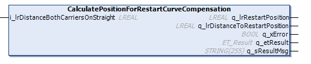
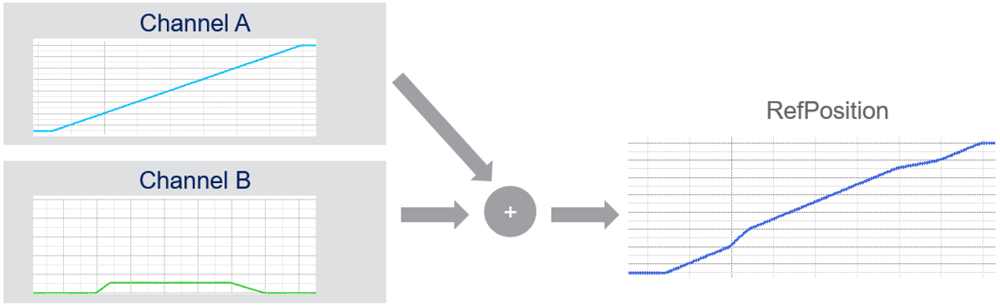
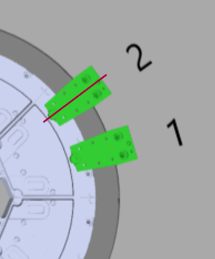
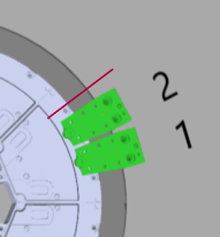
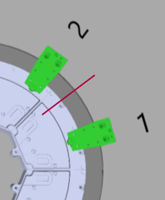

# IF\_MoveSyncFromStandstill - CalculatePositionForRestartCurveCompensation (Method)

## Overview

|  |  |
| --- | --- |
| Type: | Method |
| Available as of: | V1.2.5.0 |

## Task

Calculating the restart position of a carrier for restarting a synchronized movement with curve compensation.

## Description

The movement of a carrier with the move commands [StartSyncToCarrierInFront](IF_MoveSyncPathFromStandstill-Start-586FE52E.html) (for a synchronized movement) and [StartCurveCompensationToCarrierInFront](IF_MoveSyncPathFromStandstill-Start-58861273.html#IF_MoveSyncPathFromStandstill-Start-58861273) (for additional curve compensation) is executed on two channels:

* Channel A: movement of the master carrier to which the selected carrier is synchronized
* Channel B: additional movement for curve compensation

For more information on the use of channels, refer to [Move Commands and Channels](Move_Channels-36D35D8B.html).

The following situations require the calculation of the restart position:

* In case of a stop or an emergency stop of the machine through the application or in case of a Sercos reboot, the motion values on channel B are transferred to channel A (see general information on [channel bundling](Move_Channels-36D35D8B.html#Move_Channels-36D35D8B__ChannelBundl-36D389A6)).

  |  |  |
  | --- | --- |
  |  | For a visual illustration, refer to the [curve compensation stop](../../../../../api/video?lang=en-US&bookKey=12b7d85fa51c27993eba220464d3f92e7f4b2e169ad9a7e8385a2a97ab6ec332&videoName=MLSLib_CurveCompStop.mp4) video sequence. |
* The carrier is moved out of its initial position after a stop.

  Initial Position 

  Smaller distance 

  Larger distance 

## Restart procedure

For restarting a stopped synchronized movement with curve compensation, proceed as follows:

| Step | Action | Comment |
| --- | --- | --- |
| 1 | Call the method CalculatePositionForRestartCurveCompensation to determine the restart position. | The input parameter i\_lrDistanceBothCarrierOnStraight corresponds to the distance of the carriers defined on a straight part of the track. The value can be read from the parameter lrDistanceToMasterAtStartSync (see feedback interface [IF\_CarrierFeedbackMoveSyncFromStandstillParameter](CarrFeedbMoveSyncStandstPara-2FA2261A.html#CarrFeedbMoveSyncStandstPara-2FA2261A)) or it is known from the application:  The output parameter q\_lrRestartPosition indicates the calculated position required for a restart of the carrier when executing the method StartCurveCompensationToCarrierInFront.  The output parameter q\_lrDistanceToRestart indicates the positive or negative distance of the carrier to the restart position: |
| 2 | Execute a move command, for example the move command [MoveGapControl](IF_MoveGapControl-5B81ACFA.html#IF_MoveGapControl-5B81ACFA), to move the carrier to the restart position. | - |
| 3 | Wait until the carrier is in restart position. | - |
| 4 | Call the method [StartSyncToCarrierInFront](IF_MoveSyncPathFromStandstill-Start-586FE52E.html#IF_MoveSyncPathFromStandstill-Start-586FE52E). | - |
| 5 | Call the method [StartCurveCompensationToCarrierInFront](IF_MoveSyncPathFromStandstill-Start-58861273.html#IF_MoveSyncPathFromStandstill-Start-58861273) to split the position of the carrier to channel A and B. | **Result:** The selected carrier is ready to follow the master carrier. |

## Inputs

| Input | Data type | Description |
| --- | --- | --- |
| i\_lrDistanceBothCarrierOnStraight | LREAL | Indicates the distance from the reference position of the carrier on channel A to the reference position of the master at the start of the synchronization. NOTE: The superimposed parts of the movement on channel B are not considered for the distance.  NOTE: The value can be read, for example, from the parameter lrDistanceToMasterAtStartSync (see feedback interface [IF\_CarrierFeedbackMoveSyncFromStandstillParameter](CarrFeedbMoveSyncStandstPara-2FA2261A.html#CarrFeedbMoveSyncStandstPara-2FA2261A)). |

## Outputs

| Output | Data type | Description |
| --- | --- | --- |
| q\_lrRestartPosition | LREAL | Indicates the calculated position required for a restart of the carrier when executing the method [StartCurveCompensationToCarrierInFront](IF_MoveSyncPathFromStandstill-Start-58861273.html#IF_MoveSyncPathFromStandstill-Start-58861273). |
| q\_lrDistanceToRestartPosition | LREAL | Indicates the distance of the carrier to the restart position. If the carrier is in front of the restart position, the value of this parameter is positive. If the carrier is behind the restart position, the value of this parameter is negative. |
| q\_xError | BOOL | Indicates TRUE if an error has been detected. For details, refer to q\_etResult and q\_sResultMsg. |
| q\_etResult | [ET\_Result](ET_Result-509D6EF3.html#ET_Result-509D6EF3) | Provides diagnostic and status information as a numeric value. If q\_xError = FALSE, q\_etResult provides status information. If q\_xError = TRUE, q\_etResult provides diagnostic/error information. |
| q\_sResultMsg | STRING [255] | Provides additional diagnostic and status information as a text message. |

EIO0000004641.10