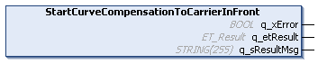
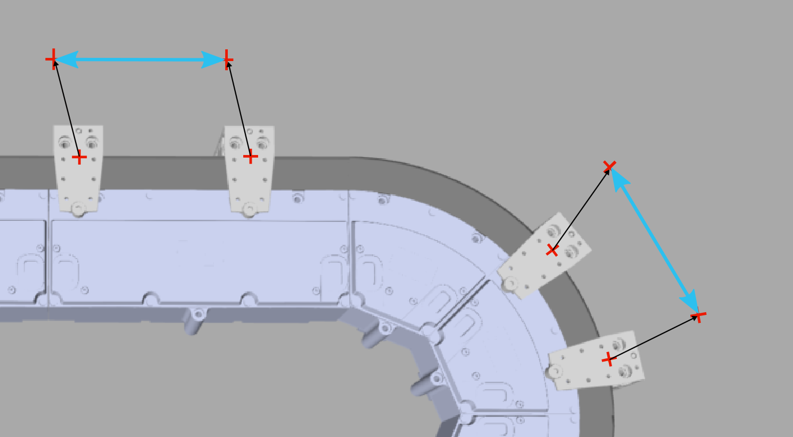

# IF\_MoveSyncFromStandstill - StartCurveCompensationToCarrierInFront (Method)

## Overview

|  |  |
| --- | --- |
| Type: | Method |
| Available as of: | V1.0.0.0 |



## Task

Curve compensation for a synchronized movement of the selected carrier with the carrier in front. The carrier in front is considered as the master carrier and the selected carrier is considered as the connected carrier.

(For more information on the carrier positions, refer to the [general description](IntroMC_MovDir-10BB46E9.html#IntroMC_MovDir-10BB46E9__InFrontBehind-10BB584B) of a Lexium™ MC multi carrier track.)

## Description

With the method StartCurveCompensationToCarrierInFront, you can apply an additional curve compensation cam to a synchronized movement of the carrier with the carrier in front (started by the method [StartSyncToCarrierInFront](IF_MoveSyncPathFromStandstill-Start-586FE52E.html)).

NOTE: The curve compensation is limited to a synchronized movement of two carriers only.

NOTE: Curve compensation is not applicable to a carrier if the distance of the selected carrier to the carrier in front (master carrier) is greater than the arc length of the smallest curved section of the track.

As a precondition, both carriers must be in standstill. The value of the parameter Carrier.RefVelocity must be 0. For more information on the carrier object Lexium MC Carrier and the parameter RefVelocity within the user function MovementData, refer to the [Lexium™ MC multi carrier Device Objects and Parameters Guide](../../../../../api/crossBook?lang=en-US&virtualBookName=MCRDOaPG&topicID=RefVelocity_9CE9F910).

The selected carrier follows the carrier in front considering the distance between the ToolPivotPoint of the selected carrier and the ToolPivotPoint of the carrier in front. (For more information on the definition of the ToolPivotPoint, see the method [SetToolPivotPointOffset](CarrConfigSetPiv-E1EA1065.html#CarrConfigSetPiv-E1EA1065).)

The distance between two carriers is the Euclidean distance, also in the curves. This involves the following aspects:

* The movement inside the curve has to be adjusted.
* The adjusted movement is automatically calculated inside the cam.
* In the curves, the distance considered is the Euclidean distance between the tool pivot points as defined by the parameter ToolPivotPoint, not the arc length of the curve.
* Inside the curve, the distance between the carriers themselves is smaller due to the curve compensation.

With the synchronized movement with curve compensation, the carrier follows the carrier in front one-to-one without considering the motion parameters specified in the method [SetMotionParameter](IF_Motion-SetMotionParameterMethod-534A9C05.html).

Synchronization to carrier in front with curve compensation 

ToolPivotPointOffset example values:

* x = -25
* y = 100
* z = 0 (by default)

|  |  |
| --- | --- |
|  | For a visual illustration, refer to the [curve compensation](../../../../../api/video?lang=en-US&bookKey=12b7d85fa51c27993eba220464d3f92e7f4b2e169ad9a7e8385a2a97ab6ec332&videoName=MLSLib_CurveComp.mp4) video sequence. |

NOTE: For restarting a stopped synchronized movement with curve compensation, refer to [IF\_MoveSyncFromStandstill - CalculatePositionForRestartCurveCompensation (Method)](MoveSync-CalcRestart-652B9119.html).

  

With an open track, the carriers could leave the track at the ends. Therefore, mechanical hard stops must be mounted at both ends of an open track.

| WARNING | |
| --- | --- |
|  | Unintended Equipment OPERATION  Mount mechanical hard stops at both ends of an open track.  Failure to follow these instructions can result in death, serious injury, or equipment damage. |

## Feedbacks

Feedbacks are available in the interface [IF\_CarrierFeedbackMoveSyncFromStandstill](IF_FeedbackMoveSyncPathFromStandsti-58E5517F.html#IF_FeedbackMoveSyncPathFromStandsti-58E5517F).

## Inputs

The method has no inputs.

## Outputs

| Output | Data type | Description |
| --- | --- | --- |
| q\_xError | BOOL | Indicates TRUE if an error has been detected. For details, refer to q\_etResult and q\_sResultMsg. |
| q\_etResult | [ET\_Result](ET_Result-509D6EF3.html#ET_Result-509D6EF3) | Provides diagnostic and status information as a numeric value. If q\_xError = FALSE, q\_etResult provides status information. If q\_xError = TRUE, q\_etResult provides diagnostic/error information. |
| q\_sResultMsg | STRING [255] | Provides additional diagnostic and status information as a text message. |

## Call Examples

Before executing the method StartCurveCompensationToCarrierInFront, the methods SetMotionParameter and StartSyncToCarrierInFront must be called at least once.

**Preconditions:**

* The selected carrier (connected carrier) and the carrier in front (master carrier) must be in standstill.
* The method StartSyncToCarrierInFront must have been called.
* The values of the parameter ToolPivotPoint.X of the master carrier and the connected carrier must be equal.
* The values of the parameter ToolPivotPoint.Y of the master carrier and the connected carrier must be equal.
* The gap between the carriers must be large enough for the curve compensation movement which depends on the tool pivot point configuration.

Example:

```
...ifMotion.SetMotionParameter(...)
...ifMoveDirectly.Start(...)
...ifMoveSyncFromStandStill.StartSyncToCarrierInFront(...)
...ifMoveSyncFromStandStill.StartCurveCompensationToCarrierInFront(...)
```

EIO0000004641.10