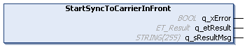
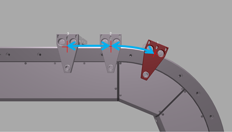
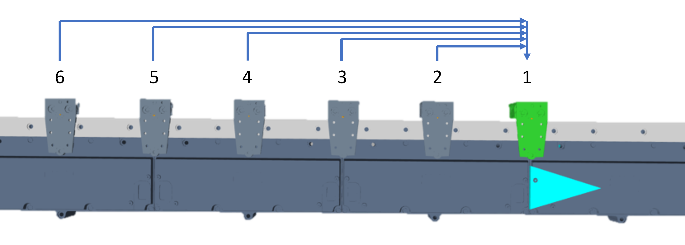
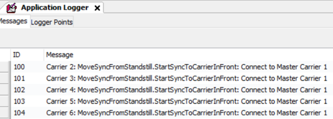
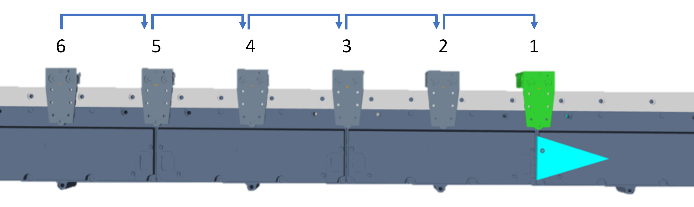
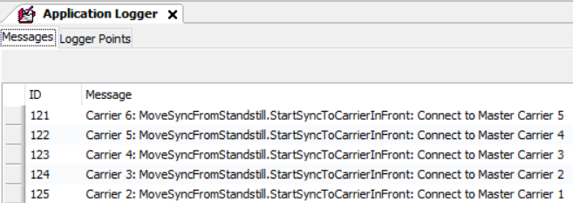
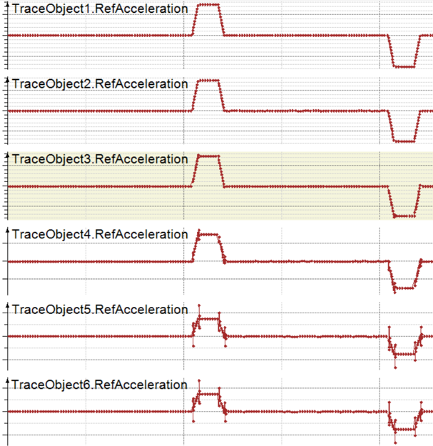

# IF\_MoveSyncFromStandstill - StartSyncToCarrierInFront (Method)

## Overview

|  |  |
| --- | --- |
| Type: | Method |
| Available as of: | V1.0.0.0 |



## Task

Synchronization of the selected carrier to the carrier in front.

(For more information on the carrier positions, refer to the [general description](IntroMC_MovDir-10BB46E9.html#IntroMC_MovDir-10BB46E9__InFrontBehind-10BB584B) of a Lexium™ MC multi carrier track.)

## Description

The method StartSyncToCarrierInFront allows a one-to-one synchronization of the selected carrier to the carrier in front. The carrier in front is considered as the master carrier and the selected carrier is considered as the connected carrier. If the carrier in front is already following a master carrier, then this master carrier is used as the reference.

NOTE: When executing this move command, you override previous move commands.

NOTE: If the carrier in front is already following the selected carrier, it is not allowed to use the method StartSyncToCarrierInFront.

NOTE: When you synchronize more than one carrier to a master using the method StartSyncToCarrierInFront, avoid cascading synchronized carriers: Call the carriers to be synchronized in an order starting with the first carrier next to the master. For more information on synchronizing more than one carrier, refer to the [Synchronization examples](#IF_MoveSyncPathFromStandstill-Start-586FE52E__SyncExample-C538D7B3).

NOTE: The synchronization of carriers can result in deviations in the acceleration/deceleration of a synchronized carrier so that the maximum acceleration/deceleration values for the synchronized carrier could be exceeded. The maximum acceleration/deceleration values of the master carrier are not affected.

In synchronized movements of a carrier connected to an external master or to a master carrier in front or behind, the movement of the selected carrier is controlled by the master.

| CAUTION | |
| --- | --- |
|  | CARRIER Collision  Define the master movement in a way that avoids collisions with other carriers.  Failure to follow these instructions can result in injury or equipment damage. |

NOTE: You can use the function block [FB\_CrashPrevention](FB_CrashPrev-B100416B.html#FB_CrashPrev-B100416B) as an additional protection measure to help avoid collisions.

With an open track, the carriers could leave the track at the ends. Therefore, mechanical hard stops must be mounted at both ends of an open track.

| WARNING | |
| --- | --- |
|  | Unintended Equipment OPERATION  Mount mechanical hard stops at both ends of an open track.  Failure to follow these instructions can result in death, serious injury, or equipment damage. |

As a precondition for calling the method StartSyncToCarrierInFront, both carriers must be in standstill. The value of the parameter Carrier.RefVelocity must be 0. For more information on the carrier object Lexium MC Carrier and the parameter RefVelocity within the user function MovementData, refer to the [Lexium™ MC multi carrier Device Objects and Parameters Guide](../../../../../api/crossBook?lang=en-US&virtualBookName=MCRDOaPG&topicID=RefVelocity_9CE9F910).

The selected carrier follows the carrier in front on the path position with a one-to-one cam according to the following rules:

* For the distance between the carriers, the length on the path described by the carrier center point is considered.
* The distance between the carrier positions always stays the same.
* In the curves, the distance used is the arc length of the curve, measured in mm.

With the synchronized movement, the carrier follows the carrier in front one-to-one without considering the motion parameters specified in the method [SetMotionParameter](IF_Motion-SetMotionParameterMethod-534A9C05.html).

Synchronization to carrier in front 

## Synchronization examples

**Without cascading**

When you synchronize more than one carrier to a master using the method StartSyncToCarrierInFront, start with the first carrier next to the master to avoid cascading. If you call the following carriers one after another with StartSyncToCarrierInFront, all carriers are synchronized to the master, without cascading.

NOTE: For the master carrier, the move command MoveSyncFromStandstill is not allowed.

  

Command sequence for carrier 2 to carrier 6:

Carrier 2: ...ifMoveSyncFromStandStill.StartSyncToCarrierInFront(…)  
Carrier 3: ...ifMoveSyncFromStandStill.StartSyncToCarrierInFront(…)  
Carrier 4: ...ifMoveSyncFromStandStill.StartSyncToCarrierInFront(…)  
Carrier 5: ...ifMoveSyncFromStandStill.StartSyncToCarrierInFront(…)  
Carrier 6: ...ifMoveSyncFromStandStill.StartSyncToCarrierInFront(…)

  





  

**With cascading**

If you start calling the carriers with the last carrier and if the carrier in front is not synchronized to a master, this will result in the cascading of carriers.

Command sequence for carrier 6 to carrier 2:

Carrier 6: ...ifMoveSyncFromStandStill.StartSyncToCarrierInFront(…)  
Carrier 5: ...ifMoveSyncFromStandStill.StartSyncToCarrierInFront(…)  
Carrier 4: ...ifMoveSyncFromStandStill.StartSyncToCarrierInFront(…)  
Carrier 3: ...ifMoveSyncFromStandStill.StartSyncToCarrierInFront(…)  
Carrier 2: ...ifMoveSyncFromStandStill.StartSyncToCarrierInFront(…)

  





  

NOTE: Cascading of carriers can impair the acceleration/deceleration commands, resulting in increasingly distorted signals.



## Feedbacks

Feedbacks are available in the interface [IF\_CarrierFeedbackMoveSyncFromStandstill](IF_FeedbackMoveSyncPathFromStandsti-58E5517F.html#IF_FeedbackMoveSyncPathFromStandsti-58E5517F).

## Inputs

The method has no inputs.

## Outputs

| Output | Data type | Description |
| --- | --- | --- |
| q\_xError | BOOL | Indicates TRUE if an error has been detected. For details, refer to q\_etResult and q\_sResultMsg. |
| q\_etResult | [ET\_Result](ET_Result-509D6EF3.html#ET_Result-509D6EF3) | Provides diagnostic and status information as a numeric value. If q\_xError = FALSE, q\_etResult provides status information. If q\_xError = TRUE, q\_etResult provides diagnostic/error information. |
| q\_sResultMsg | STRING [255] | Provides additional diagnostic and status information as a text message. |

## Call Example

Before executing the method StartSyncToCarrierInFront, the method SetMotionParameter must be called at least once.

Example:

```
...ifMotion.SetMotionParameter(...)
...ifMoveDirectly.Start(...)
...ifMoveSyncFromStandstill.StartSyncToCarrierInFront(...)
```

EIO0000004641.10