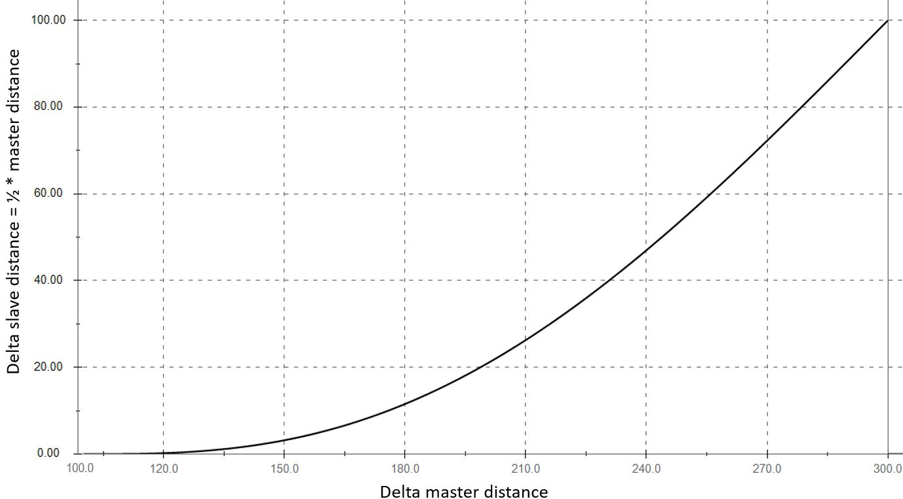
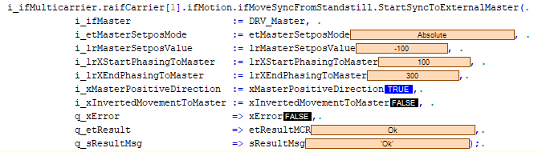
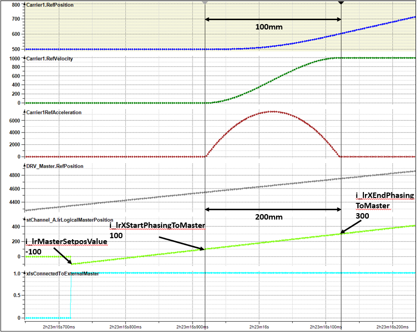

# IF\_MoveSyncFromStandstill - StartSyncToExternalMaster (Method)

## Overview

|  |  |
| --- | --- |
| Type: | Method |
| Available as of: | V1.0.0.0 |

## Task

Synchronization of the selected carrier to an external master.

## Description

The method StartSyncToExternalMaster allows a one-to-one synchronization of the carrier to an external master.

NOTE: When executing this move command, you override previous move commands.

In synchronized movements of a carrier connected to an external master or to a master carrier in front or behind, the movement of the selected carrier is controlled by the master.

| CAUTION | |
| --- | --- |
|  | CARRIER Collision  Define the master movement in a way that avoids collisions with other carriers.  Failure to follow these instructions can result in injury or equipment damage. |

NOTE: You can use the function block [FB\_CrashPrevention](FB_CrashPrev-B100416B.html#FB_CrashPrev-B100416B) as an additional protection measure to help avoid collisions.

With an open track, the carriers could leave the track at the ends. Therefore, mechanical hard stops must be mounted at both ends of an open track.

| WARNING | |
| --- | --- |
|  | Unintended Equipment OPERATION  Mount mechanical hard stops at both ends of an open track.  Failure to follow these instructions can result in death, serious injury, or equipment damage. |

As a precondition for calling the method StartSyncToExternalMaster, the selected carrier must be in standstill. The external master can be in motion. The value of the parameter RefVelocity must be 0. For more information on the carrier object Lexium MC Carrier and the parameter RefVelocity within the user function MovementData, refer to the [Lexium™ MC multi carrier Device Objects and Parameters Guide](../../../../../api/crossBook?lang=en-US&virtualBookName=MCRDOaPG&topicID=RefVelocity_9CE9F910).

In a section of the master movement defined by the start parameter i\_lrXStartPhasingToMaster and the end parameter i\_lrXEndPhasingToMaster, the carrier is phasing to the master movement.

The start cam is defined as follows: In the same time period, the carrier runs half of the distance that the master moves between i\_lrXStartPhasingToMaster and i\_lrXEndPhasingToMaster (see [example](MoveSyncExtMaster-080435F3.html#MoveSyncExtMaster-080435F3__Example-08FFA5C4)).

If i\_lrXStartPhasingToMaster = 0 and i\_lrXEndPhasingToMaster = 0, no start cam is calculated.

After phasing, the carrier follows the external master with a one-to-one cam.

With the synchronized movement, the carrier follows the master one-to-one without considering the motion parameters specified in the method [SetMotionParameter](IF_Motion-SetMotionParameterMethod-534A9C05.html).

NOTE: The synchronization of carriers can result in deviations in the acceleration/deceleration of a synchronized carrier so that the maximum acceleration/deceleration values for the synchronized carrier could be exceeded. The maximum acceleration/deceleration values of the master carrier are not affected.

If you use a C2C Encoder Input as a master, you can use the parameter C2CEncoderInput.ApplicationDelay to compensate for the delay between the master encoder (that is, the carrier) and the C2C Encoder Output on the other controller. For carrier synchronization, an additional delay of one Sercos cycle occuring on the C2C Encoder Output side of the C2C network must be input via the parameter ApplicationDelay. The method IF\_MoveSyncFromStandstill.StartSyncToExternalMaster() uses both delay parameters ApplicationDelay and DataDelay (the delay of the C2C network) to compensate for the various delays.  
For more information, refer to the description of the Synchronized Carrier Movement via C2C in the [Lexium™ MC multi carrier Device Objects and Parameters Guide](../../../../../api/crossBook?lang=en-US&virtualBookName=MCRDOaPG&topicID=SyncCarrMovemC2C_512A42D4).  
For additional information, refer also to the description of the function FC\_SetMasterEncoder() in the [SystemInterface library](../../../../../api/crossBook?lang=en-US&virtualBookName=PD.Lib.SystemInterface&topicID=D_SE_0085311) and to the description of the C2C Encoder Input delay parameters in the [LMC Pro Device Objects and Parameters Guide](../../../../../api/crossBook?lang=en-US&virtualBookName=PD.Parameter.LMCPro&topicID=D_SE_0082657).

## Example

If i\_lrXStartPhasingToMaster = 100 and i\_lrXEndPhasingToMaster = 300, the master moves 200 mm while the selected carrier (connected carrier) moves 100 mm during phasing up.

Start cam example 

Code example 

Motion example 

## Feedbacks

Feedbacks are available in the interface [IF\_CarrierFeedbackMoveSyncFromStandstill](IF_FeedbackMoveSyncPathFromStandsti-58E5517F.html#IF_FeedbackMoveSyncPathFromStandsti-58E5517F).

## Inputs

| Input | Data type | Description |
| --- | --- | --- |
| i\_ifMaster | [SystemConfigurationItf.IF\_Master](../../../../../api/crossBook?lang=en-US&virtualBookName=PD.Lib.SystemConfigurationItf&topicID=D_SE_0089174) | Access to the interface of the external master.  For more information on the interface IF\_Master, refer to the [SystemConfigurationItf library](../../../../../api/crossBook?lang=en-US&virtualBookName=PD.Lib.SystemConfigurationItf&topicID=). |
| i\_etMasterSetposMode | [SMG.ET\_SetposMode](../../../../../api/crossBook?lang=en-US&virtualBookName=PD.Lib.SoMotionGenerator&topicID=D_SE_0089446) | Access to the enumeration ET\_SetposMode for the Setpos of the master position.  For more information on the enumeration ET\_SetposMode, refer to the [PD\_SoMotionGenerator library](../../../../../api/crossBook?lang=en-US&virtualBookName=PD.Lib.SoMotionGenerator&topicID=) |
| i\_lrMasterSetposValue | LREAL | Value for the Setpos of the master position |
| i\_lrXStartPhasingToMaster | LREAL | Position of the external master where the phasing of the carrier to the master movement starts.  NOTE: i\_lrXStartPhasingToMaster < i\_lrXEndPhasingToMaster |
| i\_lrXEndPhasingToMaster | LREAL | Position of the external master where the phasing of the carrier to the master movement ends.  NOTE: i\_lrXEndPhasingToMaster > i\_lrXStartPhasingToMaster |
| i\_xMasterPositiveDirection | BOOL | If i\_xMasterPositiveDirection is set to TRUE, the external master is moving in positive direction. If i\_xMasterPositiveDirection is set to FALSE, the external master is moving in negative direction. |
| i\_xInvertedMovementToMaster | BOOL | If i\_xInvertedMovementToMaster is set to TRUE, the carrier moves in inverse direction of the master movement. If the master moves for example with positive velocity, the carrier moves with negative velocity. If i\_xInvertedMovementToMaster is set to FALSE, the carrier moves in the same direction as the master. If the master moves for example with positive velocity, the carrier also moves with positive velocity. |

## Outputs

| Output | Data type | Description |
| --- | --- | --- |
| q\_xError | BOOL | Indicates TRUE if an error has been detected. For details, refer to q\_etResult and q\_sResultMsg. |
| q\_etResult | [ET\_Result](ET_Result-509D6EF3.html#ET_Result-509D6EF3) | Provides diagnostic and status information as a numeric value. If q\_xError = FALSE, q\_etResult provides status information. If q\_xError = TRUE, q\_etResult provides diagnostic/error information. |
| q\_sResultMsg | STRING [255] | Provides additional diagnostic and status information as a text message. |

## Call Examples

Before executing the method StartSyncToExternalMaster, the method SetMotionParameter must be called at least once.

Example:

```
...ifMotion.SetMotionParameter(...)
...ifMoveSyncFromStandstill.StartSyncToExternalMaster(...)
```

EIO0000004641.10