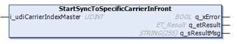
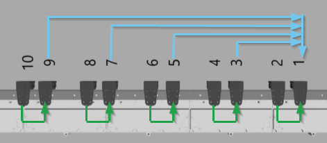
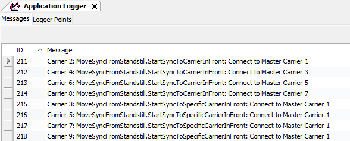

# IF\_MoveSyncFromStandstill - StartSyncToSpecificCarrierInFront (Method)

## Overview

|  |  |
| --- | --- |
| Type: | Method |
| Available as of: | V1.9.12.0 |



## Task

Synchronization of the selected carrier to a specific carrier in front.

For more information on the carrier positions, refer to the [general description](IntroMC_MovDir-10BB46E9.html#IntroMC_MovDir-10BB46E9__InFrontBehind-10BB584B) of a Lexium™ MC multi carrier track.

## Description

The method StartSyncToSpecificCarrierInFront allows a one-to-one synchronization of the selected carrier to a specific carrier in front. The specific carrier in front is considered as the master carrier and the selected carrier is considered as the connected carrier. The specific carrier in front is used as master carrier even if the specific carrier itself is already following a master carrier. The selected carrier is not directly synchronized to the master of the specific carrier.

NOTE: When executing this move command, you override previous move commands.

NOTE: If the specific carrier in front is already following the selected carrier, it is not allowed to use the method StartSyncToSpecificCarrierInFront.

NOTE: Between the selected carrier and the specific master carrier, only carriers that are synchronized to a carrier in front are allowed.

In synchronized movements of a carrier connected to an external master or to a master carrier in front or behind, the movement of the selected carrier is controlled by the master.

| CAUTION | |
| --- | --- |
|  | CARRIER Collision  Define the master movement in a way that avoids collisions with other carriers.  Failure to follow these instructions can result in injury or equipment damage. |

NOTE: You can use the function block [FB\_CrashPrevention](FB_CrashPrev-B100416B.html#FB_CrashPrev-B100416B) as an additional protection measure to help avoid collisions.

With an open track, the carriers could leave the track at the ends. Therefore, mechanical hard stops must be mounted at both ends of an open track.

| WARNING | |
| --- | --- |
|  | Unintended Equipment OPERATION  Mount mechanical hard stops at both ends of an open track.  Failure to follow these instructions can result in death, serious injury, or equipment damage. |

As a precondition for calling the method StartSyncToSpecificCarrierInFront, both carriers must be in standstill. The value of the parameter Carrier.RefVelocity must be 0. For more information on the carrier object Lexium MC Carrier and the parameter RefVelocity within the user function MovementData, refer to the [Lexium™ MC multi carrier Device Objects and Parameters Guide](../../../../../api/crossBook?lang=en-US&virtualBookName=MCRDOaPG&topicID=RefVelocity_9CE9F910).

The selected carrier follows the specific carrier in front on the path position with a one-to-one cam according to the following rules:

* For the distance between the carriers, the length on the path described by the carrier center point is considered.
* The distance between the carrier positions always stays the same.
* In the curves, the distance used is the arc length of the curve, measured in mm.

With the synchronized movement, the carrier follows the specific carrier in front one-to-one without considering the motion parameters specified in the method [SetMotionParameter](IF_Motion-SetMotionParameterMethod-534A9C05.html).

## Synchronization examples

In the following, you find an example for building groups of two carriers and synchronizing these groups to a specific master carrier:

1. Build the groups of two carrier using the method StartSyncToCarrierInFront (indicated by the green lines in graphic below):

   Carrier 2: ...ifMoveSyncFromStandStill.StartSyncToCarrierInFront(…)  
   Carrier 4: ...ifMoveSyncFromStandStill.StartSyncToCarrierInFront(…)  
   Carrier 6: ...ifMoveSyncFromStandStill.StartSyncToCarrierInFront(…)  
   Carrier 8: ...ifMoveSyncFromStandStill.StartSyncToCarrierInFront(…)  
   Carrier 10: ...ifMoveSyncFromStandStill.StartSyncToCarrierInFront(…)
2. Connect the groups to the specific carrier 1 with the method StartSyncToSpecificCarrierInFront (indicated by the blue lines in graphic below):

   Carrier 3: ...ifMoveSyncFromStandStill.StartSyncToSpecificCarrierInFront(i\_udiCarrierIndexMaster := 1, …);  
   Carrier 5: ...ifMoveSyncFromStandStill.StartSyncToSpecificCarrierInFront(i\_udiCarrierIndexMaster := 1, …);  
   Carrier 7: ...ifMoveSyncFromStandStill.StartSyncToSpecificCarrierInFront(i\_udiCarrierIndexMaster := 1, …);  
   Carrier 9: ...ifMoveSyncFromStandStill.StartSyncToSpecificCarrierInFront(i\_udiCarrierIndexMaster := 1, …);

  





## Feedbacks

Feedbacks are available in the interface [IF\_CarrierFeedbackMoveSyncFromStandstill](IF_FeedbackMoveSyncPathFromStandsti-58E5517F.html#IF_FeedbackMoveSyncPathFromStandsti-58E5517F).

## Inputs

| Input | Data type | Description |
| --- | --- | --- |
| i\_udiCarrierIndexMaster | UDINT | Carrier index of the specific master carrier. |

## Outputs

| Output | Data type | Description |
| --- | --- | --- |
| q\_xError | BOOL | Indicates TRUE if an error has been detected. For details, refer to q\_etResult and q\_sResultMsg. |
| q\_etResult | [ET\_Result](ET_Result-509D6EF3.html#ET_Result-509D6EF3) | Provides diagnostic and status information as a numeric value. If q\_xError = FALSE, q\_etResult provides status information. If q\_xError = TRUE, q\_etResult provides diagnostic/error information. |
| q\_sResultMsg | STRING [255] | Provides additional diagnostic and status information as a text message. |

## Call Example

Before executing the method StartSyncToSpecificCarrierInFront, the method SetMotionParameter must be called at least once.

Example:

```
...ifMotion.SetMotionParameter(...)
...ifMoveDirectly.Start(...)
...ifMoveSyncFromStandstill.StartSyncToSpecificCarrierInFront(...)
```

EIO0000004641.10