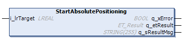
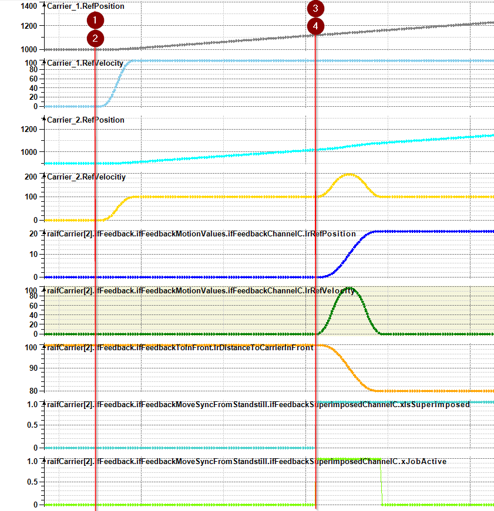

# IF\_MoveSyncFromStandstillSuperimposedChannelC - StartAbsolutePositioning (Method)

## Overview

|  |  |
| --- | --- |
| Type: | Method |
| Available as of: | V1.1.9.0 |



## Task

Starting a superimposed movement on channel C in addition to a movement with the move command [MoveSyncFromStandstill](IF_MoveSyncPathFromStandstill-5B839E78.html#IF_MoveSyncPathFromStandstill-5B839E78).

|  |  |
| --- | --- |
|  | For a visual illustration of a superimposed movement, refer to the [superimposed movement](../../../../../api/video?lang=en-US&bookKey=12b7d85fa51c27993eba220464d3f92e7f4b2e169ad9a7e8385a2a97ab6ec332&videoName=MLSLib_Superimp.mp4) video sequence. |

For more information on the use of channels, refer to [Move Commands and Channels](Move_Channels-36D35D8B.html).

## Description

The method StartAbsolutePositioning starts a superimposed movement of the carrier in addition to the MoveSyncFromStandstill movement without considering other carriers. The additional superimposed movement is independent of an active or inactive movement of the synchronized master carrier. The additional superimposed movement is executed with the velocity, the acceleration and the jerk that have been defined with the method [SetMotionParameterSuperimposedChannelC](SetMotionParaSuperimpChannC-2F8FABF8.html#SetMotionParaSuperimpChannC-2F8FABF8).

NOTE: The motion parameters defined with SetMotionParameterSuperimposedChannelC are different from the default motion values and are added to the default motion values defined with [SetMotionParameter](IF_Motion-SetMotionParameterMethod-534A9C05.html#IF_Motion-SetMotionParameterMethod-534A9C05).

NOTE: When executing the method StartAbsolutePositioning, you only override previous move commands for superimposed movements.

With the move command MoveSyncFromStandstillSuperimposedChannelC, the carrier moves to the target position without considering other carriers. Take this into account during path planning.

| CAUTION | |
| --- | --- |
|  | CARRIER Collision  Define the carrier path in a way that avoids collisions with other carriers.  Failure to follow these instructions can result in injury or equipment damage. |

NOTE: You can use the function block [FB\_CrashPrevention](FB_CrashPrev-B100416B.html#FB_CrashPrev-B100416B) as an additional protection measure to help avoid collisions.

With an open track, the carriers could leave the track at the ends. Therefore, mechanical hard stops must be mounted at both ends of an open track.

| WARNING | |
| --- | --- |
|  | Unintended Equipment OPERATION  Mount mechanical hard stops at both ends of an open track.  Failure to follow these instructions can result in death, serious injury, or equipment damage. |

## Feedbacks

Feedbacks are available in the interface [IF\_CarrierFeedbackMoveSyncFromStandstillSuperimposedChannelC](CarrFeedbMoveSyncStandstSuperimpC-2F964794.html#CarrFeedbMoveSyncStandstSuperimpC-2F964794).

## Inputs

| Output | Data type | Description |
| --- | --- | --- |
| i\_lrTarget | LREAL | Specifies the target position for the superimposed movement. |

## Outputs

| Output | Data type | Description |
| --- | --- | --- |
| q\_xError | BOOL | Indicates TRUE if an error has been detected. For details, refer to q\_etResult and q\_sResultMsg. |
| q\_etResult | [ET\_Result](ET_Result-509D6EF3.html#ET_Result-509D6EF3) | Provides diagnostic and status information as a numeric value. If q\_xError = FALSE, q\_etResult provides status information. If q\_xError = TRUE, q\_etResult provides diagnostic/error information. |
| q\_sResultMsg | STRING [255] | Provides additional diagnostic and status information as a text message. |

## Call Example

Before executing the method StartAbsolutePositioning, the method SetMotionParameterSuperimposedChannelC must be called at least once.

Example:

```
...ifMotion.SetMotionParameter(...)
...ifMoveSyncFromStandStill.StartSyncToCarrierInFront(...)
...ifMotion.SetMotionParameterSuperimposedChannelC(...)
...ifMoveSyncFromStandStill.ifSuperimposedChannelC.StartAbsolutePositioning(...)
```

NOTE: The numbers in the graphic below refer to the steps in the call example.



EIO0000004641.10