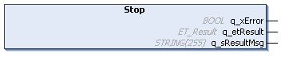

# IF\_MoveSyncFromStandstillSuperimposedChannelC - Stop (Method)

## Overview

|  |  |
| --- | --- |
| Type: | Method |
| Available as of: | V1.1.9.0 |



## Task

Stopping the superimposed part of the carrier movement on channel C, controlled by the move command [MoveSyncFromStandstillSuperimposedChannelC](MoveSyncFrStandstSuperimpC-2F9D684A.html#MoveSyncFrStandstSuperimpC-2F9D684A).

## Description

The method IF\_MoveSyncFromStandstillSuperimposedChannelC - Stop stops a superimposed carrier movement on channel C started by the method [StartAbsolutePositioning](SuperimpCStartAbsPos-2FA04A9F.html).

When the method IF\_MoveSyncFromStandstillSuperimposedChannelC - Stop is called, the carrier is stopped with a positioning command setting the velocity to zero:

```
Vel = 0
```

The motion parameters specified by the method SetMotionParameterSuperimposedChannelC (MaxAcceleration, MaxDeceleration, and MaxAbsJerk) are used for stopping the movement. For more details on the motion parameters, refer to [SetMotionParameterSuperimposedChannelC](SetMotionParaSuperimpChannC-2F8FABF8.html).

NOTE: In case of a stop initiated by the method IF\_MoveSyncFromStandstill - Stop or in case of an emergency stop of the machine through the application, the motion values on channels B and C are transferred to channel A ([channel bundling](Move_Channels-36D35D8B.html#Move_Channels-36D35D8B__ChannelBundl-36D389A6)). The superimposed motion values on channel B and C are set to 0.  
With the method IF\_MoveSyncFromStandstillSuperimposedChannelC - Stop, however, the superimposed part of the carrier movement is stopped without channel bundling. The superimposed motion values are still assigned to channel C.

For avoiding carrier movements to an unintended target due to an incorrrect starting position, use the method [SetposRelativeChannelABC](SetposRelABC-CBA8C8FC.html) and restart the interrupted superimposed movement with the intended target position.

| WARNING | |
| --- | --- |
|  | Unintended Equipment Operation  Define the restart position of an interrupted superimposed movement to avoid unintended movements.  Failure to follow these instructions can result in death, serious injury, or equipment damage. |

With the method IF\_MoveSyncFromStandstillSuperimposedChannelC - Stop, the movement of the carrier is stopped without considering other carriers, for example without considering if the carrier in front stops faster. Take this into account during path planning.

| CAUTION | |
| --- | --- |
|  | CARRIER Collision  Define the carrier path in a way that avoids collisions with other carriers.  Failure to follow these instructions can result in injury or equipment damage. |

NOTE: You can use the function block [FB\_CrashPrevention](FB_CrashPrev-B100416B.html#FB_CrashPrev-B100416B) as an additional protection measure to help avoid collisions.

With an open track, the carriers could leave the track at the ends. Therefore, mechanical hard stops must be mounted at both ends of an open track.

| WARNING | |
| --- | --- |
|  | Unintended Equipment OPERATION  Mount mechanical hard stops at both ends of an open track.  Failure to follow these instructions can result in death, serious injury, or equipment damage. |

## Inputs

The method has no inputs.

## Outputs

| Output | Data type | Description |
| --- | --- | --- |
| q\_xError | BOOL | Indicates TRUE if an error has been detected. For details, refer to q\_etResult and q\_sResultMsg. |
| q\_etResult | [ET\_Result](ET_Result-509D6EF3.html#ET_Result-509D6EF3) | Provides diagnostic and status information as a numeric value. If q\_xError = FALSE, q\_etResult provides status information. If q\_xError = TRUE, q\_etResult provides diagnostic/error information. |
| q\_sResultMsg | STRING [255] | Provides additional diagnostic and status information as a text message. |

EIO0000004641.10