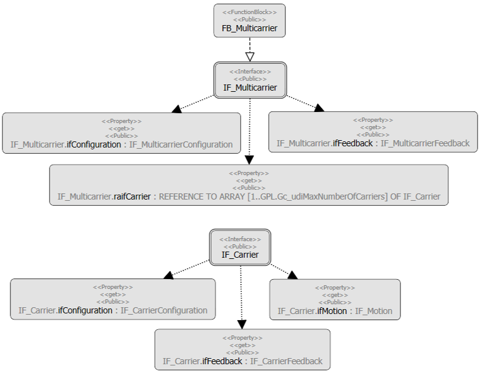

# IF\_Multicarrier - General Information

## Overview

|  |  |
| --- | --- |
| Type: | Interface |
| Available as of: | V1.0.0.0 |
| Inherits from: | - |

## Task

Entry point to the Lexium™ MC multi carrier transport system.

## Description

The interface is the entry point to the Lexium™ MC multi carrier transport system. It has properties that give access to sub-interfaces and provides methods for the connection to the Application Logger.

## Properties

| Name | Data type | Accessing | Description |
| --- | --- | --- | --- |
| etResult | [ET\_Result](ET_Result-509D6EF3.html#ET_Result-509D6EF3) | Read | Reading the status of the output [FB\_Multicarrier.q\_etResult](FB_Multicarrier-GeneralInformation-5134B521.html#FB_Multicarrier-GeneralInformation-5134B521). |
| ifConfiguration | IF\_MulticarrierConfiguration | Read | Access to the interface IF\_MulticarrierConfiguration for configuring the Lexium™ MC multi carrier track.  For more information, see [IF\_MulticarrierConfiguration](IF_MulticarrierConfiguration-Genera-7E89F357.html#IF_MulticarrierConfiguration-Genera-7E89F357). |
| ifFeedback | IF\_MulticarrierFeedback | Read | Access to the interface IF\_MulticarrierFeedback for reading general feedback information from the Lexium™ MC multi carrier transport system.  For more information, see [IF\_MulticarrierFeedback](MCFeedback-D64BDD9A.html#MCFeedback-D64BDD9A). |
| raifCarrier | REFERENCE TO ARRAY [1..GPL.Gc\_udiMaxNumberOfCarriers] OF IF\_Carrier | Read | Access to the functions of a carrier object.  For more information, see [IF\_Carrier](IF_Carrier-E050ABF7.html#IF_Carrier-E050ABF7). |
| sResultMsg | STRING [255] | Read | Reading the status of the output [FB\_Multicarrier.q\_sResultMsg](FB_Multicarrier-GeneralInformation-5134B521.html#FB_Multicarrier-GeneralInformation-5134B521). |
| xActive | BOOL | Read | Reading the status of the output [FB\_Multicarrier.q\_xActive](FB_Multicarrier-GeneralInformation-5134B521.html#FB_Multicarrier-GeneralInformation-5134B521). |
| xError | BOOL | Read | Reading the status of the output [FB\_Multicarrier.q\_xError](FB_Multicarrier-GeneralInformation-5134B521.html#FB_Multicarrier-GeneralInformation-5134B521). |
| xReady | BOOL | Read | Reading the status of the output [FB\_Multicarrier.q\_xReady](FB_Multicarrier-GeneralInformation-5134B521.html#FB_Multicarrier-GeneralInformation-5134B521). |

## Inputs

The interface has no inputs.

## Outputs

The interface has no outputs.

EIO0000004641.10