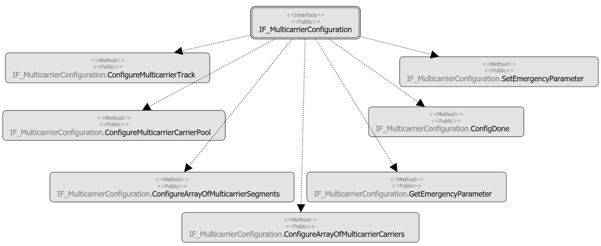

# IF\_MulticarrierConfiguration - General Information

## Overview

|  |  |
| --- | --- |
| Type: | Interface |
| Available as of: | V1.0.0.0 |
| Inherits from: | - |

## Task

Configuration of the track and of general parameters of the Lexium™ MC multi carrier transport system.

## Description

The interface provides several methods for configuring the track and general Lexium™ MC multi carrier parameters.

## Inputs

The interface has no inputs.

## Outputs

The interface has no outputs.

EIO0000004641.10