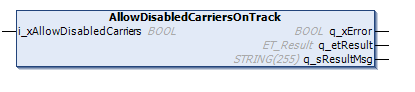

# IF\_MulticarrierConfiguration - AllowDisabledCarriersOnTrack (Method)

## Overview

|  |  |
| --- | --- |
| Type: | Method |
| Available as of: | V1.1.9.0 |

## Task

Allowing disabled carriers on the track.

## Description

With the method AllowDisabledCarriersOnTrack, you can specify that not all carriers must be enabled and in position control when the function block FB\_Multicarrier is being enabled. You can move the enabled carriers while individual carriers on the track are disabled.

## Inputs

| Input | Data type | Description |
| --- | --- | --- |
| i\_xAllowDisabledCarriers | BOOL | If i\_xAllowDisabledCarriers is set to TRUE, disabled carriers are allowed on the track when the function block FB\_Multicarrier is enabled. |

## Outputs

| Output | Data type | Description |
| --- | --- | --- |
| q\_xError | BOOL | Indicates TRUE if an error has been detected. For details, refer to q\_etResult and q\_sResultMsg. |
| q\_etResult | [ET\_Result](ET_Result-509D6EF3.html#ET_Result-509D6EF3) | Provides diagnostic and status information as a numeric value. If q\_xError = FALSE, q\_etResult provides status information. If q\_xError = TRUE, q\_etResult provides diagnostic/error information. |
| q\_sResultMsg | STRING [255] | Provides additional diagnostic and status information as a text message. |

EIO0000004641.10