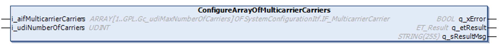

# IF\_MulticarrierConfiguration - ConfigureArrayOfMulticarrierCarriers (Method)

## Overview

|  |  |
| --- | --- |
| Type: | Method |
| Available as of: | V1.0.0.0 |



## Task

Setting the array of IF\_MulticarrierCarrier and the number of carriers.

## Description

With the method ConfigureArrayOfMulticarrierCarriers, you can set the array of IF\_MulticarrierCarrier for the Lexium™ MC multi carrier transport system. This array represents the physical alignment of the carriers.

Before calling this method, you must assign carrier objects to the array [1.. GPL.Gc\_udiMaxNumberOfCarriers] of SystemConfigurationItf.IF\_MulticarrierCarrier. For more information on system configuration, refer to the [SystemConfigurationItf library](../../../../../api/crossBook?lang=en-US&virtualBookName=PD.Lib.SystemConfigurationItf&topicID=).

Additionally, you can specify the number of carriers on the Lexium™ MC multi carrier track with the input i\_udiNumberOfCarriers.

## Inputs

| Input | Data type | Value range | Description |
| --- | --- | --- | --- |
| i\_aifMulticarrierCarriers | ARRAY [1.. GPL.Gc\_udiMaxNumberOfCarriers] OF SystemConfigurationItf.IF\_MulticarrierCarrier | – | Specifies the array of IF\_MulticarrierCarrier. |
| i\_udiNumberOfCarriers | UDINT | 1 ≤ i\_udiNumberOfCarriers ≤ 1.. GPL.Gc\_udiMaxNumberOfCarriers | Specifies the number of carriers on the Lexium™ MC multi carrier track. |

## Outputs

| Output | Data type | Description |
| --- | --- | --- |
| q\_xError | BOOL | Indicates TRUE if an error has been detected. For details, refer to q\_etResult and q\_sResultMsg. |
| q\_etResult | [ET\_Result](ET_Result-509D6EF3.html#ET_Result-509D6EF3) | Provides diagnostic and status information as a numeric value. If q\_xError = FALSE, q\_etResult provides status information. If q\_xError = TRUE, q\_etResult provides diagnostic/error information. |
| q\_sResultMsg | STRING [255] | Provides additional diagnostic and status information as a text message. |

## Call examples

The elements of the array must be assigned in the order of the carrier alignment, starting with array element 1.

```
GVL.G_aifMulticarrierCarriers[1] = MC_Carrier_1
GVL.G_aifMulticarrierCarriers[2] = MC_Carrier_2
...
ifMulticarrierConfiguration.ConfigureArrayOfMulticarrierCarriers(…)
```

EIO0000004641.10