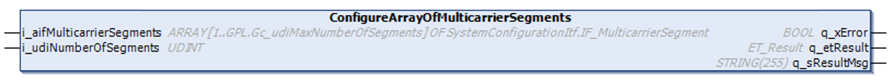

# IF\_MulticarrierConfiguration - ConfigureArrayOfMulticarrierSegments (Method)

## Overview

|  |  |
| --- | --- |
| Type: | Method |
| Available as of: | V1.0.0.0 |



## Task

Setting the array of SystemConfigurationItf.IF\_MulticarrierSegment.

## Description

With the method ConfigureArrayOfMulticarrierSegments, the array of IF\_MulticarrierSegment is set for the Lexium™ MC multi carrier transport system.

Before calling this method, segment objects must be assigned to the array [1...GPL.Gc\_udiMaxNumberOfSegments] of SystemConfigurationItf.IF\_MulticarrierSegment.

For more information on system configuration, refer to the [SystemConfigurationItf library](../../../../../api/crossBook?lang=en-US&virtualBookName=PD.Lib.SystemConfigurationItf&topicID=).

## Inputs

| Input | Data type | Description |
| --- | --- | --- |
| i\_aifMulticarrierSegment | ARRAY [1...GPL.Gc\_udiMaxNumberOfSegments] OF SystemConfigurationItf.IF\_MulticarrierSegment | Specifies the array of IF\_MulticarrierSegment. |
| i\_udiNumberOfSegments | UDINT | Specifies the number of segments. |

## Outputs

| Output | Data type | Description |
| --- | --- | --- |
| q\_xError | BOOL | Indicates TRUE if an error has been detected. For details, refer to q\_etResult and q\_sResultMsg. |
| q\_etResult | [ET\_Result](ET_Result-509D6EF3.html#ET_Result-509D6EF3) | Provides diagnostic and status information as a numeric value. If q\_xError = FALSE, q\_etResult provides status information. If q\_xError = TRUE, q\_etResult provides diagnostic/error information. |
| q\_sResultMsg | STRING [255] | Provides additional diagnostic and status information as a text message. |

## Call examples

The elements of the array must be assigned in the order of the segment alignment, starting with array element 1.

```
GVL.G_aifMulticarrierSegment [1] = MC_Segment_1
GVL.G_aifMulticarrierSegment [2] = MC_Segment_2
...
ifMulticarrierConfiguration.ConfigureArrayOfMulticarrierSegments(…)
```

EIO0000004641.10