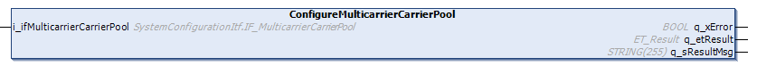

# IF\_MulticarrierConfiguration - ConfigureMulticarrierCarrierPool (Method)

## Overview

|  |  |
| --- | --- |
| Type: | Method |
| Available as of: | V1.0.0.0 |

## Task

Assigning the carrier pool object Lexium MC Carrier Pool.

## Description

With the method ConfigureMulticarrierCarrierPool, you can assign the carrier pool object Lexium MC Carrier Pool from the Devices tree to the configuration.  
For more information on the carrier object Lexium MC Carrier Pool, refer to the [Lexium™ MC multi carrier Device Objects and Parameters Guide](../../../../../api/crossBook?lang=en-US&virtualBookName=MCRDOaPG&topicID=PRT_MCCarrPool_1BA7FBC0).

## Inputs

| Input | Data type | Description |
| --- | --- | --- |
| i\_ifMulticarrierCarrierPool | SystemConfigurationItf.IF\_MulticarrierCarrierPool | Carrier pool object from the Devices tree. |

## Outputs

| Output | Data type | Description |
| --- | --- | --- |
| q\_xError | BOOL | Indicates TRUE if an error has been detected. For details, refer to q\_etResult and q\_sResultMsg. |
| q\_etResult | [ET\_Result](ET_Result-509D6EF3.html#ET_Result-509D6EF3) | Provides diagnostic and status information as a numeric value. If q\_xError = FALSE, q\_etResult provides status information. If q\_xError = TRUE, q\_etResult provides diagnostic/error information. |
| q\_sResultMsg | STRING [255] | Provides additional diagnostic and status information as a text message. |

EIO0000004641.10