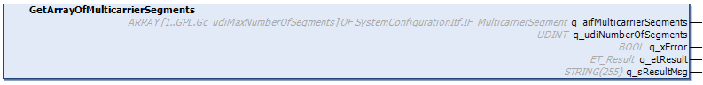

# IF\_MulticarrierConfiguration - GetArrayOfMulticarrierSegments (Method)

## Overview

|  |  |
| --- | --- |
| Type: | Method |
| Available as of: | V1.9.12.0 |

## Task

Reading out the array of IF\_MulticarrierSegment.

## Description

With the method GetArrayOfMulticarrierSegments (...), you can read out the array of IF\_MulticarrierSegment for the Lexium™ MC multi carrier transport system, defined by the method [ConfigureArrayOfMulticarrierSegments](IF_MulticarrierConfig_ArraySegments-7F1086FD.html#IF_MulticarrierConfig_ArraySegments-7F1086FD).

## Inputs

The method has no inputs.

## Outputs

| Output | Data type | Description |
| --- | --- | --- |
| q\_aifMulticarrierSegments | ARRAY [1...GPL.Gc\_udiMaxNumberOfSegments] OF SystemConfigurationItf.IF\_MulticarrierSegment | Provides the array of IF\_MulticarrierSegment. |
| q\_udiNumberOfSegments | UDINT | Provides the number of segments. |
| q\_xError | BOOL | Indicates TRUE if an error has been detected. For details, refer to q\_etResult and q\_sResultMsg. |
| q\_etResult | [ET\_Result](ET_Result-509D6EF3.html#ET_Result-509D6EF3) | Provides diagnostic and status information as a numeric value. If q\_xError = FALSE, q\_etResult provides status information. If q\_xError = TRUE, q\_etResult provides diagnostic/error information. |
| q\_sResultMsg | STRING [255] | Provides additional diagnostic and status information as a text message. |

EIO0000004641.10