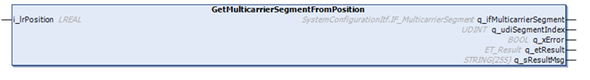

# IF\_MulticarrierConfiguration - GetMulticarrierSegmentFromPosition (Method)

## Overview

|  |  |
| --- | --- |
| Type: | Method |
| Available as of: | V1.9.12.0 |

## Task

Reading out the segment that corresponds to a specified linear position.

## Description

With the method GetMulticarrierSegmentFromPosition, you can read out the IF\_MulticarrierSegment and the segment index corresponding to a specified linear position.

For more information on segment numbering, refer to the description of the [linear coordinate system](IntroMC_CoordSys-0FC9FA31.html#IntroMC_CoordSys-0FC9FA31__CoordinateSystem-0FC9F017).

## Inputs

| Output | Data type | Description |
| --- | --- | --- |
| i\_lrPosition | LREAL | Linear position of the segment in a Lexium™ MC multi carrier track. |

## Outputs

| Output | Data type | Description |
| --- | --- | --- |
| q\_ifMulticarrierSegment | SystemConfigurationItf.IF\_MulticarrierSegment | Provides the segment of IF\_MulticarrierSegment. |
| q\_udiSegmentIndex | UDINT | Provides the segment index number (topological address) of the segment. |
| q\_xError | BOOL | Indicates TRUE if an error has been detected. For details, refer to q\_etResult and q\_sResultMsg. |
| q\_etResult | [ET\_Result](ET_Result-509D6EF3.html#ET_Result-509D6EF3) | Provides diagnostic and status information as a numeric value. If q\_xError = FALSE, q\_etResult provides status information. If q\_xError = TRUE, q\_etResult provides diagnostic/error information. |
| q\_sResultMsg | STRING [255] | Provides additional diagnostic and status information as a text message. |

EIO0000004641.10