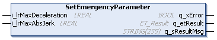

# IF\_MulticarrierConfiguration - SetEmergencyParameter (Method)

## Overview

|  |  |
| --- | --- |
| Type: | Method |
| Available as of: | V1.0.0.0 |

## Task

Setting the emergency parameters.

## Description

With the method SetEmergencyParameter, the maximum deceleration (change of velocity per time unit) and the maximum absolute jerk (change of deceleration per time unit) are set for emergency stops of the Lexium™ MC multi carrier transport system.

It is not possible to adjust the motion parameters for an active emergency stop. The adjusted values are applied and used for a later emergency stop, if required.

NOTE: The values defined with the method SetEmergencyParameter must be greater than the corresponding values defined with the methods [SetMotionParameter](IF_Motion-SetMotionParameterMethod-534A9C05.html#IF_Motion-SetMotionParameterMethod-534A9C05) or [SetMotionParameterJogging](IF_Motion-SetMotionParameterJogging-534B938D.html#IF_Motion-SetMotionParameterJogging-534B938D).

## Inputs

| Input | Data type | Value range | Unit | Description |
| --- | --- | --- | --- | --- |
| i\_lrMaxDeceleration | LREAL | GCL.Gc\_lrMinDeceleration ≤  i\_lrMaxDeceleration ≤  GCL.Gc\_lrMaxDeceleration (1) | mm/s2 | Specifies the maximum deceleration (change of velocity per time unit). |
| i\_lrMaxAbsJerk | LREAL | GCL.Gc\_lrMinAbsJerk ≤  i\_ lrMaxAbsJerk ≤  GCL.Gc\_lrMaxAbsJerk (1)  AND  i\_ lrMaxAbsJerk ≥  i\_lrMaxAcceleration (2) × 10 (3) | mm/s3 | Specifies the maximum jerk (change of acceleration per time unit). |
| **(1)** For more information on the value range, refer to the [Global Constants List (GCL)](GlobalConstantsListGCL-50A754B1.html#GlobalConstantsListGCL-50A754B1).  **(2)** Internally, it is determined which value is greater between i\_lrMaxAcceleration and i\_lrMaxDeceleration. The greater value is used for this calculation.  **(3)** The value of i\_ lrMaxAbsJerk must be greater than or equal to 10 times the value of i\_lrMaxAcceleration (or i\_lrMaxDeceleration, whichever of the two is greater). If this is not the case, it is internally set to a value that is 10 times the value of i\_lrMaxAcceleration or i\_lrMaxDeceleration. | | | | |

## Outputs

| Output | Data type | Description |
| --- | --- | --- |
| q\_xError | BOOL | Indicates TRUE if an error has been detected. For details, refer to q\_etResult and q\_sResultMsg. |
| q\_etResult | [ET\_Result](ET_Result-509D6EF3.html#ET_Result-509D6EF3) | Provides diagnostic and status information as a numeric value. If q\_xError = FALSE, q\_etResult provides status information. If q\_xError = TRUE, q\_etResult provides diagnostic/error information. |
| q\_sResultMsg | STRING [255] | Provides additional diagnostic and status information as a text message. |

EIO0000004641.10