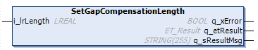

# IF\_MulticarrierConfiguration - SetGapCompensationLength (Method)

## Overview

|  |  |
| --- | --- |
| Type: | Method |
| Available as of: | V1.8.4.0 |

## Task

Setting the reference length for the carriers on a track, used for gap compensation.

## Description

With the method SetGapCompensationLength, you can set the reference length used for gap compensation for the carriers on a track. For more information on gap compensation, refer to the method [IF\_Motion - ActivateGapCompensation](ActivateGapComp-EF24B4E9.html#ActivateGapComp-EF24B4E9).

NOTE: By default, the reference length used for gap compensation is 50 mm, corresponding to the length of a standard Lexium™ MC12 carrier.

## Inputs

| Input | Data type | Value range | Unit | Description |
| --- | --- | --- | --- | --- |
| i\_lrLength | LREAL | 0 ≤  i\_lrLength | mm | Set the reference length for the carriers on a track, used for gap compensation. |

## Outputs

| Output | Data type | Description |
| --- | --- | --- |
| q\_xError | BOOL | Indicates TRUE if an error has been detected. For details, refer to q\_etResult and q\_sResultMsg. |
| q\_etResult | [ET\_Result](ET_Result-509D6EF3.html#ET_Result-509D6EF3) | Provides diagnostic and status information as a numeric value. If q\_xError = FALSE, q\_etResult provides status information. If q\_xError = TRUE, q\_etResult provides diagnostic/error information. |
| q\_sResultMsg | STRING [255] | Provides additional diagnostic and status information as a text message. |

EIO0000004641.10