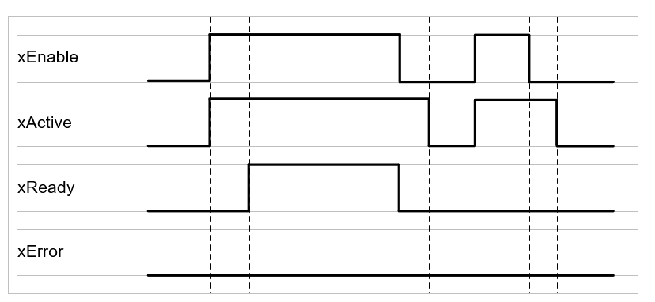

# Behavioral Model

## General Information

The following explanation only refers to standard stations (for more information refer to [Standard stations](StandardStations-F040E185.html#StandardStations-F040E185) or for example to [FB\_ClampingStation](FB_ClampStation-EE39C219.html#FB_ClampStation-EE39C219), [FB\_DeclampingStation](FBDeclampStation-EE3BBD74.html#FBDeclampStation-EE3BBD74) or [FB\_GroupingStation](FBGroupStation-EE41D516.html#FBGroupStation-EE41D516)):

By setting the property xEnable to TRUE, the function block starts the enabling process. The function block continues initialization and the property xActive is set to TRUE. Once the initialization is finished and no error is active, the property xReady is set to TRUE.

If an error occurs, the property xError indicates TRUE and remains TRUE until the function block is disabled.

## Signal Diagram

## Common Outputs

The methods of the function block FB\_CoreStation provide the following common outputs:

| Output | Data type | Description |
| --- | --- | --- |
| q\_xError | BOOL | Indicates TRUE if an error has been detected. For details, refer to q\_etResult and q\_sResultMsg. |
| q\_etResult | [ET\_Result](ET_Result-CB42A938.html#ET_Result-CB42A938) | Provides diagnostic and status information as a numeric value. If q\_xError = FALSE, q\_etResult provides status information. If q\_xError = TRUE, q\_etResult provides diagnostic/error information. |
| q\_sResultMsg | STRING [255] | Provides additional diagnostic and status information as a text message. |

## Common Properties

The standard stations provide the following common properties:

| Name | Data type | Accessing | Description |
| --- | --- | --- | --- |
| etResult | [ET\_Result](ET_Result-CB42A938.html#ET_Result-CB42A938) | Read | Provides diagnostic and status information as a numeric value.  If xError = FALSE, etResult provides status information. If xError = TRUE, etResult provides diagnostic/error information. |
| sResultMsg | STRING [255] | Read | The event-triggered property sResultMsg provides additional diagnostic and status information as a text message. |
| xActive | BOOL | Read | Indicates TRUE if the function block is active. |
| xEnable | BOOL | Write | If xEnable is set to TRUE, the station is enabled (activated). |
| xError | BOOL | Read | Indicates TRUE if an error has been detected. For details, refer to etResult and sResultMsg. |
| xErrorQuit | BOOL | Write | When an error is detected, state machine is going to a WAITING state.  If xErrorQuit is set to TRUE, you leave this WAITING state and reset the error variables. |
| xReady | BOOL | Read | Indicates TRUE if the function block is enabled and no error is active.  Indicates FALSE if the function block is enabled and an error is active or if the function block is disabled. |

EIO0000004643.03