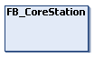
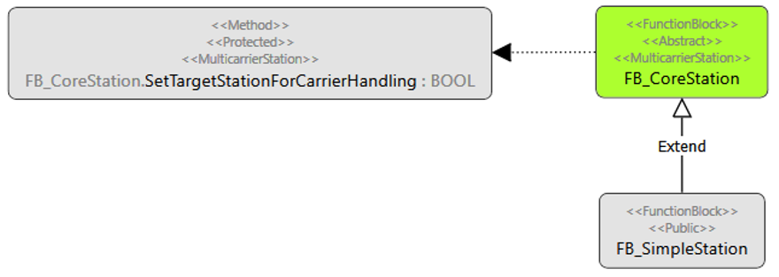
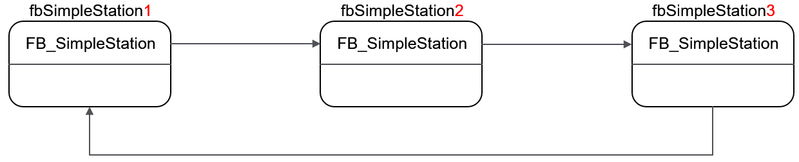

# FB\_CoreStation - General Information

## Overview

|  |  |
| --- | --- |
| Type: | Function block |
| Available as of: | V1.0.0.0 |
| Inherits from: | - |
| Implements: | [IF\_CoreStation](IF_CoreStation-CE432D70.html#IF_CoreStation-CE432D70) |



## Task

Function block providing general methods for the handling of carriers with regard to the individual stations as well as the interaction between the stations.

## Description

The function block FB\_CoreStation is the core element of the MulticarrierStation library.

The function block FB\_CoreStation implements the interface IF\_CoreStation for enabling the assignment of stations to other stations and provides the method SetTargetStationForCarrierHandling for the assigning task.

A user-defined station can inherit the function block FB\_CoreStation and use the method SetTargetStationForCarrierHandling for defining the target station.

For a user-defined station with, for instance, the name FB\_SimpleStation, the corresponding code reads as follows:  

```
FUNCTION_BLOCK FB_SimpleStation EXTENDS MCRS.FB_CoreStation
```



For defining the target stations for the individual stations of a track, proceed as follows:

1. Instantiate the required number of stations:

   ```
   fbSimpleStation1 : FB_SimpleStation;
   fbSimpleStation2 : FB_SimpleStation;
   fbSimpleStation3 : FB_SimpleStation;
   ```
2. Assign the appropriate station as the target station with the method [SetTargetStationForCarrierHandling](SetTargetStation-CBCA4B23.html#SetTargetStation-CBCA4B23):

   ```
   fbSimpleStation1.SetTargetStationForCarrierHandling(i_ifCorestation := fbSimpleStation2);
   fbSimpleStation2.SetTargetStationForCarrierHandling(i_ifCorestation := fbSimpleStation3);
   fbSimpleStation3.SetTargetStationForCarrierHandling(i_ifCorestation := fbSimpleStation1);
   ```

This example for target station assignment can be illustrated as follows:



For handing over carriers to the target station, you can use the method [HandoverCarriersToTargetStation](HandoverCarrier-CBC625EF.html#HandoverCarrier-CBC625EF).

NOTE: By assigning a target station and by handing over carriers to the target station, you do not trigger a motion command. The methods SetTargetStationForCarrierHandling and HandoverCarriersToTargetStation only control the logical handling of carriers in a station, i.e. in the station storage, and they do not trigger a move command.

## Properties

| Name | Data type | Accessing | Description |
| --- | --- | --- | --- |
| lrHandoverTargetGap | LREAL | Read/Write | With the property lrHandoverTargetGap, you can set a target gap for carriers that are sent to the station.  If the carrier is sent to the target station with the move command MoveGapControl, use this target gap.  For more information on the move command MoveGapControl, refer to the [Multicarrier library](../../../../../api/crossBook?lang=en-US&virtualBookName=MLSLib&topicID=IF_MoveGapControl_5B81ACFA) . |
| lrHandoverTargetPosition | LREAL | Read/Write | With the property lrHandoverTargetPosition, you can set the target position for carriers that are sent to the station.  If the carrier is sent to the target station with a move command, use this target position.  For the available move commands, refer to the enumeration ET\_MoveCommand in the [Multicarrier library](../../../../../api/crossBook?lang=en-US&virtualBookName=MLSLib&topicID=ET_MoveComm_DA370FC4) . |
| raudiCarrierIndexArray | REFERENCE TO ARRAY [1..MCR.GPL.Gc\_udiMaxNumberOfCarriers] OF UDINT | Read | Array specifying the carriers in the station by their index numbers.  This property indicates which carriers are assigned to the station.  For more information, refer to the global parameter list of the [Multicarrier library](../../../../../api/crossBook?lang=en-US&virtualBookName=MLSLib&topicID=GlobalParameterListGPL_50ADCFD5) . |
| sName | STRING [80] | Read/Write | With the property sName, you can set the name of the station.  This name is also used when the method RegisterLoggerPoint (see [RegisterLoggerPoint](RegisterLoggerPoint-CBD22325.html#RegisterLoggerPoint-CBD22325)) is used to register the function block to the Application Logger.  If the property sName  is not set, the instance name of the function block FB\_CoreStation is used. |
| udiNumberOfCarriersInStationStanding | UDINT | Read | Indicates the number of assigned carriers that are in standstill in the station. |
| udiNumberOfCarriersInStationTotal | UDINT | Read | Indicates the number of carriers that are assigned to the station. |
| udiStationId | UDINT | Read | Indicates the ID of the station. |
| xActivateAPLEntriesForMovedCarriers | BOOL | Write | If xActivateAPLEntriesForMovedCarriers is set to TRUE, Application Logger messages are written for the carriers assigned to the station.  As a precondition, the property xEnableActivationOfAPLEntriesForCarriers must be set to TRUE.  NOTE: The property xActivateAPLEntriesForMovedCarriers overwrites the corresponding property xApplicationLoggerEntriesActive of the [Multicarrier library](../../../../../api/crossBook?lang=en-US&virtualBookName=MLSLib&topicID=CarrFeedbConf_E1D3F75B) . |
| xEnableActivationOfAPLEntriesForCarriers | BOOL | Write | If xEnableActivationOfAPLEntriesForCarriers is set to TRUE, the property xActivateAPLEntriesForMovedCarriers is enabled and the logging of carriers via the Application Logger can be activated or deactivated.  For an application example of the properties xEnableActivationOfAPLEntriesForCarriers and xActivateAPLEntriesForMovedCarriers, refer to the description of Station-based Carrier Logging in the [Lexium™ MC multi carrier Example Guide](../../../../../api/crossBook?lang=en-US&virtualBookName=exMulCar&topicID=StationCarrLog_366A4FEE). |

## Inputs

The function block has no inputs.

## Outputs

The function block has no outputs.

## Mandatory Access Specifiers

The methods and properties of the function block FB\_CoreStation are assigned the access specifier `FINAL`. This helps to protect the methods and properties from being overwritten. When an attempt is made to overwrite a method or property, an error message is displayed.

In addition, some methods are also assigned the access specifier `PROTECTED`. They can only be called and displayed in function blocks inheriting the function block FB\_CoreStation.

EIO0000004643.03