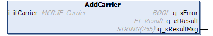

# FB\_CoreStation - AddCarrier (Method)

## Overview

|  |  |
| --- | --- |
| Type: | Method |
| Available as of: | V1.0.0.0 |

## Task

Adding a carrier to the station.

## Description

With the method AddCarrier, you can add a carrier object from the Multicarrier library to the station.

In a typical implementation, the procedure is as follows:

1. When the Lexium™ MC multi carrier track is enabled, the carriers are moved into the first station.
2. The carriers must be added to this first station.
3. Once the carriers have been added to the first station, you do not need to add them to further stations. Instead, the carriers are handed over to the next station with the method [HandoverCarriersToTargetStation](HandoverCarrier-CBC625EF.html#HandoverCarrier-CBC625EF).

|  |  |
| --- | --- |
|  | For a visual illustration of the method AddCarrier, refer to the [AddCarrier](../../../../../api/video?lang=en-US&bookKey=646b35560ad3f6dd2f6da6163bc584aef0f38056acad443509b763109147523a&videoName=MCRSLib_AddCarr.mp4) video sequence. |

## Inputs

| Input | Data type | Description |
| --- | --- | --- |
| i\_ifCarrier | MCR.IF\_Carrier | Carrier object from the Multicarrier library.  For more information, refer to the [Multicarrier library](../../../../../api/crossBook?lang=en-US&virtualBookName=MLSLib&topicID=IF_Carrier_E050ABF7). |

## Outputs

| Output | Data type | Description |
| --- | --- | --- |
| q\_xError | BOOL | Indicates TRUE if an error has been detected. For details, refer to q\_etResult and q\_sResultMsg. |
| q\_etResult | [ET\_Result](ET_Result-CB42A938.html#ET_Result-CB42A938) | Provides diagnostic and status information as a numeric value. If q\_xError = FALSE, q\_etResult provides status information. If q\_xError = TRUE, q\_etResult provides diagnostic/error information. |
| q\_sResultMsg | STRING [255] | Provides additional diagnostic and status information as a text message. |

## Access Specifier

The method AddCarrier is assigned the access specifier `FINAL`. This helps to protect the method from being overwritten.

For more information, see [Mandatory Access Specifiers](FB_CoreStation-CDC7F259.html#FB_CoreStation-CDC7F259__MandatoryAccessSpecifiers-CEEB6B6B).

EIO0000004643.03