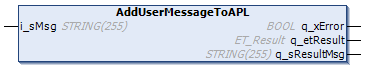

# FB\_CoreStation - AddUserMessageToAPL (Method)

## Overview

|  |  |
| --- | --- |
| Type: | Method |
| Available as of: | V1.0.0.0 |

## Task

Sending a logger message to the Application Logger with logger level APL.ET\_Loglevel.UserAction.

For more information on the logger levels, refer to: [ET\_LogLevel](../../../../../api/crossBook?lang=en-US&virtualBookName=PD.Lib.ApplicationLogger&topicID=D_SE_0077662).

## Description

With the method AddUserMessageToAPL, you can send a logger message to the Application Logger.

The method AddUserMessageToAPL can only be called when the function block FB\_CoreStation has been registered as a logger point to the Application Logger by using the method [RegisterLoggerPoint](RegisterLoggerPoint-CBD22325.html#RegisterLoggerPoint-CBD22325).

  

NOTE: The information that is given to the logger point during the call of RegisterLoggerPoint is linked to the messages that are sent via this logger point and does not have to be included inside the messages.

## Inputs

| Input | Data type | Description |
| --- | --- | --- |
| i\_sMsg | STRING [255] | The user-defined logger message. |

## Outputs

| Output | Data type | Description |
| --- | --- | --- |
| q\_xError | BOOL | Indicates TRUE if an error has been detected. For details, refer to q\_etResult and q\_sResultMsg. |
| q\_etResult | [ET\_Result](ET_Result-CB42A938.html#ET_Result-CB42A938) | Provides diagnostic and status information as a numeric value. If q\_xError = FALSE, q\_etResult provides status information. If q\_xError = TRUE, q\_etResult provides diagnostic/error information. |
| q\_sResultMsg | STRING [255] | Provides additional diagnostic and status information as a text message. |

## Access Specifiers

The method AddUserMessageToAPL is assigned the access specifiers `FINAL` and `PROTECTED`.

The specifier `FINAL` helps to protect the method from being overwritten. The specifier `PROTECTED` ensures that the method can only be called and shown inside a function block inheriting the function block FB\_CoreStation.

For more information, see [Mandatory Access Specifiers](FB_CoreStation-CDC7F259.html#FB_CoreStation-CDC7F259__MandatoryAccessSpecifiers-CEEB6B6B).

EIO0000004643.03