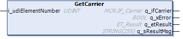

# FB\_CoreStation - GetCarrier (Method)

## Overview

|  |  |
| --- | --- |
| Type: | Method |
| Available as of: | V1.0.0.0 |

## Task

Accessing the interface IF\_Carrier for a selected carrier of the station.

## Description

With the method GetCarrier, you get access to the interface MCR.IF\_Carrier for a carrier that has been selected via the input i\_udiElementNumber.

## Inputs

| Input | Data type | Description |
| --- | --- | --- |
| i\_udiElementNumber | UDINT | Indicates which carrier is selected from the internal storage of the station. |

## Outputs

| Output | Data type | Description |
| --- | --- | --- |
| q\_ifCarrier | MCR.IF\_Carrier | Carrier object from the Multicarrier library.  For more information, refer to the [Multicarrier library](../../../../../api/crossBook?lang=en-US&virtualBookName=MLSLib&topicID=IF_Carrier_E050ABF7). |
| q\_xError | BOOL | Indicates TRUE if an error has been detected. For details, refer to q\_etResult and q\_sResultMsg. |
| q\_etResult | [ET\_Result](ET_Result-CB42A938.html#ET_Result-CB42A938) | Provides diagnostic and status information as a numeric value. If q\_xError = FALSE, q\_etResult provides status information. If q\_xError = TRUE, q\_etResult provides diagnostic/error information. |
| q\_sResultMsg | STRING [255] | Provides additional diagnostic and status information as a text message. |

## Access Specifiers

The method GetCarrier is assigned the access specifiers `FINAL` and `PROTECTED`.

The specifier `FINAL` helps to protect the method from being overwritten. The specifier `PROTECTED` ensures that the method can only be called and shown inside a function block inheriting the function block FB\_CoreStation.

For more information, see [Mandatory Access Specifiers](FB_CoreStation-CDC7F259.html#FB_CoreStation-CDC7F259__MandatoryAccessSpecifiers-CEEB6B6B).

EIO0000004643.03