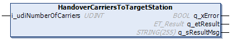

# FB\_CoreStation - HandoverCarriersToTargetStation (Method)

## Overview

|  |  |
| --- | --- |
| Type: | Method |
| Available as of: | V1.0.0.0 |

## Task

Handing over one or more carriers to another station.

## Description

With the method HandoverCarriersToTargetStation, you can hand over carriers from the present station to the target station.

NOTE: By handing over, the carriers are assigned to the next station but they are not moved by this method. The movement must be defined by appropriate move commands.

NOTE: As soon as the carrier is handed over to the target station, the target station can control the carrier (target position, motion parameters and motion instruction type).

The target station has to be set in advance with the method [SetTargetStationForCarrierHandling](SetTargetStation-CBCA4B23.html#SetTargetStation-CBCA4B23).

|  |  |
| --- | --- |
|  | For a visual illustration of the method HandoverCarriersToTargetStation, refer to the [Handover](../../../../../api/video?lang=en-US&bookKey=646b35560ad3f6dd2f6da6163bc584aef0f38056acad443509b763109147523a&videoName=MCRSLib_Handover.mp4) video sequence. |

## Inputs

| Input | Data type | Description |
| --- | --- | --- |
| i\_udiNumberOfCarriers | UDINT | Indicates the number of carriers that are stored in the internal storage of the target station. |

## Outputs

| Output | Data type | Description |
| --- | --- | --- |
| q\_xError | BOOL | Indicates TRUE if an error has been detected. For details, refer to q\_etResult and q\_sResultMsg. |
| q\_etResult | [ET\_Result](ET_Result-CB42A938.html#ET_Result-CB42A938) | Provides diagnostic and status information as a numeric value. If q\_xError = FALSE, q\_etResult provides status information. If q\_xError = TRUE, q\_etResult provides diagnostic/error information. |
| q\_sResultMsg | STRING [255] | Provides additional diagnostic and status information as a text message. |

## Access Specifiers

The method HandoverCarriersToTargetStation is assigned the access specifiers `FINAL` and `PROTECTED`.

The specifier `FINAL` helps to protect the method from being overwritten. The specifier `PROTECTED` ensures that the method can only be called and shown inside a function block inheriting the function block FB\_CoreStation.

For more information, see [Mandatory Access Specifiers](FB_CoreStation-CDC7F259.html#FB_CoreStation-CDC7F259__MandatoryAccessSpecifiers-CEEB6B6B).

EIO0000004643.03