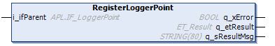

# FB\_CoreStation - RegisterLoggerPoint (Method)

## Overview

|  |  |
| --- | --- |
| Type: | Method |
| Available as of: | V1.0.0.0 |

## Task

Registering the station to the Application Logger.

## Description

With the method RegisterLoggerPoint, the station function block FB\_CoreStation is registered as a logger point to the Application Logger.

The station function block is defined by the property i\_sName. The property i\_sName defined in the function block FB\_CoreStation (see [FB\_CoreStation](FB_CoreStation-CDC7F259.html#FB_CoreStation-CDC7F259)) is also used for registering the function block to the Application Logger.

The input i\_ifParent specifies the parent logger point under which the present logger point is to be registered in the logger point tree.

For more information on the Application Logger, refer to: [Using the Application Logger](../../../../../api/crossBook?lang=en-US&virtualBookName=PD.Lib.ApplicationLogger&topicID=D_SE_0077693).

## Inputs

| Input | Data type | Description |
| --- | --- | --- |
| i\_ifParent | APL.IF\_LoggerPoint | Parent logger point under which the logger point of the function block is registered. |

## Outputs

| Output | Data type | Description |
| --- | --- | --- |
| q\_xError | BOOL | Indicates TRUE if an error has been detected. For details, refer to q\_etResult and q\_sResultMsg. |
| q\_etResult | [ET\_Result](ET_Result-CB42A938.html#ET_Result-CB42A938) | Provides diagnostic and status information as a numeric value. If q\_xError = FALSE, q\_etResult provides status information. If q\_xError = TRUE, q\_etResult provides diagnostic/error information. |
| q\_sResultMsg | STRING [255] | Provides additional diagnostic and status information as a text message. |

## Access Specifier

The method RegisterLoggerPoint is assigned the access specifier `FINAL`. This helps to protect the method from being overwritten.

For more information, see [Mandatory Access Specifiers](FB_CoreStation-CDC7F259.html#FB_CoreStation-CDC7F259__MandatoryAccessSpecifiers-CEEB6B6B).

EIO0000004643.03