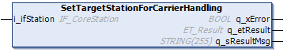

# FB\_CoreStation - SetTargetStationForCarrierHandling (Method)

## Overview

|  |  |
| --- | --- |
| Type: | Method |
| Available as of: | V1.0.0.0 |

## Task

Assigning the target station for the carrier(s).

## Description

With the method SetTargetStationForCarrierHandling, you can specify the target station to which the carrier(s) are handed over.

For an example of target station assignment, refer to [FB\_CoreStation - General Information](FB_CoreStation-CDC7F259.html#FB_CoreStation-CDC7F259).

## Inputs

| Input | Data type | Description |
| --- | --- | --- |
| i\_ifStation | [IF\_CoreStation](IF_CoreStation-CE432D70.html#IF_CoreStation-CE432D70) | Specifies the target station for handing over the carrier(s). |

## Outputs

| Output | Data type | Description |
| --- | --- | --- |
| q\_xError | BOOL | Indicates TRUE if an error has been detected. For details, refer to q\_etResult and q\_sResultMsg. |
| q\_etResult | [ET\_Result](ET_Result-CB42A938.html#ET_Result-CB42A938) | Provides diagnostic and status information as a numeric value. If q\_xError = FALSE, q\_etResult provides status information. If q\_xError = TRUE, q\_etResult provides diagnostic/error information. |
| q\_sResultMsg | STRING [255] | Provides additional diagnostic and status information as a text message. |

## Access Specifier

The method SetTargetStationForCarrierHandling is assigned the access specifier `FINAL`. This helps to protect the method from being overwritten.

For more information, see [Mandatory Access Specifiers](FB_CoreStation-CDC7F259.html#FB_CoreStation-CDC7F259__MandatoryAccessSpecifiers-CEEB6B6B).

EIO0000004643.03