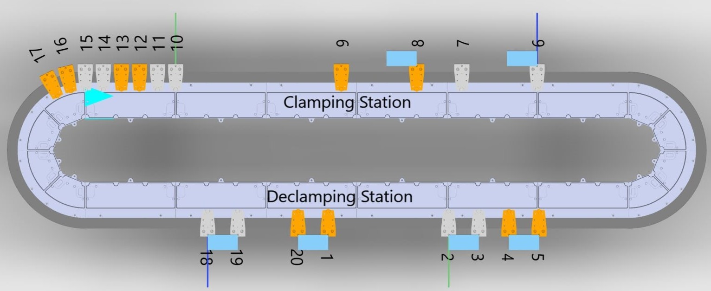
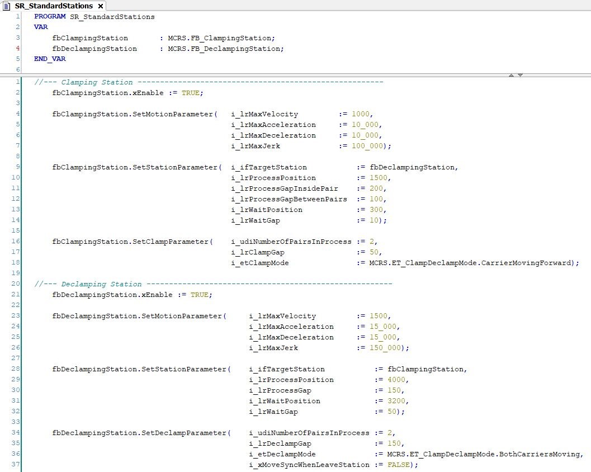
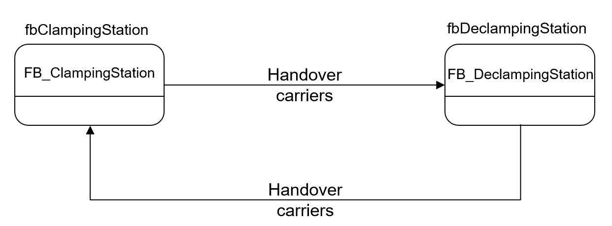
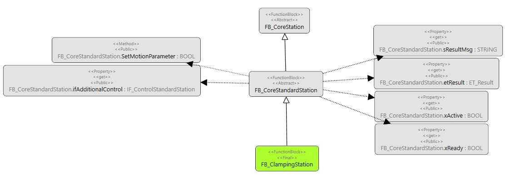

# Standard Stations - General Information

## Overview

|  |  |
| --- | --- |
| Type: | Function block |
| Available as of: | – |
| Inherits from: | [FB\_CoreStation](FB_CoreStation-CB436CE9.html#FB_CoreStation-CB436CE9) |
| Implements: | – |
| Versions: | – |

## Task

Providing standard methods and properties for handling the movement of carriers into a station, within a station and out of the station to the next station.

## Description

Standard stations extend the basic function block [FB\_CoreStation](FB_CoreStation-CDC7F259.html#FB_CoreStation-CDC7F259). They provide station-specific features (methods and properties) for general processes like clamping of a product by a pair of carriers, declamping a product or combining carriers in groups.

The standard stations handle the movement of carriers into a station, within a station and out of the station to the next station.

Generally, standard stations are working in forward moving direction. Backward movements are also possible, for example when clamping a product with one carrier moving forward and one carrier moving backward.  
For more information on the moving direction of a Lexium™ MC multi carrier transport system, refer to the [Multicarrier library](../../../../../api/crossBook?lang=en-US&virtualBookName=MLSLib&topicID=IntroMC_MovDir_10BB46E9).

Furthermore, standard stations provide a number of options for controlling the processes at the station: You can move out the carriers from the process position in order to clear the process, hold the process, stop the carriers in the process and restart the process. For more information on these options, refer to the interface [IF\_ControlStandardStation](CtrlGroupStation-EED16FBE.html#CtrlGroupStation-EED16FBE).

The methods and properties of the standard stations cannot be overwritten and it is not possible to add new methods or properties to the function blocks. Standard stations can be combined with each other or with new user-defined stations.

Standard stations typically have a waiting position and a process position. Carriers that are not in process are waiting at the waiting position with a defined waiting gap. For the carriers in the process, a process position and a process gap are defined.

## Example

The track in the following example has two stations: the Clamping Station and the Declamping Station:

* In the Clamping Station, four carriers (6, 7, 8, and 9) are in the process. They constitute two carrier pairs with a process gap of 100 mm between the pairs. The process gap within a carrier pair is 200 mm. Eight carriers (10 - 17) are waiting with a waiting gap of 10 mm.
* In the Declamping Station, two pairs of carriers (18/19 and 20/1) are in the process with a process gap of 150 mm and four carriers (2 - 5) are waiting with a waiting gap of 50 mm.



## Procedure

For using standard stations (like for example FB\_ClampingStation and FB\_DeclampingStation), proceed as follows:

1. Instantiate the standard station in the declaration part (see graphic below, upper part):
2. Enable the standard station function block.
3. Call the methods to configure the standard station in the implementation part (see graphic below, lower part):
   * assign a target station
   * specify the process position and the process gap
   * specify the waiting position and the waiting gap
   * specify the motion parameters
   * define specific parameters depending on the type of standard station



For this example, the target station assignment can be illustrated as follows:



For handing over carriers to the target station, you can use the method [HandoverCarriersToTargetStation](HandoverCarrier-CBC625EF.html#HandoverCarrier-CBC625EF).

In general, the method CyclicMotionCall is used in each standard station function block. CyclicMotionCall is called cyclically to execute the movements of the carriers:

```
fbClampingStation.CyclicMotionCall(
            iq_xTriggerClamping   := xTriggerClamping,
            iq_xTriggerMoveOut    := xTriggerMoveOut;
```

## Properties from Standard Station

| Name | Data type | Accessing | Description |
| --- | --- | --- | --- |
| xEnable | BOOL | Write | If xEnable is set to TRUE, the station is enabled (activated). |
| xError | BOOL | Read | Indicates TRUE if an error has been detected. For details, refer to etResult and sResultMsg. |
| xErrorQuit | BOOL | Write | When an error is detected, state machine is going to a WAITING state.  If xErrorQuit is set to TRUE, you leave this WAITING state and reset the error variables. |

## Properties from Hidden Function Block



The following properties come from the hidden function block FB\_CoreStandardStation that extends the standard station:

| Name | Data type | Accessing | Description |
| --- | --- | --- | --- |
| etResult | [ET\_Result](ET_Result-CB42A938.html#ET_Result-CB42A938) | Read | Provides diagnostic and status information as a numeric value.  If xError = FALSE, etResult provides status information. If xError = TRUE, etResult provides diagnostic/error information. |
| ifAdditionalControls | [IF\_ControlStandardStation](CtrlGroupStation-EED16FBE.html#CtrlGroupStation-EED16FBE) | Read | Access to the interface IF\_ControlStandardStation that provides methods for controlling the standard station. |
| sResultMsg | STRING [255] | Read | The event-triggered property sResultMsg provides additional diagnostic and status information as a text message. |
| xActive | BOOL | Read | Indicates TRUE if the function block is enabled. |
| xReady | BOOL | Read | Indicates TRUE if the function block is enabled and no error is active.  Indicates FALSE if the function block is enabled and an error is active or if the function block is disabled. |

EIO0000004643.03