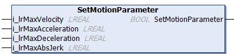

# Standard Stations - SetMotionParameter (Method)

## Overview

|  |  |
| --- | --- |
| Type: | Method |
| Available as of: | V1.0.0.0 |

## Task

Setting the motion parameters.

## Description

With the method SetMotionParameter, you can specify the maximum velocity (change of position per time unit), the maximum acceleration/deceleration (change of velocity per time unit), and the maximum jerk (change of acceleration per time unit) with which the motion of the carrier must be executed.

NOTE: If one or more of the motion parameters are not within the valid value range, a diagnostic message is generated and the modified motion values are not considered for the next move command. The next move command uses the last valid set of motion parameters.

NOTE: Before executing the method CyclicMotionCall, the method SetMotionParameter must be called at least once.   
For more information on the CyclicMotionCall methods, refer to [FB\_ClampingStation](CycMotionCall-EB443FEE.html#CycMotionCall-EB443FEE), [FB\_DeclampingStation](CycMotionCall-EB453A25.html#CycMotionCall-EB453A25) and [FB\_GroupingStation](CycMotionCall-EC493E53.html#CycMotionCall-EC493E53).

The return value SetMotionParameter of type BOOL indicates TRUE if the motion parameters have been set successfully.

## Inputs

| Input | Data type | Value range | Unit | Description |
| --- | --- | --- | --- | --- |
| i\_lrMaxVelocity | LREAL | MCR.GCL.Gc\_lrMinVelocity ≤  i\_lrMaxVelocity ≤  MCR.GCL.Gc\_lrMaxVelocity (1) | mm/s | Specifies the maximum velocity (change of position per time unit). |
| i\_lrMaxAcceleration | LREAL | MCR.GCL.Gc\_lrMinAcceleration ≤  i\_lrMaxAcceleration ≤  MCR.GCL.Gc\_lrMaxAcceleration (1) | mm/s2 | Specifies the maximum acceleration (change of velocity per time unit). |
| i\_lrMaxDeceleration | LREAL | MCR.GCL.Gc\_lrMinDeceleration ≤  i\_lrMaxDeceleration ≤  MCR.GCL.Gc\_lrMaxDeceleration (1) | mm/s2 | Specifies the maximum deceleration (change of velocity per time unit). |
| i\_lrMaxAbsJerk | LREAL | MCR.GCL.Gc\_lrMinAbsJerk ≤  i\_ lrMaxAbsJerk ≤  MCR.GCL.Gc\_lrMaxAbsJerk (1)  AND  i\_ lrMaxAbsJerk ≥  i\_lrMaxAcceleration (2) × 10 (3) | mm/s3 | Specifies the maximum jerk (change of acceleration per time unit). |
| **(1)** For more information on the value range, refer to the Global Constants List (GCL) of the [Multicarrier library](../../../../../api/crossBook?lang=en-US&virtualBookName=MLSLib&topicID=GlobalConstantsListGCL_50A754B1).  **(2)** Internally, it is determined which value is greater between i\_lrMaxAcceleration and i\_lrMaxDeceleration. The greater value is used for this calculation.  **(3)** The value of i\_ lrMaxAbsJerk must be greater than or equal to 10 times the value of i\_lrMaxAcceleration (or i\_lrMaxDeceleration, whichever of the two is greater). If this is not the case, it is internally set to a value that is 10 times the value of i\_lrMaxAcceleration (or i\_lrMaxDeceleration). | | | | |

## Outputs

The method has no outputs

EIO0000004643.03