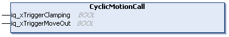

# FB\_ClampingStation - CyclicMotionCall (Method)

## Overview

|  |  |
| --- | --- |
| Type: | Method |
| Available as of: | V1.0.0.0 |

## Task

Handling the carriers in the clamping station.

## Description

With the method CyclicMotionCall, you can control the carrier movement in the clamping station:  

* the start of the clamping movement when the property xStationReadyForClamping indicates that the carriers in the process are in standstill and are ready for clamping
* the start of the leaving movement when the property xStationReadyForMoveOut indicates that the carriers in the process are in standstill and are ready for moving out

The input iq\_xTriggerMoveOut is only evaluated when the property xStationReadyForMoveOut is TRUE.

When the input iq\_xTriggerMoveOut is already set to TRUE or has a rising edge:

* the MoveOut command is triggered
* the pairs of carriers are logically handed over
* both signals iq\_xTriggerMoveOut and xStationReadyForMoveOut are reset to FALSE

The method CyclicMotionCall must be called cyclically.

NOTE: Before executing the method CyclicMotionCall, the function block FB\_ClampingStation must be enabled and the methods [SetMotionParameter](SetMotionPara-EAA1A5CA.html#SetMotionPara-EAA1A5CA), [SetClampParameter](SetClampPara-EB3FBFF7.html#SetClampPara-EB3FBFF7), and [SetStationParameter](SetStationPara-EABCFF46.html#SetStationPara-EABCFF46) must be called at least once.

## Inputs/Outputs

| Input | Data type | Description |
| --- | --- | --- |
| iq\_xTriggerClamping | BOOL | Event-triggered Boolean command to start clamping when the parameter xStationReadyForClamping is TRUE (see [FB\_ClampingStation](FB_ClampStation-EE39C219.html#FB_ClampStation-EE39C219__Properties-EE39D5C5)).  The parameter iq\_xTriggerClamping is reset to FALSE when the carriers have clamped the product.  When the clamping is done, the parameter xStationReadyForClamping is reset to FALSE and the parameter xStationReadyForMoveOut  is set to TRUE. |
| iq\_xTriggerMoveOut | BOOL | Event-triggered Boolean command to start moving the carriers out of the station when the parameter xStationReadyForMoveOut  is TRUE (see [FB\_ClampingStation](FB_ClampStation-EE39C219.html#FB_ClampStation-EE39C219__Properties-EE39D5C5)). |

EIO0000004643.03