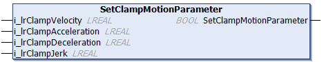

# FB\_ClampingStation - SetClampMotionParameter (Method)

## Overview

|  |  |
| --- | --- |
| Type: | Method |
| Available as of: | V1.0.0.0 |

## Task

Setting specific motion parameters for the clamping movement.

## Description

With the method SetClampMotionParameter, you can set specific motion parameters for clamping movements. When the method has been called with a clamp velocity greater than 0.0, the clamping movements in the process are executed with the motion parameters defined by the method.

NOTE: The method SetClampMotionParameter is optional.

The return value SetClampMotionParameter of type BOOL indicates TRUE if the motion parameters have been set successfully.

## Inputs

| Input | Data type | Value range | Unit | Description |
| --- | --- | --- | --- | --- |
| i\_lrClampVelocity | LREAL | MCR.GCL.Gc\_lrMinVelocity ≤  i\_lrClampVelocity ≤  MCR.GCL.Gc\_lrMaxVelocity (1) | mm/s | Specifies the velocity (change of position per time unit) during the clamping movements.  If i\_lrClampVelocity = 0.0, the motion parameters that are used for the movement of the carriers arriving at the clamping station are also used during the clamping process. |
| i\_lrClampAcceleration | LREAL | MCR.GCL.Gc\_lrMinAcceleration ≤  i\_lrClampAcceleration ≤  MCR.GCL.Gc\_lrMaxAcceleration (1) | mm/s2 | Specifies the acceleration (change of velocity per time unit) during the clamping movements. |
| i\_lrClampDeceleration | LREAL | MCR.GCL.Gc\_lrMinDeceleration ≤  i\_lrClampDeceleration ≤  MCR.GCL.Gc\_lrMaxDeceleration (1) | mm/s2 | Specifies the deceleration (change of velocity per time unit) during the clamping movements. |
| i\_lrClampJerk | LREAL | MCR.GCL.Gc\_lrMinAbsJerk ≤  i\_lrClampJerk ≤  MCR.GCL.Gc\_lrMaxAbsJerk (1)  AND  i\_lrClampJerk ≥  i\_lrClampAcceleration(2) × 10 (3) | mm/s3 | Specifies the jerk (change of acceleration per time unit) during the clamping movements. |
| **(1)** For more information on the value range, refer to the Global Constants List (GCL) of the [Multicarrier library](../../../../../api/crossBook?lang=en-US&virtualBookName=MLSLib&topicID=GlobalConstantsListGCL_50A754B1).  **(2)** Internally, it is determined which value is greater between i\_lrMaxAcceleration and i\_lrMaxDeceleration. The greater value is used for this calculation.  **(3)** The value of i\_ lrMaxAbsJerk must be greater than or equal to 10 times the value of i\_lrMaxAcceleration (or i\_lrMaxDeceleration, whichever of the two is greater). If this is not the case, it is internally set to a value that is 10 times the value of i\_lrMaxAcceleration (or i\_lrMaxDeceleration). | | | | |

## Outputs

The method has no outputs.

EIO0000004643.03