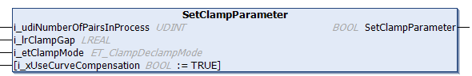

# FB\_ClampingStation - SetClampParameter (Method)

## Overview

|  |  |
| --- | --- |
| Type: | Method |
| Available as of: | V1.0.0.0 |

## Task

Setting the parameters for the clamping of products with pairs of carriers.

## Description

With the method SetClampParameter, you can specify the parameters of the clamping station.

NOTE: Before executing the method [CyclicMotionCall](CycMotionCall-EB443FEE.html#CycMotionCall-EB443FEE), the method SetClampParameter must be called at least once.

The return value SetClampParameter of type BOOL indicates TRUE if the setting of the parameters has been executed successfully.

## Inputs

| Input | Data type | Description |
| --- | --- | --- |
| i\_udiNumberOfPairsInProcess | UDINT | Specifies the number of carrier pairs that are expected to clamp a product in the clamping process. |
| i\_lrClampGap | LREAL | Specifies the gap inside a pair of carriers after the clamping process. |
| i\_etClampMode | [ET\_ClampDeclampMode](ET_ClampDeclMode-EA9786D7.html#ET_ClampDeclMode-EA9786D7) | For defining the mode of clamping: which carrier(s) move(s) during the clamping process. |
| i\_xUseCurveCompensation | BOOL | If i\_xUseCurveCompensation is set to TRUE, the second carrier of a carrier pair is synchronized to the first carrier of the pair, and additionally a curve compensation is executed via the method StartCurveCompensationToCarrierInFront.  For more information on curve compensation with the method StartCurveCompensationToCarrierInFront, refer to the [Multicarrier library](../../../../../api/crossBook?lang=en-US&virtualBookName=MLSLib&topicID=IF_MoveSyncPathFromStandstill_Start_58861273) .  NOTE: The ToolPivotPoint settings are not part of the FB\_ClampingStation and must be set separately. For more information on the ToolPivotPoint settings, refer to the [Multicarrier library](../../../../../api/crossBook?lang=en-US&virtualBookName=MLSLib&topicID=CarrConfigSetPiv_E1EA1065) .  If i\_xUseCurveCompensation is set to FALSE, no curve compensation is executed.  By default, the parameter i\_xUseCurveCompensation is set to TRUE. |

## Outputs

The method has no outputs.

EIO0000004643.03